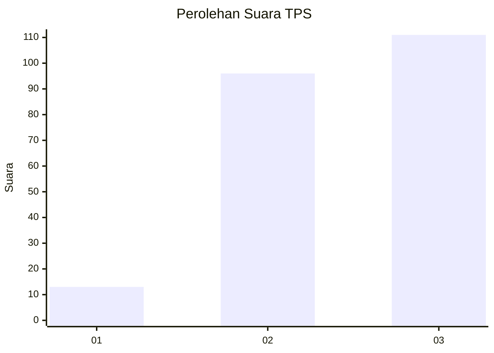
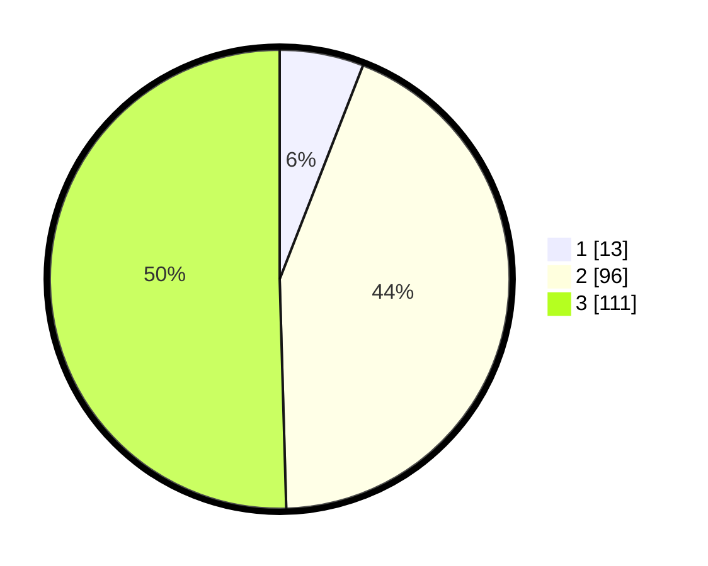

# Hasil

## Grafik

## Tabel

| No. | Nama Paslon    | Suara | Suara (raw) | Persentase |
|:--- |:-------------- | -----:| -----------:| ----------:|
| 1   | ANIES MUHAIMIN | 13    | [13][p-1]   | 5,91       |
| 2   | PRABOWO GIBRAN | 96    | [96][p-2]   | 43,64      |
| 3   | GANJAR MAHFUD  | 111   | [111][p-3]  | 50,45      |

[p-1]: https://github.com/gigit-pemilu/pemilu-2024-34-di-yogyakarta/blob/main/pilpres/hitung-suara/sub/34-di-yogyakarta/sub/71-kota-yogyakarta/sub/10-gondomanan/sub/1001-ngupasan/sub/002-tps/sub/paslon-1.txt
[p-2]: https://github.com/gigit-pemilu/pemilu-2024-34-di-yogyakarta/blob/main/pilpres/hitung-suara/sub/34-di-yogyakarta/sub/71-kota-yogyakarta/sub/10-gondomanan/sub/1001-ngupasan/sub/002-tps/sub/paslon-2.txt
[p-3]: https://github.com/gigit-pemilu/pemilu-2024-34-di-yogyakarta/blob/main/pilpres/hitung-suara/sub/34-di-yogyakarta/sub/71-kota-yogyakarta/sub/10-gondomanan/sub/1001-ngupasan/sub/002-tps/sub/paslon-3.txt

## Foto C Plano

https://sirekap-obj-formc.kpu.go.id/53fd/pemilu/ppwp/34/71/10/10/01/3471101001002-20240214-155011--5dae2cfe-34aa-4c2c-8018-d77d9af24318.jpg

https://sirekap-obj-formc.kpu.go.id/53fd/pemilu/ppwp/34/71/10/10/01/3471101001002-20240215-011819--834dc8ed-eb26-4711-ba62-903491e472fe.jpg

https://sirekap-obj-formc.kpu.go.id/53fd/pemilu/ppwp/34/71/10/10/01/3471101001002-20240215-011906--aff8dbfc-f00f-4563-81cc-e159c943a7ab.jpg

## Metadata

| Key        | Value               |
| ---------- | ------------------- |
| Time Stamp | 2024-02-15 12:00:28 |

## DATA PEMILIH TETAP

Jumlah pemilih dalam DPT: **238**.
 * L: **112**.
 * P: **126**.

## DATA PENGGUNA HAK PILIH

Jumlah pengguna hak pilih dalam DPT: **187**.
 * L: **84**.
 * P: **103**.

Jumlah pengguna hak pilih dalam DPTb: **34**.
 * L: **27**.
 * P: **7**.

Jumlah pengguna hak pilih dalam DPK: **0**.
 * L: **0**.
 * P: **0**.

Jumlah pengguna hak pilih: **221**.
 * L: **111**.
 * P: **110**.

## JUMLAH SUARA SAH DAN TIDAK SAH

JUMLAH SELURUH SUARA SAH: **220**.

JUMLAH SUARA TIDAK SAH: **1**.

JUMLAH SELURUH SUARA SAH DAN SUARA TIDAK SAH: **221**.

