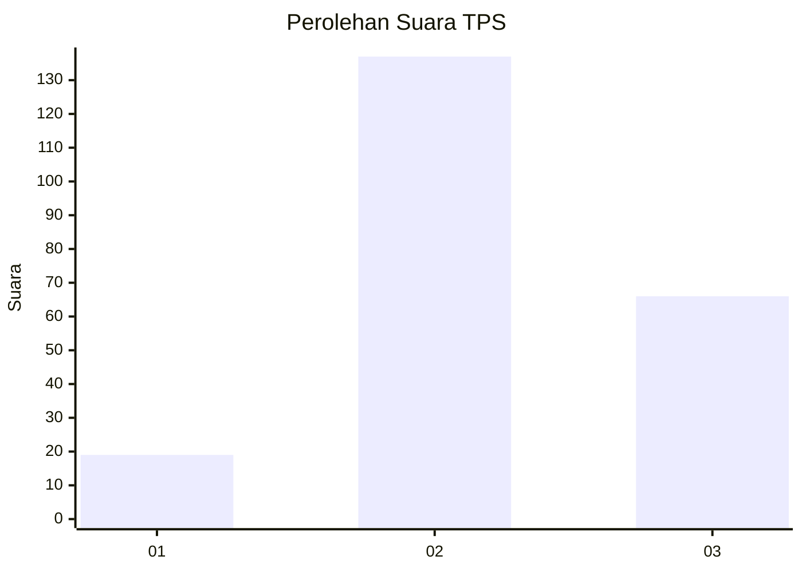
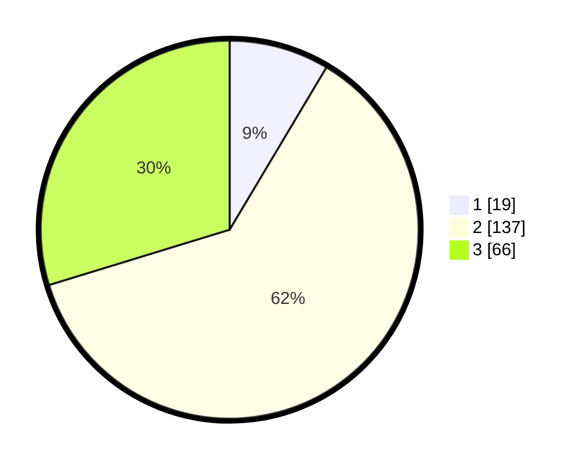

# Hasil

## Grafik

## Tabel

| No. | Nama Paslon    | Suara | Suara (raw) | Persentase |
|:--- |:-------------- | -----:| -----------:| ----------:|
| 1   | ANIES MUHAIMIN | 19    | [19][p-1]   | 8,56       |
| 2   | PRABOWO GIBRAN | 137   | [137][p-2]  | 61,71      |
| 3   | GANJAR MAHFUD  | 66    | [66][p-3]   | 29,73      |

[p-1]: https://github.com/gigit-pemilu/pemilu-2024-34-di-yogyakarta/blob/main/pilpres/hitung-suara/sub/34-di-yogyakarta/sub/71-kota-yogyakarta/sub/10-gondomanan/sub/1001-ngupasan/sub/005-tps/sub/paslon-1.txt
[p-2]: https://github.com/gigit-pemilu/pemilu-2024-34-di-yogyakarta/blob/main/pilpres/hitung-suara/sub/34-di-yogyakarta/sub/71-kota-yogyakarta/sub/10-gondomanan/sub/1001-ngupasan/sub/005-tps/sub/paslon-2.txt
[p-3]: https://github.com/gigit-pemilu/pemilu-2024-34-di-yogyakarta/blob/main/pilpres/hitung-suara/sub/34-di-yogyakarta/sub/71-kota-yogyakarta/sub/10-gondomanan/sub/1001-ngupasan/sub/005-tps/sub/paslon-3.txt

## Foto C Plano

https://sirekap-obj-formc.kpu.go.id/4780/pemilu/ppwp/34/71/10/10/01/3471101001005-20240216-113249--b85a80bc-68da-41b0-90b4-9512211838d9.jpg

https://sirekap-obj-formc.kpu.go.id/4780/pemilu/ppwp/34/71/10/10/01/3471101001005-20240216-113257--cbafdee4-27ca-4c14-8945-30089ab4a3c7.jpg

https://sirekap-obj-formc.kpu.go.id/4780/pemilu/ppwp/34/71/10/10/01/3471101001005-20240216-113253--784b13a8-7a80-4826-a30f-58aa4d8b67e2.jpg

## Metadata

| Key        | Value               |
| ---------- | ------------------- |
| Time Stamp | 2024-02-17 16:00:02 |

## DATA PEMILIH TETAP

Jumlah pemilih dalam DPT: **258**.
 * L: **124**.
 * P: **134**.

## DATA PENGGUNA HAK PILIH

Jumlah pengguna hak pilih dalam DPT: **206**.
 * L: **91**.
 * P: **115**.

Jumlah pengguna hak pilih dalam DPTb: **16**.
 * L: **9**.
 * P: **7**.

Jumlah pengguna hak pilih dalam DPK: **1**.
 * L: **0**.
 * P: **1**.

Jumlah pengguna hak pilih: **223**.
 * L: **100**.
 * P: **123**.

## JUMLAH SUARA SAH DAN TIDAK SAH

JUMLAH SELURUH SUARA SAH: **222**.

JUMLAH SUARA TIDAK SAH: **1**.

JUMLAH SELURUH SUARA SAH DAN SUARA TIDAK SAH: **223**.

