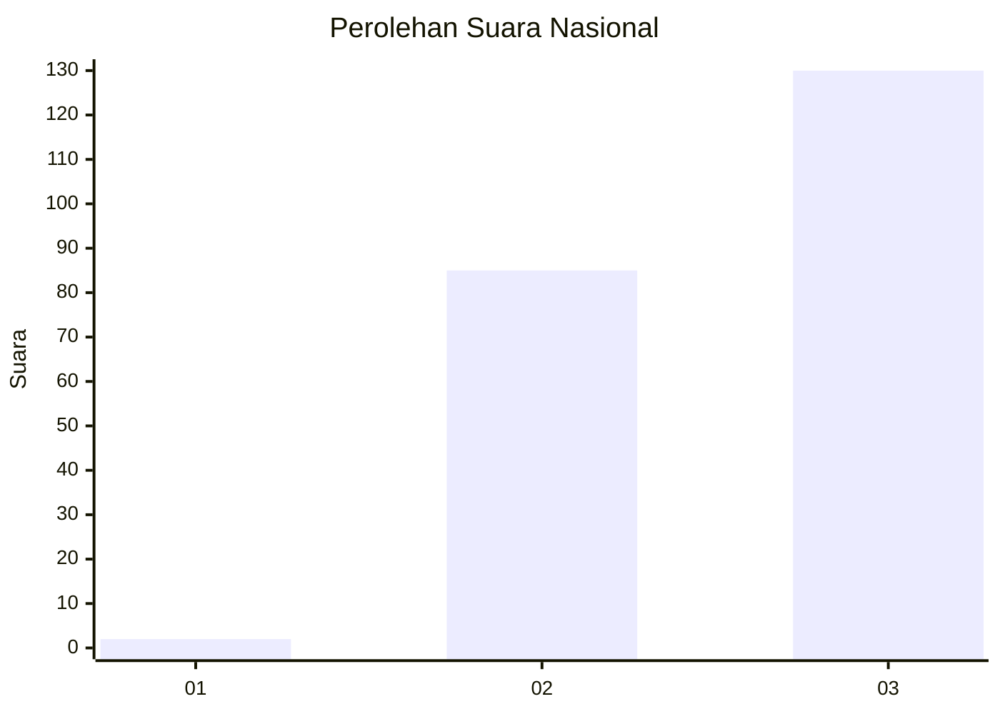
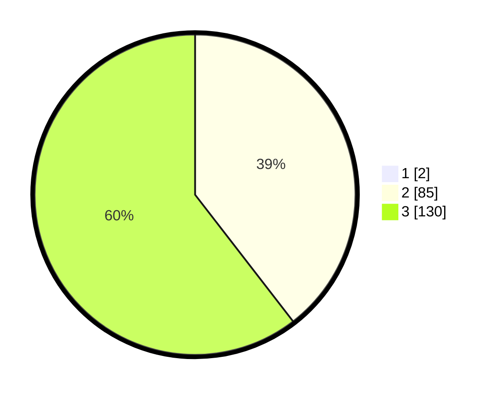

# Hasil

## Grafik

## Tabel

| No. | Nama Paslon    | Suara | Suara (raw) | Persentase |
|:--- |:-------------- | -----:| -----------:| ----------:|
| 1   | ANIES MUHAIMIN | 2     | [2][p-1]    | 0,92       |
| 2   | PRABOWO GIBRAN | 85    | [85][p-2]   | 39,17      |
| 3   | GANJAR MAHFUD  | 130   | [130][p-3]  | 59,91      |

[p-1]: https://github.com/gigit-pemilu/pemilu-2024/blob/main/pilpres/hitung-suara/sub/34-di-yogyakarta/sub/71-kota-yogyakarta/sub/10-gondomanan/sub/1001-ngupasan/sub/006-tps/sub/paslon-1.txt
[p-2]: https://github.com/gigit-pemilu/pemilu-2024/blob/main/pilpres/hitung-suara/sub/34-di-yogyakarta/sub/71-kota-yogyakarta/sub/10-gondomanan/sub/1001-ngupasan/sub/006-tps/sub/paslon-2.txt
[p-3]: https://github.com/gigit-pemilu/pemilu-2024/blob/main/pilpres/hitung-suara/sub/34-di-yogyakarta/sub/71-kota-yogyakarta/sub/10-gondomanan/sub/1001-ngupasan/sub/006-tps/sub/paslon-3.txt

## Foto C Plano

https://sirekap-obj-formc.kpu.go.id/2347/pemilu/ppwp/34/71/10/10/01/3471101001006-20240215-002645--165e2cc0-a7ea-4009-81a5-e25bd4c89240.jpg

https://sirekap-obj-formc.kpu.go.id/2347/pemilu/ppwp/34/71/10/10/01/3471101001006-20240215-002731--10758345-c347-44b5-bfbb-a5bb9d2c4a84.jpg

https://sirekap-obj-formc.kpu.go.id/2347/pemilu/ppwp/34/71/10/10/01/3471101001006-20240215-002813--cf53d25e-6f5a-48f4-85da-45724f987d73.jpg

## Metadata

| Key        | Value               |
| ---------- | ------------------- |
| Time Stamp | 2024-02-26 09:00:00 |

## DATA PEMILIH TETAP

Jumlah pemilih dalam DPT: **264**.
 * L: **129**.
 * P: **135**.

## DATA PENGGUNA HAK PILIH

Jumlah pengguna hak pilih dalam DPT: **203**.
 * L: **102**.
 * P: **101**.

Jumlah pengguna hak pilih dalam DPTb: **13**.
 * L: **885**.
 * P: **808**.

Jumlah pengguna hak pilih dalam DPK: **1**.
 * L: **88**.
 * P: **801**.

Jumlah pengguna hak pilih: **217**.
 * L: **107**.
 * P: **114**.

## JUMLAH SUARA SAH DAN TIDAK SAH

JUMLAH SELURUH SUARA SAH: **217**.

JUMLAH SUARA TIDAK SAH: **0**.

JUMLAH SELURUH SUARA SAH DAN SUARA TIDAK SAH: **217**.

