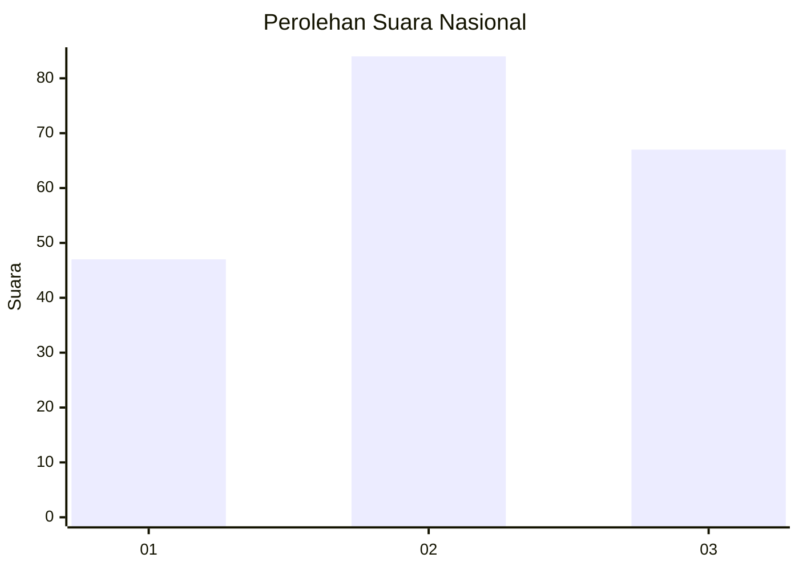
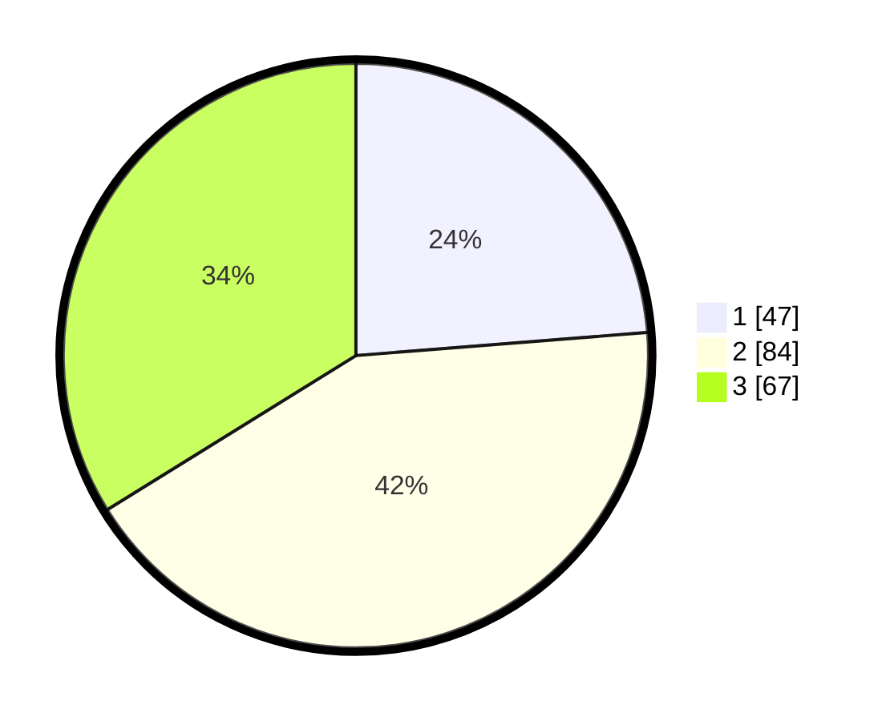

# Hasil

## Grafik

## Tabel

| No. | Nama Paslon    | Suara | Suara (raw) | Persentase |
|:--- |:-------------- | -----:| -----------:| ----------:|
| 1   | ANIES MUHAIMIN | 47    | [47][p-1]   | 23,74      |
| 2   | PRABOWO GIBRAN | 84    | [84][p-2]   | 42,42      |
| 3   | GANJAR MAHFUD  | 67    | [67][p-3]   | 33,84      |

[p-1]: https://github.com/gigit-pemilu/pemilu-2024/blob/main/pilpres/hitung-suara/sub/34-di-yogyakarta/sub/71-kota-yogyakarta/sub/10-gondomanan/sub/1002-prawirodirjan/sub/004-tps/sub/paslon-1.txt
[p-2]: https://github.com/gigit-pemilu/pemilu-2024/blob/main/pilpres/hitung-suara/sub/34-di-yogyakarta/sub/71-kota-yogyakarta/sub/10-gondomanan/sub/1002-prawirodirjan/sub/004-tps/sub/paslon-2.txt
[p-3]: https://github.com/gigit-pemilu/pemilu-2024/blob/main/pilpres/hitung-suara/sub/34-di-yogyakarta/sub/71-kota-yogyakarta/sub/10-gondomanan/sub/1002-prawirodirjan/sub/004-tps/sub/paslon-3.txt

## Foto C Plano

https://sirekap-obj-formc.kpu.go.id/b897/pemilu/ppwp/34/71/10/10/02/3471101002004-20240214-205030--3a921843-e8a1-4141-a8bd-0d64c58bf39c.jpg

https://sirekap-obj-formc.kpu.go.id/b897/pemilu/ppwp/34/71/10/10/02/3471101002004-20240214-205207--c467149c-d86f-4b30-a9a0-488d575d17d6.jpg

https://sirekap-obj-formc.kpu.go.id/b897/pemilu/ppwp/34/71/10/10/02/3471101002004-20240214-205402--9284354e-b941-4c50-8988-7337a4f4df64.jpg

## Metadata

| Key        | Value               |
| ---------- | ------------------- |
| Time Stamp | 2024-02-24 22:31:28 |

## DATA PEMILIH TETAP

Jumlah pemilih dalam DPT: **252**.
 * L: **0**.
 * P: **0**.

## DATA PENGGUNA HAK PILIH

Jumlah pengguna hak pilih dalam DPT: **193**.
 * L: **0**.
 * P: **0**.

Jumlah pengguna hak pilih dalam DPTb: **13**.
 * L: **0**.
 * P: **0**.

Jumlah pengguna hak pilih dalam DPK: **1**.
 * L: **0**.
 * P: **0**.

Jumlah pengguna hak pilih: **207**.
 * L: **0**.
 * P: **0**.

## JUMLAH SUARA SAH DAN TIDAK SAH

JUMLAH SELURUH SUARA SAH: **198**.

JUMLAH SUARA TIDAK SAH: **9**.

JUMLAH SELURUH SUARA SAH DAN SUARA TIDAK SAH: **207**.

