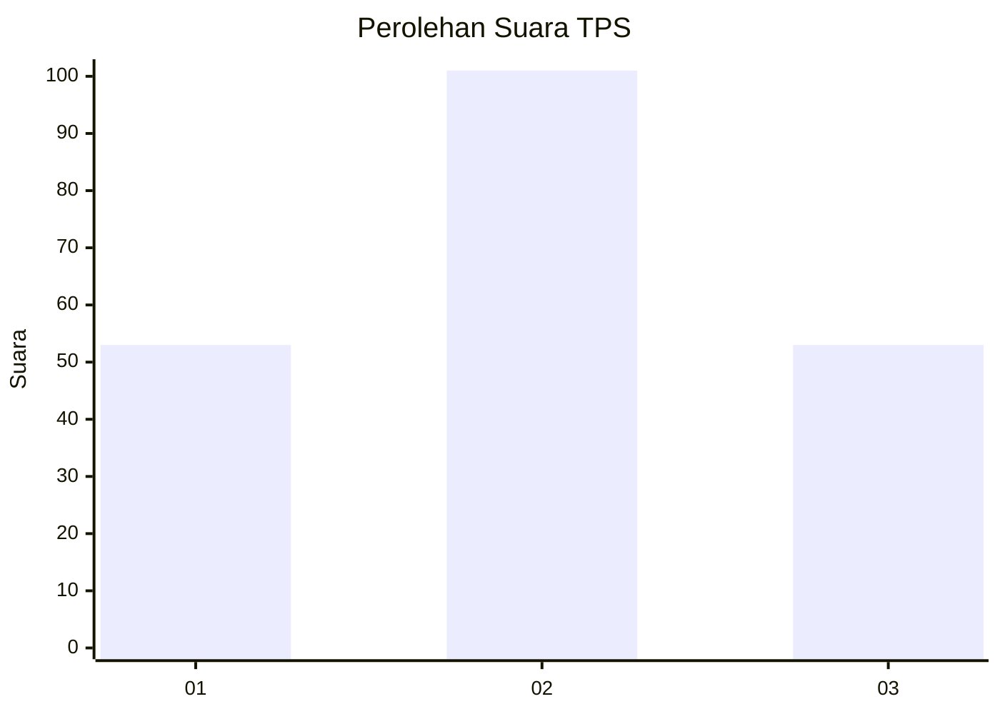
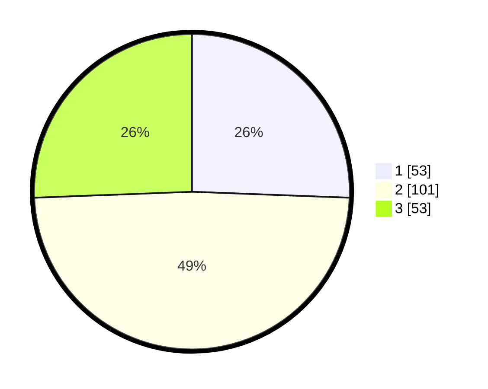

# Hasil

## Grafik

## Tabel

| No. | Nama Paslon    | Suara | Suara (raw) | Persentase |
|:--- |:-------------- | -----:| -----------:| ----------:|
| 1   | ANIES MUHAIMIN | 53    | [53][p-1]   | 25,60      |
| 2   | PRABOWO GIBRAN | 101   | [101][p-2]  | 48,79      |
| 3   | GANJAR MAHFUD  | 53    | [53][p-3]   | 25,60      |

[p-1]: https://github.com/gigit-pemilu/pemilu-2024-34-di-yogyakarta/blob/main/pilpres/hitung-suara/sub/34-di-yogyakarta/sub/71-kota-yogyakarta/sub/10-gondomanan/sub/1002-prawirodirjan/sub/009-tps/sub/paslon-1.txt
[p-2]: https://github.com/gigit-pemilu/pemilu-2024-34-di-yogyakarta/blob/main/pilpres/hitung-suara/sub/34-di-yogyakarta/sub/71-kota-yogyakarta/sub/10-gondomanan/sub/1002-prawirodirjan/sub/009-tps/sub/paslon-2.txt
[p-3]: https://github.com/gigit-pemilu/pemilu-2024-34-di-yogyakarta/blob/main/pilpres/hitung-suara/sub/34-di-yogyakarta/sub/71-kota-yogyakarta/sub/10-gondomanan/sub/1002-prawirodirjan/sub/009-tps/sub/paslon-3.txt

## Foto C Plano

https://sirekap-obj-formc.kpu.go.id/b3d0/pemilu/ppwp/34/71/10/10/02/3471101002009-20240214-234034--2af4ef4b-4a20-416a-8099-64a0a7edfdff.jpg

https://sirekap-obj-formc.kpu.go.id/b3d0/pemilu/ppwp/34/71/10/10/02/3471101002009-20240214-210530--c92c1777-ba6c-458f-9eee-2a5704d1fc6c.jpg

https://sirekap-obj-formc.kpu.go.id/b3d0/pemilu/ppwp/34/71/10/10/02/3471101002009-20240216-195352--daa97890-41e1-43a0-a6ac-edc50d502b6b.jpg

## Metadata

| Key        | Value               |
| ---------- | ------------------- |
| Time Stamp | 2024-02-16 21:01:00 |

