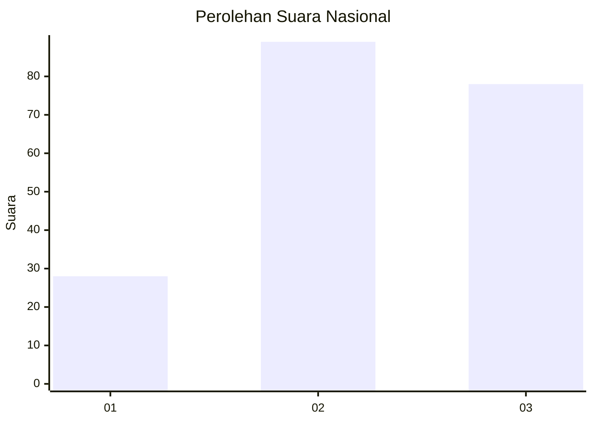
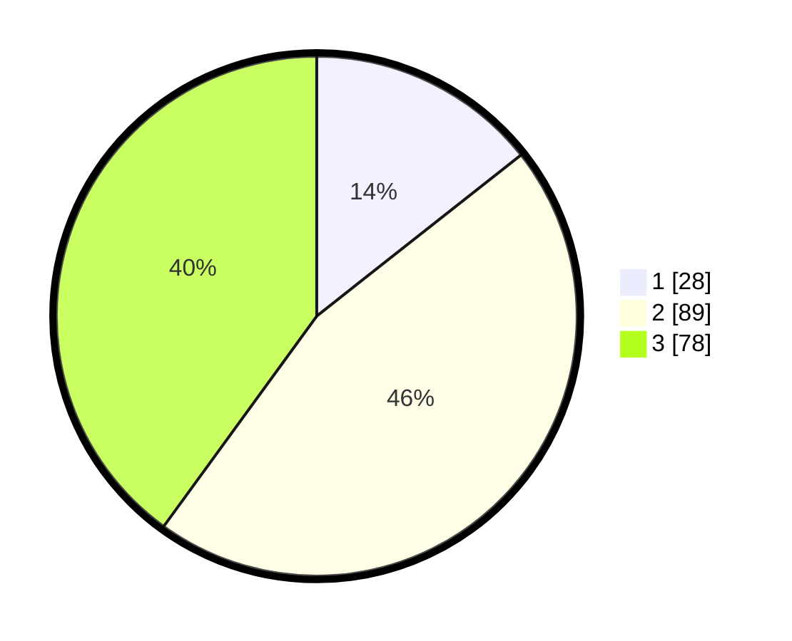

# Hasil

## Grafik

## Tabel

| No. | Nama Paslon    | Suara | Suara (raw) | Persentase |
|:--- |:-------------- | -----:| -----------:| ----------:|
| 1   | ANIES MUHAIMIN | 28    | [28][p-1]   | 14,36      |
| 2   | PRABOWO GIBRAN | 89    | [89][p-2]   | 45,64      |
| 3   | GANJAR MAHFUD  | 78    | [78][p-3]   | 40,00      |

[p-1]: https://github.com/gigit-pemilu/pemilu-2024/blob/main/pilpres/hitung-suara/sub/34-di-yogyakarta/sub/71-kota-yogyakarta/sub/11-pakualaman/sub/1001-purwokinanti/sub/002-tps/sub/paslon-1.txt
[p-2]: https://github.com/gigit-pemilu/pemilu-2024/blob/main/pilpres/hitung-suara/sub/34-di-yogyakarta/sub/71-kota-yogyakarta/sub/11-pakualaman/sub/1001-purwokinanti/sub/002-tps/sub/paslon-2.txt
[p-3]: https://github.com/gigit-pemilu/pemilu-2024/blob/main/pilpres/hitung-suara/sub/34-di-yogyakarta/sub/71-kota-yogyakarta/sub/11-pakualaman/sub/1001-purwokinanti/sub/002-tps/sub/paslon-3.txt

## Foto C Plano

https://sirekap-obj-formc.kpu.go.id/5558/pemilu/ppwp/34/71/11/10/01/3471111001002-20240214-191921--f5f78af3-fea7-4f49-b90e-966010406109.jpg

https://sirekap-obj-formc.kpu.go.id/5558/pemilu/ppwp/34/71/11/10/01/3471111001002-20240215-004600--e824f66d-86ad-4f6c-afd2-fbf8792922ba.jpg

https://sirekap-obj-formc.kpu.go.id/5558/pemilu/ppwp/34/71/11/10/01/3471111001002-20240214-191955--2ba651ac-9800-43e0-bb9f-de9f6ccdfd01.jpg

## Metadata

| Key        | Value               |
| ---------- | ------------------- |
| Time Stamp | 2024-02-15 12:00:28 |

## DATA PEMILIH TETAP

Jumlah pemilih dalam DPT: **223**.
 * L: **111**.
 * P: **112**.

## DATA PENGGUNA HAK PILIH

Jumlah pengguna hak pilih dalam DPT: **182**.
 * L: **92**.
 * P: **90**.

Jumlah pengguna hak pilih dalam DPTb: **12**.
 * L: **3**.
 * P: **9**.

Jumlah pengguna hak pilih dalam DPK: **1**.
 * L: **1**.
 * P: **0**.

Jumlah pengguna hak pilih: **195**.
 * L: **96**.
 * P: **99**.

## JUMLAH SUARA SAH DAN TIDAK SAH

JUMLAH SELURUH SUARA SAH: **195**.

JUMLAH SUARA TIDAK SAH: **0**.

JUMLAH SELURUH SUARA SAH DAN SUARA TIDAK SAH: **195**.

