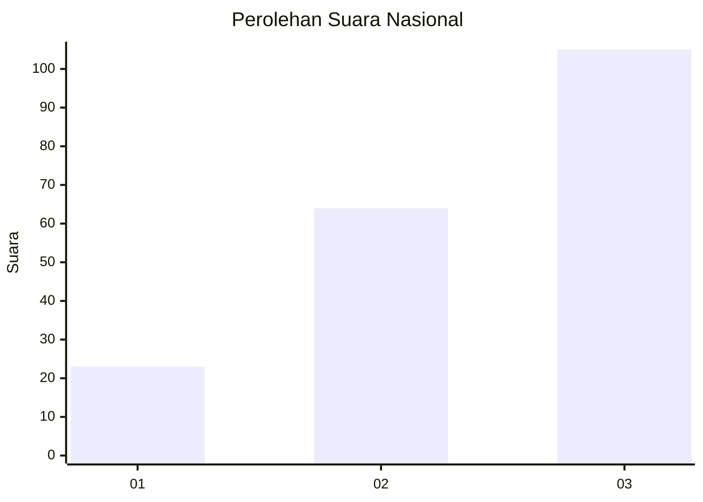
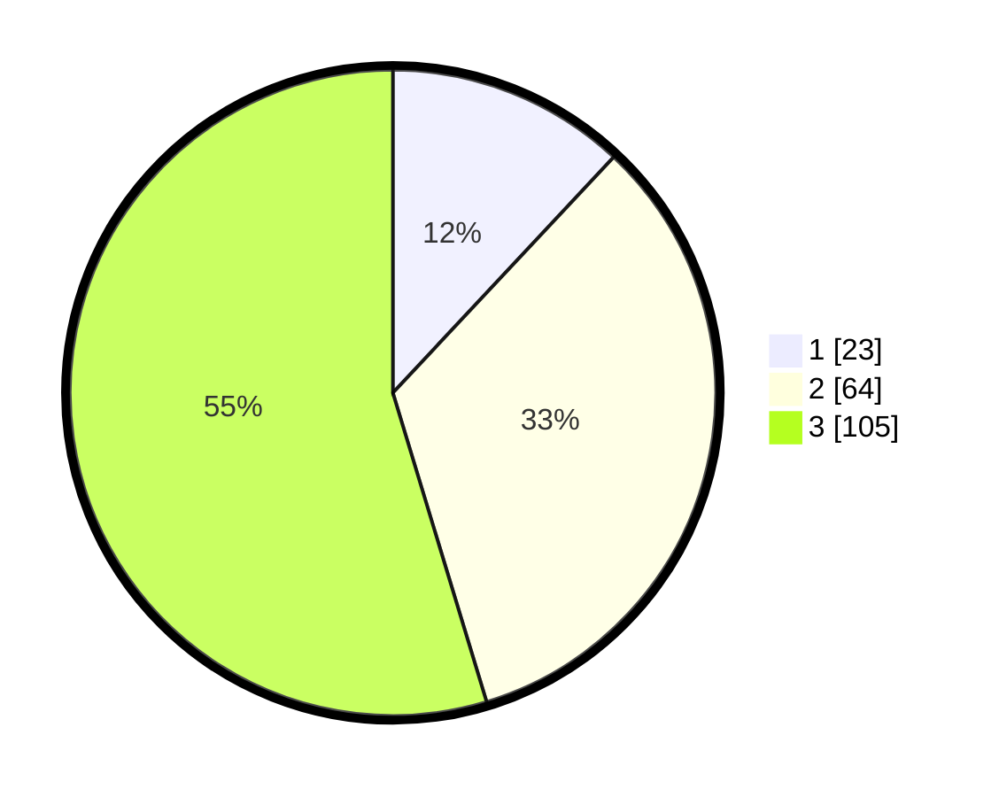

# Hasil

## Grafik

## Tabel

| No. | Nama Paslon    | Suara | Suara (raw) | Persentase |
|:--- |:-------------- | -----:| -----------:| ----------:|
| 1   | ANIES MUHAIMIN | 23    | [23][p-1]   | 11,98      |
| 2   | PRABOWO GIBRAN | 64    | [64][p-2]   | 33,33      |
| 3   | GANJAR MAHFUD  | 105   | [105][p-3]  | 54,69      |

[p-1]: https://github.com/gigit-pemilu/pemilu-2024/blob/main/pilpres/hitung-suara/sub/34-di-yogyakarta/sub/71-kota-yogyakarta/sub/11-pakualaman/sub/1001-purwokinanti/sub/003-tps/sub/paslon-1.txt
[p-2]: https://github.com/gigit-pemilu/pemilu-2024/blob/main/pilpres/hitung-suara/sub/34-di-yogyakarta/sub/71-kota-yogyakarta/sub/11-pakualaman/sub/1001-purwokinanti/sub/003-tps/sub/paslon-2.txt
[p-3]: https://github.com/gigit-pemilu/pemilu-2024/blob/main/pilpres/hitung-suara/sub/34-di-yogyakarta/sub/71-kota-yogyakarta/sub/11-pakualaman/sub/1001-purwokinanti/sub/003-tps/sub/paslon-3.txt

## Foto C Plano

https://sirekap-obj-formc.kpu.go.id/0e15/pemilu/ppwp/34/71/11/10/01/3471111001003-20240214-184721--5c715547-1e9a-4b3b-a55d-6e7bf8c00cba.jpg

https://sirekap-obj-formc.kpu.go.id/0e15/pemilu/ppwp/34/71/11/10/01/3471111001003-20240214-185409--f3302adc-66ad-4142-9f02-43805237759b.jpg

https://sirekap-obj-formc.kpu.go.id/0e15/pemilu/ppwp/34/71/11/10/01/3471111001003-20240214-185034--017dad73-9fcc-40af-9d92-a50b6d2ee7c7.jpg

## Metadata

| Key        | Value               |
| ---------- | ------------------- |
| Time Stamp | 2024-02-14 21:46:01 |

## DATA PEMILIH TETAP

Jumlah pemilih dalam DPT: **213**.
 * L: **98**.
 * P: **115**.

## DATA PENGGUNA HAK PILIH

Jumlah pengguna hak pilih dalam DPT: **188**.
 * L: **86**.
 * P: **102**.

Jumlah pengguna hak pilih dalam DPTb: **6**.
 * L: **3**.
 * P: **3**.

Jumlah pengguna hak pilih dalam DPK: **2**.
 * L: **1**.
 * P: **1**.

Jumlah pengguna hak pilih: **196**.
 * L: **90**.
 * P: **106**.

## JUMLAH SUARA SAH DAN TIDAK SAH

JUMLAH SELURUH SUARA SAH: **192**.

JUMLAH SUARA TIDAK SAH: **4**.

JUMLAH SELURUH SUARA SAH DAN SUARA TIDAK SAH: **196**.

