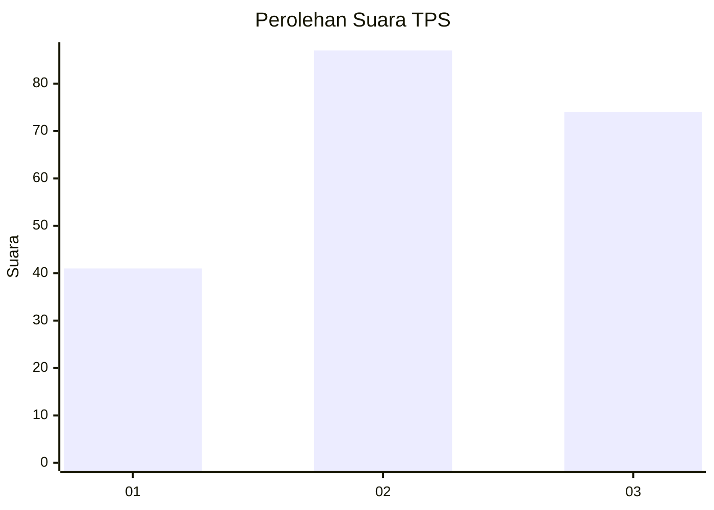
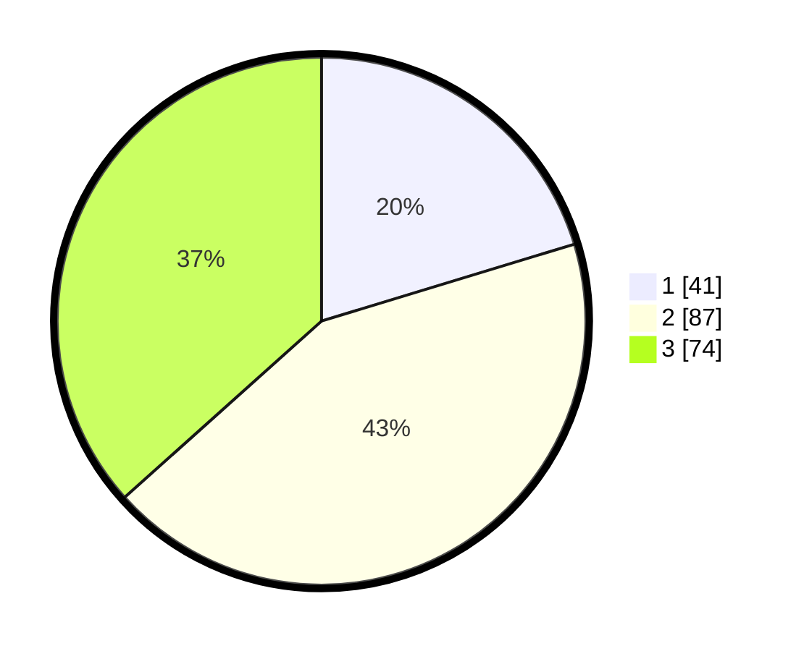

# Hasil

## Grafik

## Tabel

| No. | Nama Paslon    | Suara | Suara (raw) | Persentase |
|:--- |:-------------- | -----:| -----------:| ----------:|
| 1   | ANIES MUHAIMIN | 41    | [41][p-1]   | 20,30      |
| 2   | PRABOWO GIBRAN | 87    | [87][p-2]   | 43,07      |
| 3   | GANJAR MAHFUD  | 74    | [74][p-3]   | 36,63      |

[p-1]: https://github.com/gigit-pemilu/pemilu-2024-34-di-yogyakarta/blob/main/pilpres/hitung-suara/sub/34-di-yogyakarta/sub/71-kota-yogyakarta/sub/11-pakualaman/sub/1001-purwokinanti/sub/005-tps/sub/paslon-1.txt
[p-2]: https://github.com/gigit-pemilu/pemilu-2024-34-di-yogyakarta/blob/main/pilpres/hitung-suara/sub/34-di-yogyakarta/sub/71-kota-yogyakarta/sub/11-pakualaman/sub/1001-purwokinanti/sub/005-tps/sub/paslon-2.txt
[p-3]: https://github.com/gigit-pemilu/pemilu-2024-34-di-yogyakarta/blob/main/pilpres/hitung-suara/sub/34-di-yogyakarta/sub/71-kota-yogyakarta/sub/11-pakualaman/sub/1001-purwokinanti/sub/005-tps/sub/paslon-3.txt

## Foto C Plano

https://sirekap-obj-formc.kpu.go.id/0402/pemilu/ppwp/34/71/11/10/01/3471111001005-20240214-235934--9cb58879-bd61-45fa-93ed-e85ea7fb1124.jpg

https://sirekap-obj-formc.kpu.go.id/0402/pemilu/ppwp/34/71/11/10/01/3471111001005-20240215-000023--5c12baf0-120c-4e26-a604-b09962586b03.jpg

https://sirekap-obj-formc.kpu.go.id/0402/pemilu/ppwp/34/71/11/10/01/3471111001005-20240215-000124--35c39189-335d-4426-a686-f273695180b4.jpg

## Metadata

| Key        | Value               |
| ---------- | ------------------- |
| Time Stamp | 2024-02-15 16:30:25 |

## DATA PEMILIH TETAP

Jumlah pemilih dalam DPT: **254**.
 * L: **121**.
 * P: **133**.

## DATA PENGGUNA HAK PILIH

Jumlah pengguna hak pilih dalam DPT: **193**.
 * L: **92**.
 * P: **101**.

Jumlah pengguna hak pilih dalam DPTb: **9**.
 * L: **0**.
 * P: **9**.

Jumlah pengguna hak pilih dalam DPK: **2**.
 * L: **2**.
 * P: **0**.

Jumlah pengguna hak pilih: **204**.
 * L: **94**.
 * P: **110**.

## JUMLAH SUARA SAH DAN TIDAK SAH

JUMLAH SELURUH SUARA SAH: **202**.

JUMLAH SUARA TIDAK SAH: **2**.

JUMLAH SELURUH SUARA SAH DAN SUARA TIDAK SAH: **204**.

