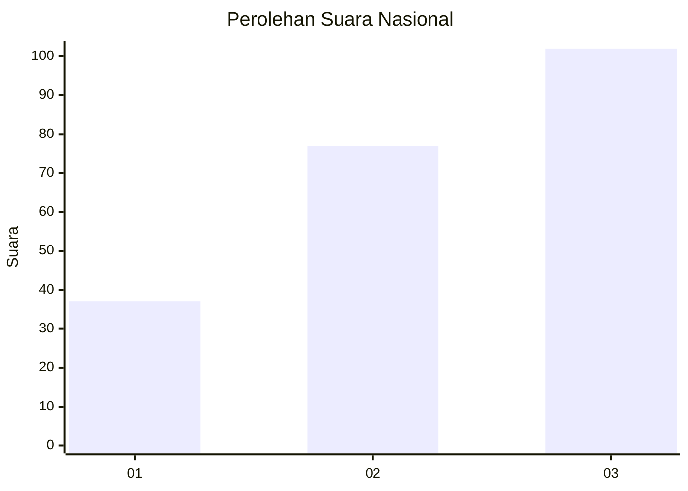
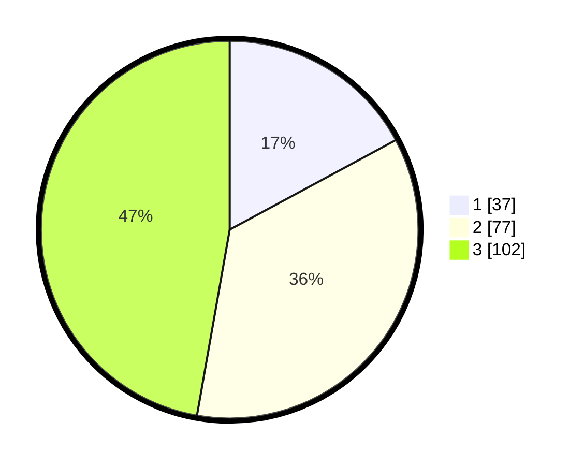

# Hasil

## Grafik

## Tabel

| No. | Nama Paslon    | Suara | Suara (raw) | Persentase |
|:--- |:-------------- | -----:| -----------:| ----------:|
| 1   | ANIES MUHAIMIN | 37    | [37][p-1]   | 17,13      |
| 2   | PRABOWO GIBRAN | 77    | [77][p-2]   | 35,65      |
| 3   | GANJAR MAHFUD  | 102   | [102][p-3]  | 47,22      |

[p-1]: https://github.com/gigit-pemilu/pemilu-2024/blob/main/pilpres/hitung-suara/sub/34-di-yogyakarta/sub/71-kota-yogyakarta/sub/11-pakualaman/sub/1001-purwokinanti/sub/012-tps/sub/paslon-1.txt
[p-2]: https://github.com/gigit-pemilu/pemilu-2024/blob/main/pilpres/hitung-suara/sub/34-di-yogyakarta/sub/71-kota-yogyakarta/sub/11-pakualaman/sub/1001-purwokinanti/sub/012-tps/sub/paslon-2.txt
[p-3]: https://github.com/gigit-pemilu/pemilu-2024/blob/main/pilpres/hitung-suara/sub/34-di-yogyakarta/sub/71-kota-yogyakarta/sub/11-pakualaman/sub/1001-purwokinanti/sub/012-tps/sub/paslon-3.txt

## Foto C Plano

https://sirekap-obj-formc.kpu.go.id/ffad/pemilu/ppwp/34/71/11/10/01/3471111001012-20240214-225000--1dddeda4-143b-4955-baf5-aa1605a39536.jpg

https://sirekap-obj-formc.kpu.go.id/ffad/pemilu/ppwp/34/71/11/10/01/3471111001012-20240215-074042--bfb330f2-46d3-4131-af9f-66ef217d7605.jpg

https://sirekap-obj-formc.kpu.go.id/ffad/pemilu/ppwp/34/71/11/10/01/3471111001012-20240214-225434--9a7f8b26-8a87-4fe1-bb62-5b65eee724d4.jpg

## Metadata

| Key        | Value               |
| ---------- | ------------------- |
| Time Stamp | 2024-02-19 06:16:00 |

