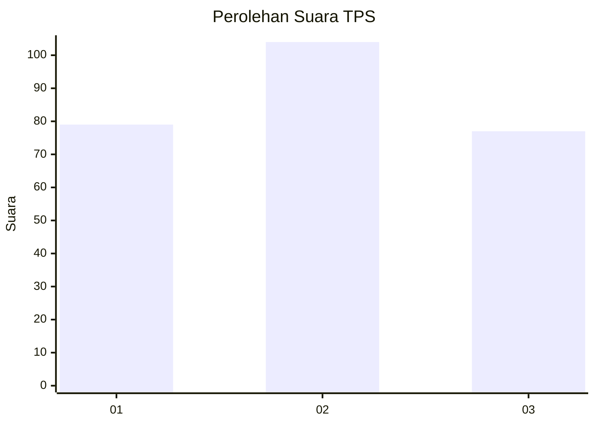
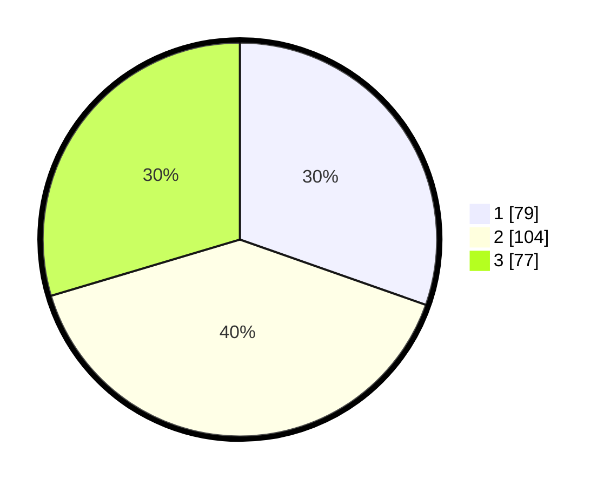

# Hasil

## Grafik

## Tabel

| No. | Nama Paslon    | Suara | Suara (raw) | Persentase |
|:--- |:-------------- | -----:| -----------:| ----------:|
| 1   | ANIES MUHAIMIN | 79    | [79][p-1]   | 30,38      |
| 2   | PRABOWO GIBRAN | 104   | [104][p-2]  | 40,00      |
| 3   | GANJAR MAHFUD  | 77    | [77][p-3]   | 29,62      |

[p-1]: https://github.com/gigit-pemilu/pemilu-2024-34-di-yogyakarta/blob/main/pilpres/hitung-suara/sub/34-di-yogyakarta/sub/71-kota-yogyakarta/sub/11-pakualaman/sub/1001-purwokinanti/sub/017-tps/sub/paslon-1.txt
[p-2]: https://github.com/gigit-pemilu/pemilu-2024-34-di-yogyakarta/blob/main/pilpres/hitung-suara/sub/34-di-yogyakarta/sub/71-kota-yogyakarta/sub/11-pakualaman/sub/1001-purwokinanti/sub/017-tps/sub/paslon-2.txt
[p-3]: https://github.com/gigit-pemilu/pemilu-2024-34-di-yogyakarta/blob/main/pilpres/hitung-suara/sub/34-di-yogyakarta/sub/71-kota-yogyakarta/sub/11-pakualaman/sub/1001-purwokinanti/sub/017-tps/sub/paslon-3.txt

## Foto C Plano

https://sirekap-obj-formc.kpu.go.id/1aeb/pemilu/ppwp/34/71/11/10/01/3471111001017-20240214-192256--bf53421d-1d25-48de-91b8-aff3870634f8.jpg

https://sirekap-obj-formc.kpu.go.id/1aeb/pemilu/ppwp/34/71/11/10/01/3471111001017-20240216-115930--d34b8c24-c2d8-44c2-aa8e-804ff7b1392b.jpg

https://sirekap-obj-formc.kpu.go.id/1aeb/pemilu/ppwp/34/71/11/10/01/3471111001017-20240214-192325--2b2fd88b-c3e0-4421-ac5d-8f70495315cd.jpg

## Metadata

| Key        | Value               |
| ---------- | ------------------- |
| Time Stamp | 2024-02-16 21:01:00 |

## DATA PEMILIH TETAP

Jumlah pemilih dalam DPT: **295**.
 * L: **132**.
 * P: **163**.

## DATA PENGGUNA HAK PILIH

Jumlah pengguna hak pilih dalam DPT: **245**.
 * L: **106**.
 * P: **139**.

Jumlah pengguna hak pilih dalam DPTb: **20**.
 * L: **13**.
 * P: **7**.

Jumlah pengguna hak pilih dalam DPK: **2**.
 * L: **1**.
 * P: **1**.

Jumlah pengguna hak pilih: **267**.
 * L: **120**.
 * P: **147**.

## JUMLAH SUARA SAH DAN TIDAK SAH

JUMLAH SELURUH SUARA SAH: **260**.

JUMLAH SUARA TIDAK SAH: **7**.

JUMLAH SELURUH SUARA SAH DAN SUARA TIDAK SAH: **267**.

