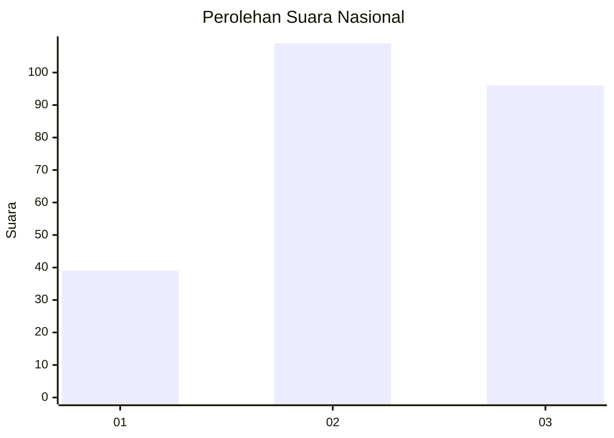
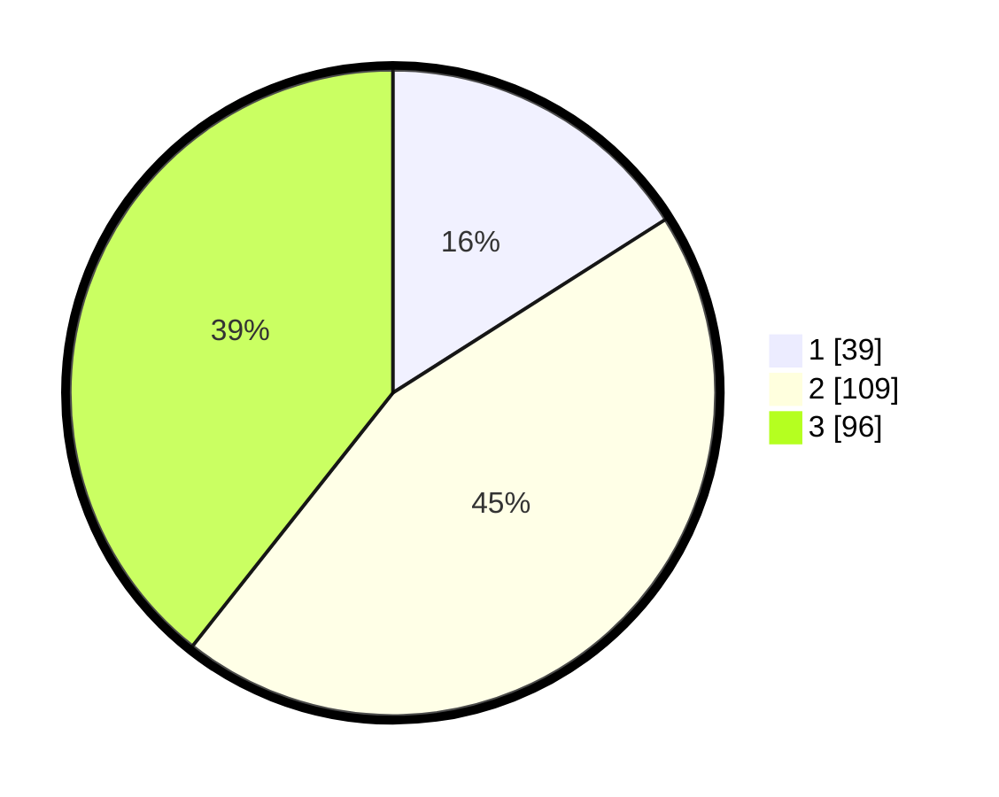

# Hasil

## Grafik

## Tabel

| No. | Nama Paslon    | Suara | Suara (raw) | Persentase |
|:--- |:-------------- | -----:| -----------:| ----------:|
| 1   | ANIES MUHAIMIN | 39    | [39][p-1]   | 15,98      |
| 2   | PRABOWO GIBRAN | 109   | [109][p-2]  | 44,67      |
| 3   | GANJAR MAHFUD  | 96    | [96][p-3]   | 39,34      |

[p-1]: https://github.com/gigit-pemilu/pemilu-2024/blob/main/pilpres/hitung-suara/sub/34-di-yogyakarta/sub/71-kota-yogyakarta/sub/11-pakualaman/sub/1002-gunungketur/sub/001-tps/sub/paslon-1.txt
[p-2]: https://github.com/gigit-pemilu/pemilu-2024/blob/main/pilpres/hitung-suara/sub/34-di-yogyakarta/sub/71-kota-yogyakarta/sub/11-pakualaman/sub/1002-gunungketur/sub/001-tps/sub/paslon-2.txt
[p-3]: https://github.com/gigit-pemilu/pemilu-2024/blob/main/pilpres/hitung-suara/sub/34-di-yogyakarta/sub/71-kota-yogyakarta/sub/11-pakualaman/sub/1002-gunungketur/sub/001-tps/sub/paslon-3.txt

## Foto C Plano

https://sirekap-obj-formc.kpu.go.id/6d3a/pemilu/ppwp/34/71/11/10/02/3471111002001-20240216-132112--82b28710-58d5-459a-81b7-ea359824e5ab.jpg

https://sirekap-obj-formc.kpu.go.id/6d3a/pemilu/ppwp/34/71/11/10/02/3471111002001-20240216-184235--f7d7a183-79e9-422b-97d3-e9ad50203b14.jpg

https://sirekap-obj-formc.kpu.go.id/6d3a/pemilu/ppwp/34/71/11/10/02/3471111002001-20240214-210013--f561ff5d-4fc0-4fa3-80f2-c211e32642fc.jpg

## Metadata

| Key        | Value               |
| ---------- | ------------------- |
| Time Stamp | 2024-02-16 21:01:00 |

