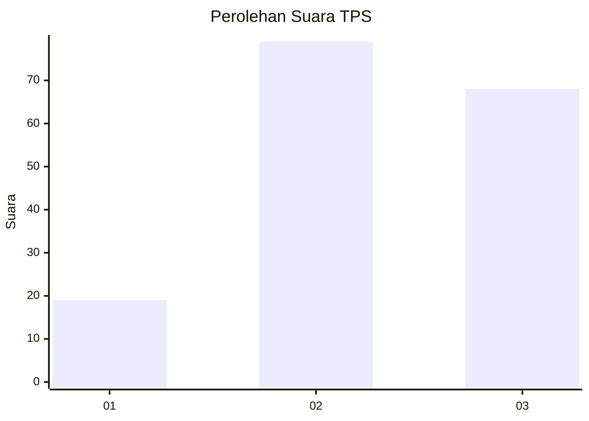
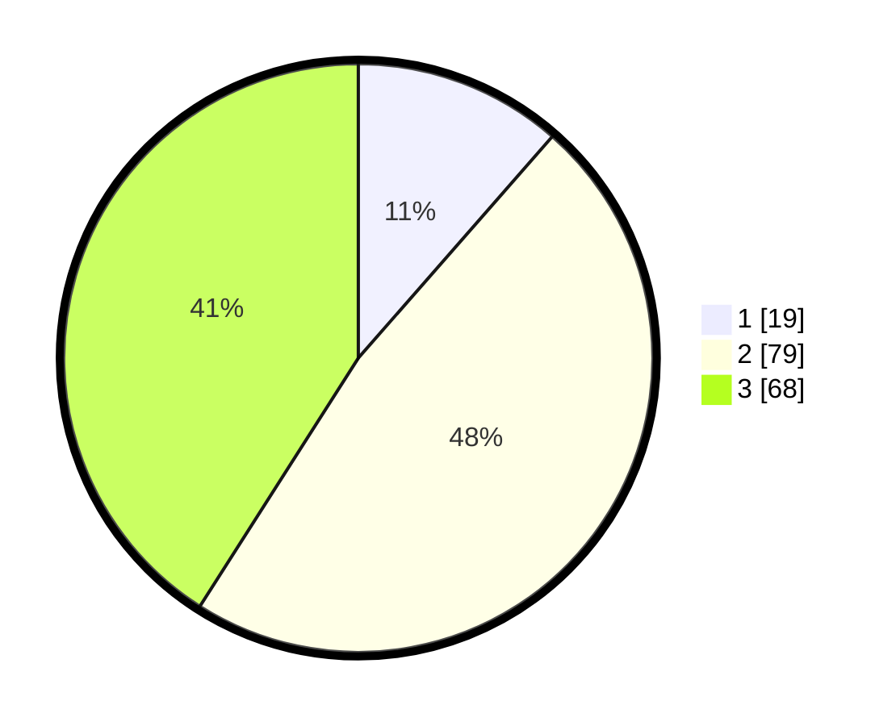

# Hasil

## Grafik

## Tabel

| No. | Nama Paslon    | Suara | Suara (raw) | Persentase |
|:--- |:-------------- | -----:| -----------:| ----------:|
| 1   | ANIES MUHAIMIN | 19    | [19][p-1]   | 11,45      |
| 2   | PRABOWO GIBRAN | 79    | [79][p-2]   | 47,59      |
| 3   | GANJAR MAHFUD  | 68    | [68][p-3]   | 40,96      |

[p-1]: https://github.com/gigit-pemilu/pemilu-2024-34-di-yogyakarta/blob/main/pilpres/hitung-suara/sub/34-di-yogyakarta/sub/71-kota-yogyakarta/sub/11-pakualaman/sub/1002-gunungketur/sub/003-tps/sub/paslon-1.txt
[p-2]: https://github.com/gigit-pemilu/pemilu-2024-34-di-yogyakarta/blob/main/pilpres/hitung-suara/sub/34-di-yogyakarta/sub/71-kota-yogyakarta/sub/11-pakualaman/sub/1002-gunungketur/sub/003-tps/sub/paslon-2.txt
[p-3]: https://github.com/gigit-pemilu/pemilu-2024-34-di-yogyakarta/blob/main/pilpres/hitung-suara/sub/34-di-yogyakarta/sub/71-kota-yogyakarta/sub/11-pakualaman/sub/1002-gunungketur/sub/003-tps/sub/paslon-3.txt

## Foto C Plano

https://sirekap-obj-formc.kpu.go.id/cabe/pemilu/ppwp/34/71/11/10/02/3471111002003-20240215-003415--bdca8b24-ac5b-4528-84bc-d035c89ef24e.jpg

https://sirekap-obj-formc.kpu.go.id/cabe/pemilu/ppwp/34/71/11/10/02/3471111002003-20240215-003536--a85aea64-ca0a-4535-9f52-07d3757e6bc3.jpg

https://sirekap-obj-formc.kpu.go.id/cabe/pemilu/ppwp/34/71/11/10/02/3471111002003-20240214-231045--fe5f0b33-8819-406f-a4c2-6f3ac831bf47.jpg

## Metadata

| Key        | Value               |
| ---------- | ------------------- |
| Time Stamp | 2024-02-19 06:16:00 |

