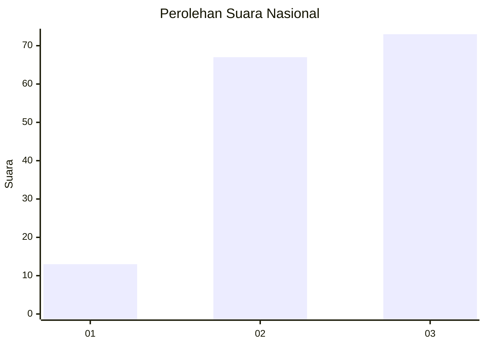
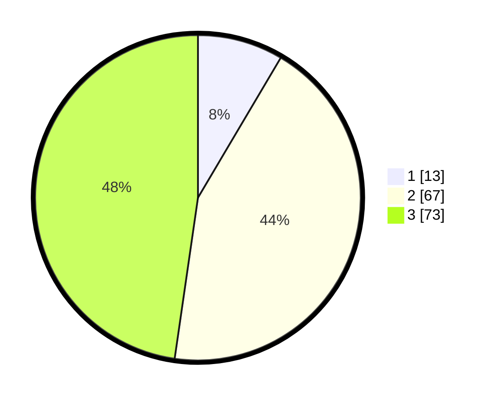

# Hasil

## Grafik

## Tabel

| No. | Nama Paslon    | Suara | Suara (raw) | Persentase |
|:--- |:-------------- | -----:| -----------:| ----------:|
| 1   | ANIES MUHAIMIN | 13    | [13][p-1]   | 8,50       |
| 2   | PRABOWO GIBRAN | 67    | [67][p-2]   | 43,79      |
| 3   | GANJAR MAHFUD  | 73    | [73][p-3]   | 47,71      |

[p-1]: https://github.com/gigit-pemilu/pemilu-2024/blob/main/pilpres/hitung-suara/sub/34-di-yogyakarta/sub/71-kota-yogyakarta/sub/11-pakualaman/sub/1002-gunungketur/sub/903-tps/sub/paslon-1.txt
[p-2]: https://github.com/gigit-pemilu/pemilu-2024/blob/main/pilpres/hitung-suara/sub/34-di-yogyakarta/sub/71-kota-yogyakarta/sub/11-pakualaman/sub/1002-gunungketur/sub/903-tps/sub/paslon-2.txt
[p-3]: https://github.com/gigit-pemilu/pemilu-2024/blob/main/pilpres/hitung-suara/sub/34-di-yogyakarta/sub/71-kota-yogyakarta/sub/11-pakualaman/sub/1002-gunungketur/sub/903-tps/sub/paslon-3.txt

## Foto C Plano

https://sirekap-obj-formc.kpu.go.id/769e/pemilu/ppwp/34/71/11/10/02/3471111002903-20240214-194845--453fa05e-02c1-42b1-ad6f-f07472ec537c.jpg

https://sirekap-obj-formc.kpu.go.id/769e/pemilu/ppwp/34/71/11/10/02/3471111002903-20240214-195927--8c6cc9c8-65f2-4895-96c9-8eb7a6bb71fc.jpg

https://sirekap-obj-formc.kpu.go.id/769e/pemilu/ppwp/34/71/11/10/02/3471111002903-20240214-195113--09d32c4e-b17b-4f59-868f-364913700e36.jpg

## Metadata

| Key        | Value               |
| ---------- | ------------------- |
| Time Stamp | 2024-02-19 06:16:00 |

## DATA PEMILIH TETAP

Jumlah pemilih dalam DPT: **156**.
 * L: **156**.
 * P: **0**.

## DATA PENGGUNA HAK PILIH

Jumlah pengguna hak pilih dalam DPT: **6**.
 * L: **6**.
 * P: **0**.

Jumlah pengguna hak pilih dalam DPTb: **152**.
 * L: **152**.
 * P: **0**.

Jumlah pengguna hak pilih dalam DPK: **2**.
 * L: **2**.
 * P: **0**.

Jumlah pengguna hak pilih: **160**.
 * L: **160**.
 * P: **0**.

## JUMLAH SUARA SAH DAN TIDAK SAH

JUMLAH SELURUH SUARA SAH: **153**.

JUMLAH SUARA TIDAK SAH: **7**.

JUMLAH SELURUH SUARA SAH DAN SUARA TIDAK SAH: **160**.

