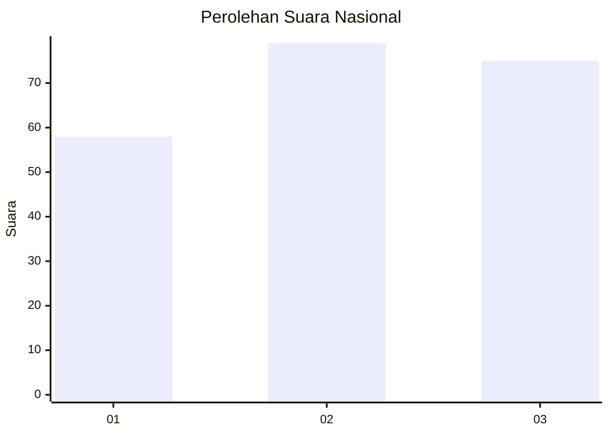
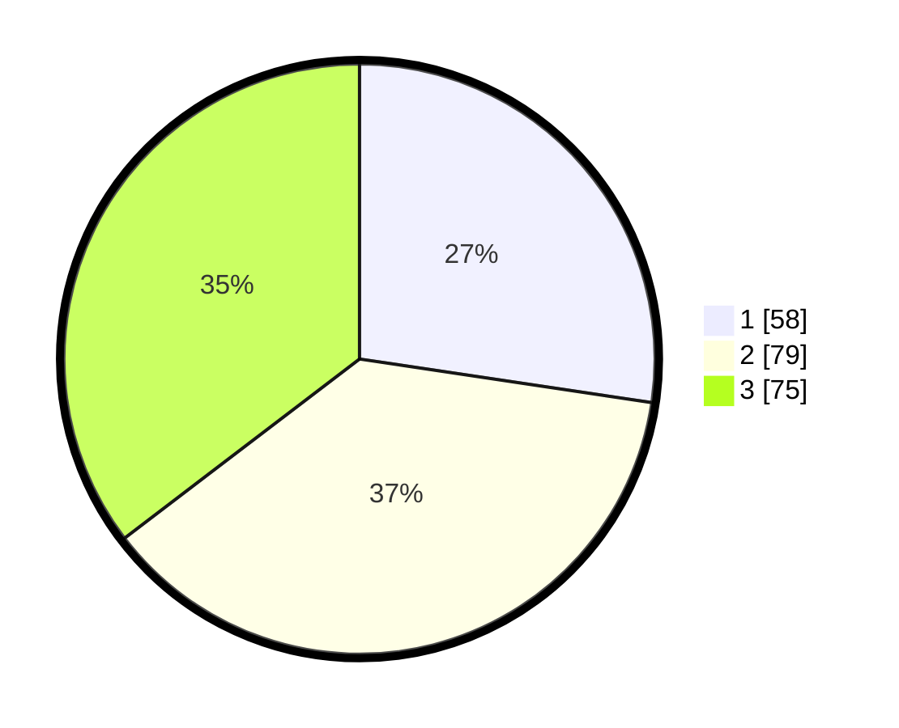

# Hasil

## Grafik

## Tabel

| No. | Nama Paslon    | Suara | Suara (raw) | Persentase |
|:--- |:-------------- | -----:| -----------:| ----------:|
| 1   | ANIES MUHAIMIN | 58    | [58][p-1]   | 27,36      |
| 2   | PRABOWO GIBRAN | 79    | [79][p-2]   | 37,26      |
| 3   | GANJAR MAHFUD  | 75    | [75][p-3]   | 35,38      |

[p-1]: https://github.com/gigit-pemilu/pemilu-2024/blob/main/pilpres/hitung-suara/sub/34-di-yogyakarta/sub/71-kota-yogyakarta/sub/12-mergangsan/sub/1001-keparakan/sub/002-tps/sub/paslon-1.txt
[p-2]: https://github.com/gigit-pemilu/pemilu-2024/blob/main/pilpres/hitung-suara/sub/34-di-yogyakarta/sub/71-kota-yogyakarta/sub/12-mergangsan/sub/1001-keparakan/sub/002-tps/sub/paslon-2.txt
[p-3]: https://github.com/gigit-pemilu/pemilu-2024/blob/main/pilpres/hitung-suara/sub/34-di-yogyakarta/sub/71-kota-yogyakarta/sub/12-mergangsan/sub/1001-keparakan/sub/002-tps/sub/paslon-3.txt

## Foto C Plano

https://sirekap-obj-formc.kpu.go.id/8d17/pemilu/ppwp/34/71/12/10/01/3471121001002-20240215-000138--cd3a39d5-2857-4751-b988-adc99ceb08d7.jpg

https://sirekap-obj-formc.kpu.go.id/8d17/pemilu/ppwp/34/71/12/10/01/3471121001002-20240215-000415--d9e6b1b7-5263-4d36-bbfc-93f48d626a51.jpg

https://sirekap-obj-formc.kpu.go.id/8d17/pemilu/ppwp/34/71/12/10/01/3471121001002-20240215-000639--2cab1a7a-09f6-46bb-a02e-65b09d4a230a.jpg

## Metadata

| Key        | Value               |
| ---------- | ------------------- |
| Time Stamp | 2024-02-24 22:31:28 |

## DATA PEMILIH TETAP

Jumlah pemilih dalam DPT: **266**.
 * L: **130**.
 * P: **136**.

## DATA PENGGUNA HAK PILIH

Jumlah pengguna hak pilih dalam DPT: **221**.
 * L: **107**.
 * P: **114**.

Jumlah pengguna hak pilih dalam DPTb: **13**.
 * L: **2**.
 * P: **11**.

Jumlah pengguna hak pilih dalam DPK: **3**.
 * L: **1**.
 * P: **2**.

Jumlah pengguna hak pilih: **237**.
 * L: **110**.
 * P: **127**.

## JUMLAH SUARA SAH DAN TIDAK SAH

JUMLAH SELURUH SUARA SAH: **232**.

JUMLAH SUARA TIDAK SAH: **5**.

JUMLAH SELURUH SUARA SAH DAN SUARA TIDAK SAH: **237**.

