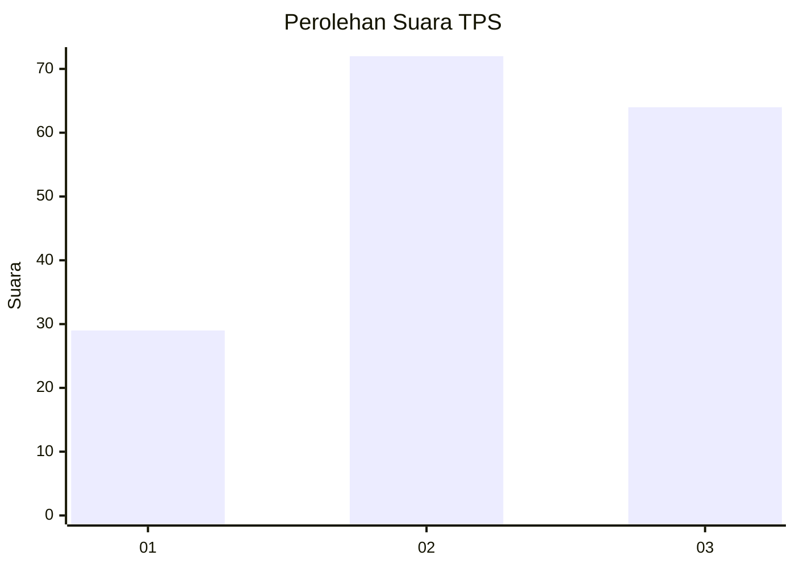
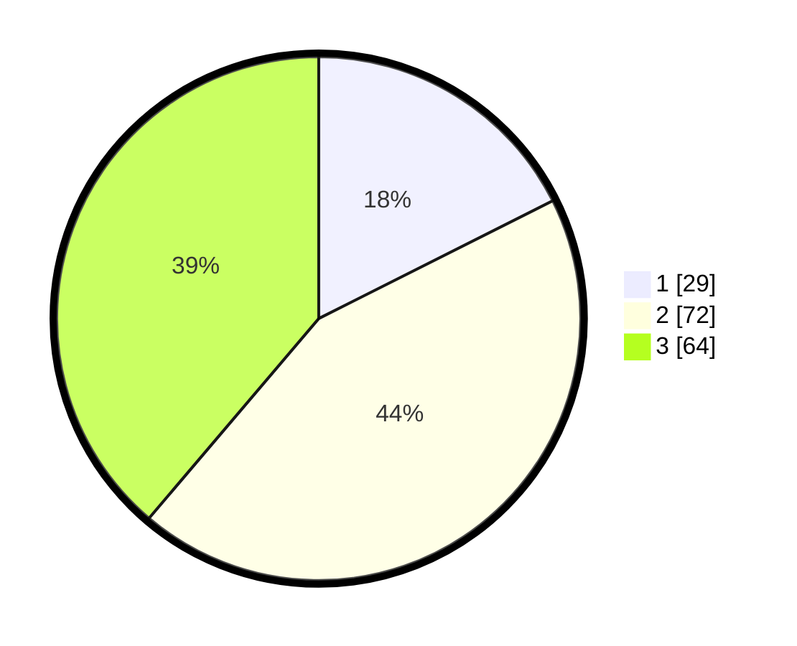

# Hasil

## Grafik

## Tabel

| No. | Nama Paslon    | Suara | Suara (raw) | Persentase |
|:--- |:-------------- | -----:| -----------:| ----------:|
| 1   | ANIES MUHAIMIN | 29    | [29][p-1]   | 17,58      |
| 2   | PRABOWO GIBRAN | 72    | [72][p-2]   | 43,64      |
| 3   | GANJAR MAHFUD  | 64    | [64][p-3]   | 38,79      |

[p-1]: https://github.com/gigit-pemilu/pemilu-2024-34-di-yogyakarta/blob/main/pilpres/hitung-suara/sub/34-di-yogyakarta/sub/71-kota-yogyakarta/sub/12-mergangsan/sub/1001-keparakan/sub/004-tps/sub/paslon-1.txt
[p-2]: https://github.com/gigit-pemilu/pemilu-2024-34-di-yogyakarta/blob/main/pilpres/hitung-suara/sub/34-di-yogyakarta/sub/71-kota-yogyakarta/sub/12-mergangsan/sub/1001-keparakan/sub/004-tps/sub/paslon-2.txt
[p-3]: https://github.com/gigit-pemilu/pemilu-2024-34-di-yogyakarta/blob/main/pilpres/hitung-suara/sub/34-di-yogyakarta/sub/71-kota-yogyakarta/sub/12-mergangsan/sub/1001-keparakan/sub/004-tps/sub/paslon-3.txt

## Foto C Plano

https://sirekap-obj-formc.kpu.go.id/9ca1/pemilu/ppwp/34/71/12/10/01/3471121001004-20240215-012137--7a093bee-f14b-4d89-a371-5acb0182f57a.jpg

https://sirekap-obj-formc.kpu.go.id/9ca1/pemilu/ppwp/34/71/12/10/01/3471121001004-20240215-012251--53cf69e7-2d87-47de-8f5e-9465ec34ede9.jpg

https://sirekap-obj-formc.kpu.go.id/9ca1/pemilu/ppwp/34/71/12/10/01/3471121001004-20240215-012431--7fe04e57-a28c-49ac-9e3a-a94ee9865e9b.jpg

## Metadata

| Key        | Value               |
| ---------- | ------------------- |
| Time Stamp | 2024-02-24 22:31:28 |

