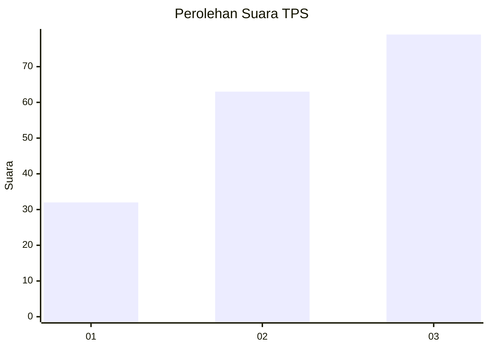
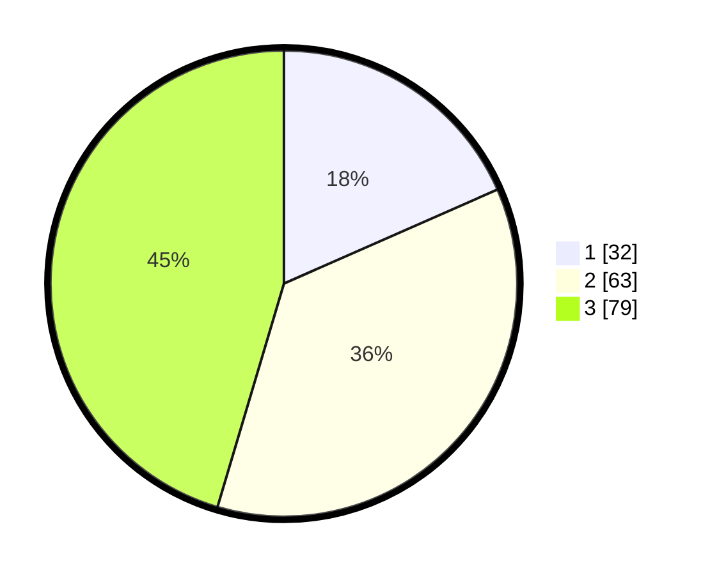

# Hasil

## Grafik

## Tabel

| No. | Nama Paslon    | Suara | Suara (raw) | Persentase |
|:--- |:-------------- | -----:| -----------:| ----------:|
| 1   | ANIES MUHAIMIN | 32    | [32][p-1]   | 18,39      |
| 2   | PRABOWO GIBRAN | 63    | [63][p-2]   | 36,21      |
| 3   | GANJAR MAHFUD  | 79    | [79][p-3]   | 45,40      |

[p-1]: https://github.com/gigit-pemilu/pemilu-2024-34-di-yogyakarta/blob/main/pilpres/hitung-suara/sub/34-di-yogyakarta/sub/71-kota-yogyakarta/sub/12-mergangsan/sub/1001-keparakan/sub/012-tps/sub/paslon-1.txt
[p-2]: https://github.com/gigit-pemilu/pemilu-2024-34-di-yogyakarta/blob/main/pilpres/hitung-suara/sub/34-di-yogyakarta/sub/71-kota-yogyakarta/sub/12-mergangsan/sub/1001-keparakan/sub/012-tps/sub/paslon-2.txt
[p-3]: https://github.com/gigit-pemilu/pemilu-2024-34-di-yogyakarta/blob/main/pilpres/hitung-suara/sub/34-di-yogyakarta/sub/71-kota-yogyakarta/sub/12-mergangsan/sub/1001-keparakan/sub/012-tps/sub/paslon-3.txt

## Foto C Plano

https://sirekap-obj-formc.kpu.go.id/3f22/pemilu/ppwp/34/71/12/10/01/3471121001012-20240214-221022--8c754037-6143-499e-afe8-ecadddbc7fc6.jpg

https://sirekap-obj-formc.kpu.go.id/3f22/pemilu/ppwp/34/71/12/10/01/3471121001012-20240214-205305--34c086d7-0534-4211-bd63-10c584dd5ce3.jpg

https://sirekap-obj-formc.kpu.go.id/3f22/pemilu/ppwp/34/71/12/10/01/3471121001012-20240214-205452--8be347d2-abe8-402e-9cfc-a401b41f7028.jpg

## Metadata

| Key        | Value               |
| ---------- | ------------------- |
| Time Stamp | 2024-02-15 00:41:44 |

