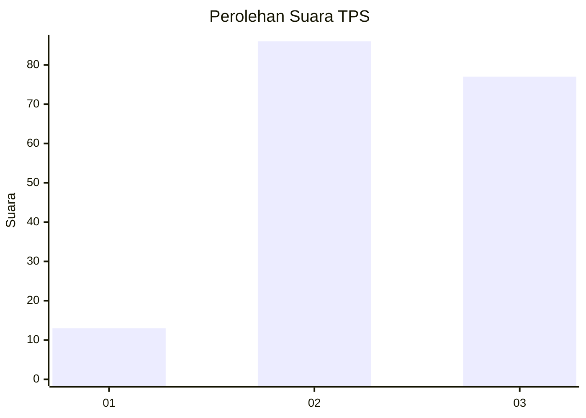
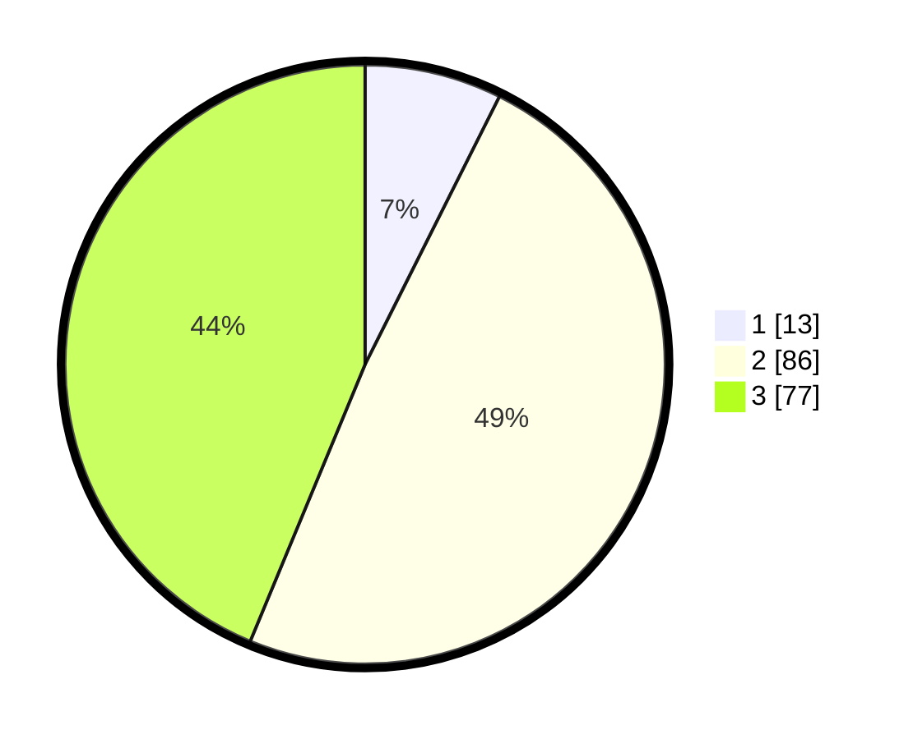

# Hasil

## Grafik

## Tabel

| No. | Nama Paslon    | Suara | Suara (raw) | Persentase |
|:--- |:-------------- | -----:| -----------:| ----------:|
| 1   | ANIES MUHAIMIN | 13    | [13][p-1]   | 7,39       |
| 2   | PRABOWO GIBRAN | 86    | [86][p-2]   | 48,86      |
| 3   | GANJAR MAHFUD  | 77    | [77][p-3]   | 43,75      |

[p-1]: https://github.com/gigit-pemilu/pemilu-2024-34-di-yogyakarta/blob/main/pilpres/hitung-suara/sub/34-di-yogyakarta/sub/71-kota-yogyakarta/sub/12-mergangsan/sub/1001-keparakan/sub/013-tps/sub/paslon-1.txt
[p-2]: https://github.com/gigit-pemilu/pemilu-2024-34-di-yogyakarta/blob/main/pilpres/hitung-suara/sub/34-di-yogyakarta/sub/71-kota-yogyakarta/sub/12-mergangsan/sub/1001-keparakan/sub/013-tps/sub/paslon-2.txt
[p-3]: https://github.com/gigit-pemilu/pemilu-2024-34-di-yogyakarta/blob/main/pilpres/hitung-suara/sub/34-di-yogyakarta/sub/71-kota-yogyakarta/sub/12-mergangsan/sub/1001-keparakan/sub/013-tps/sub/paslon-3.txt

## Foto C Plano

https://sirekap-obj-formc.kpu.go.id/0f3e/pemilu/ppwp/34/71/12/10/01/3471121001013-20240215-041631--a4bdf277-a22b-4008-be29-a3cf8043e263.jpg

https://sirekap-obj-formc.kpu.go.id/0f3e/pemilu/ppwp/34/71/12/10/01/3471121001013-20240215-041723--ee18148d-c50e-4bf1-9c3c-3a203872958c.jpg

https://sirekap-obj-formc.kpu.go.id/0f3e/pemilu/ppwp/34/71/12/10/01/3471121001013-20240215-041817--adcc1491-c961-4549-8d83-abca6f4912ca.jpg

## Metadata

| Key        | Value               |
| ---------- | ------------------- |
| Time Stamp | 2024-02-24 22:31:28 |

