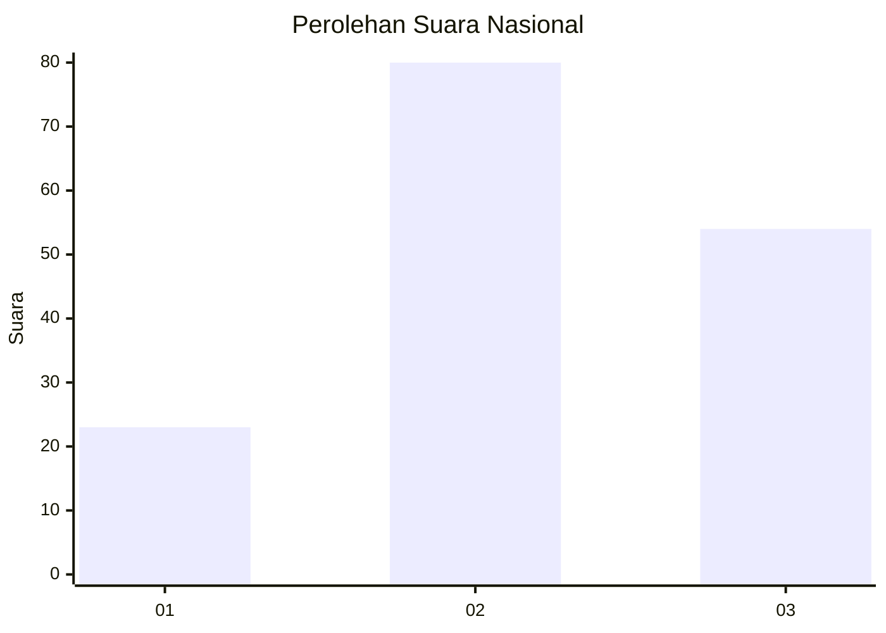
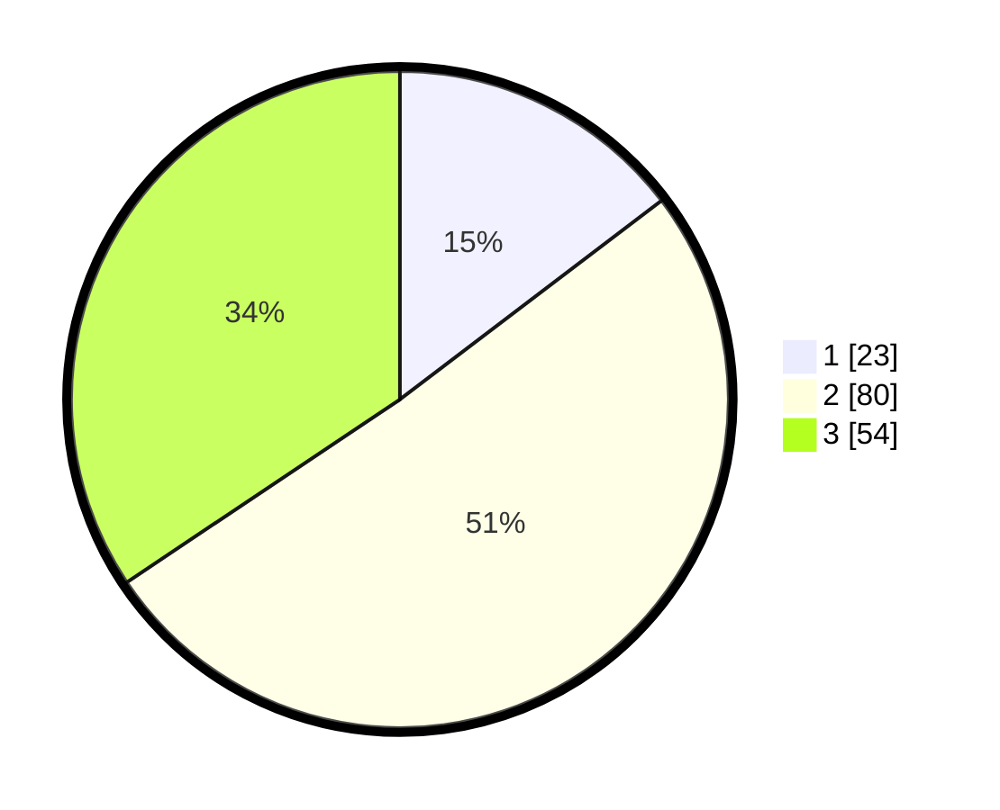

# Hasil

## Grafik

## Tabel

| No. | Nama Paslon    | Suara | Suara (raw) | Persentase |
|:--- |:-------------- | -----:| -----------:| ----------:|
| 1   | ANIES MUHAIMIN | 23    | [23][p-1]   | 14,65      |
| 2   | PRABOWO GIBRAN | 80    | [80][p-2]   | 50,96      |
| 3   | GANJAR MAHFUD  | 54    | [54][p-3]   | 34,39      |

[p-1]: https://github.com/gigit-pemilu/pemilu-2024/blob/main/pilpres/hitung-suara/sub/34-di-yogyakarta/sub/71-kota-yogyakarta/sub/12-mergangsan/sub/1001-keparakan/sub/019-tps/sub/paslon-1.txt
[p-2]: https://github.com/gigit-pemilu/pemilu-2024/blob/main/pilpres/hitung-suara/sub/34-di-yogyakarta/sub/71-kota-yogyakarta/sub/12-mergangsan/sub/1001-keparakan/sub/019-tps/sub/paslon-2.txt
[p-3]: https://github.com/gigit-pemilu/pemilu-2024/blob/main/pilpres/hitung-suara/sub/34-di-yogyakarta/sub/71-kota-yogyakarta/sub/12-mergangsan/sub/1001-keparakan/sub/019-tps/sub/paslon-3.txt

## Foto C Plano

https://sirekap-obj-formc.kpu.go.id/abfc/pemilu/ppwp/34/71/12/10/01/3471121001019-20240214-190819--adee7dd0-1e17-435b-b276-3132a55252a7.jpg

https://sirekap-obj-formc.kpu.go.id/abfc/pemilu/ppwp/34/71/12/10/01/3471121001019-20240214-193126--bcb921a8-c189-4f1c-9666-2f83d2524c10.jpg

https://sirekap-obj-formc.kpu.go.id/abfc/pemilu/ppwp/34/71/12/10/01/3471121001019-20240214-190857--743f5d15-3f70-4ba0-981e-f4ca6e336243.jpg

## Metadata

| Key        | Value               |
| ---------- | ------------------- |
| Time Stamp | 2024-02-14 21:46:01 |

