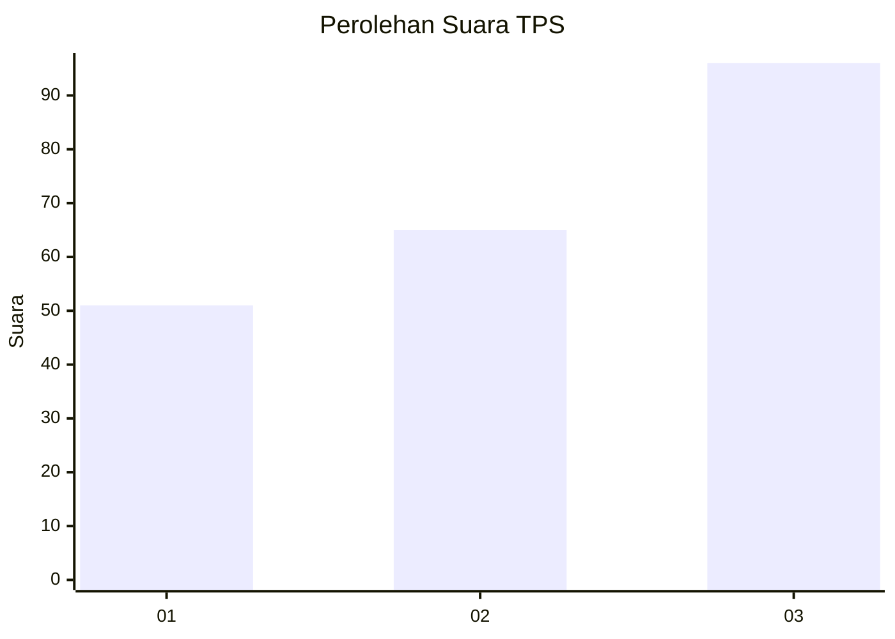
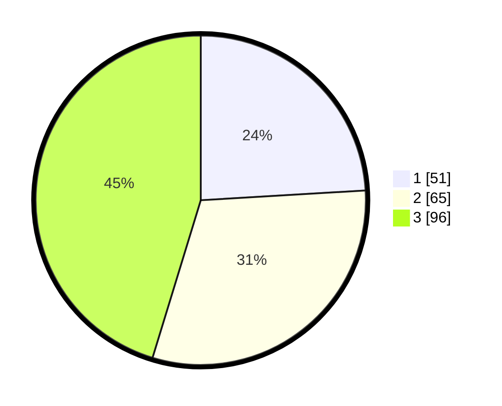

# Hasil

## Grafik

## Tabel

| No. | Nama Paslon    | Suara | Suara (raw) | Persentase |
|:--- |:-------------- | -----:| -----------:| ----------:|
| 1   | ANIES MUHAIMIN | 51    | [51][p-1]   | 24,06      |
| 2   | PRABOWO GIBRAN | 65    | [65][p-2]   | 30,66      |
| 3   | GANJAR MAHFUD  | 96    | [96][p-3]   | 45,28      |

[p-1]: https://github.com/gigit-pemilu/pemilu-2024-34-di-yogyakarta/blob/main/pilpres/hitung-suara/sub/34-di-yogyakarta/sub/71-kota-yogyakarta/sub/12-mergangsan/sub/1001-keparakan/sub/027-tps/sub/paslon-1.txt
[p-2]: https://github.com/gigit-pemilu/pemilu-2024-34-di-yogyakarta/blob/main/pilpres/hitung-suara/sub/34-di-yogyakarta/sub/71-kota-yogyakarta/sub/12-mergangsan/sub/1001-keparakan/sub/027-tps/sub/paslon-2.txt
[p-3]: https://github.com/gigit-pemilu/pemilu-2024-34-di-yogyakarta/blob/main/pilpres/hitung-suara/sub/34-di-yogyakarta/sub/71-kota-yogyakarta/sub/12-mergangsan/sub/1001-keparakan/sub/027-tps/sub/paslon-3.txt

## Foto C Plano

https://sirekap-obj-formc.kpu.go.id/35ff/pemilu/ppwp/34/71/12/10/01/3471121001027-20240216-172913--6cc5ab0b-a47d-469e-b66b-e97f931ee52a.jpg

https://sirekap-obj-formc.kpu.go.id/35ff/pemilu/ppwp/34/71/12/10/01/3471121001027-20240216-154222--3b42a29d-b7cd-4d76-8112-5f2592dd218f.jpg

https://sirekap-obj-formc.kpu.go.id/35ff/pemilu/ppwp/34/71/12/10/01/3471121001027-20240216-153754--c7bc24b5-0403-412c-8aaf-615916c2ca3e.jpg

## Metadata

| Key        | Value               |
| ---------- | ------------------- |
| Time Stamp | 2024-02-17 16:00:02 |

