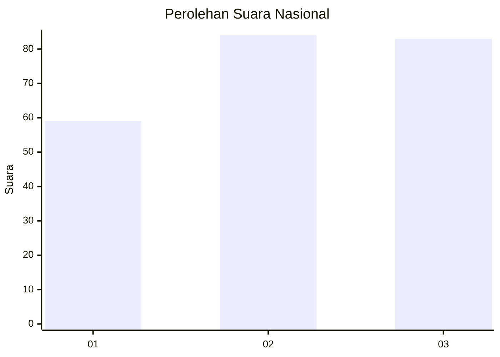
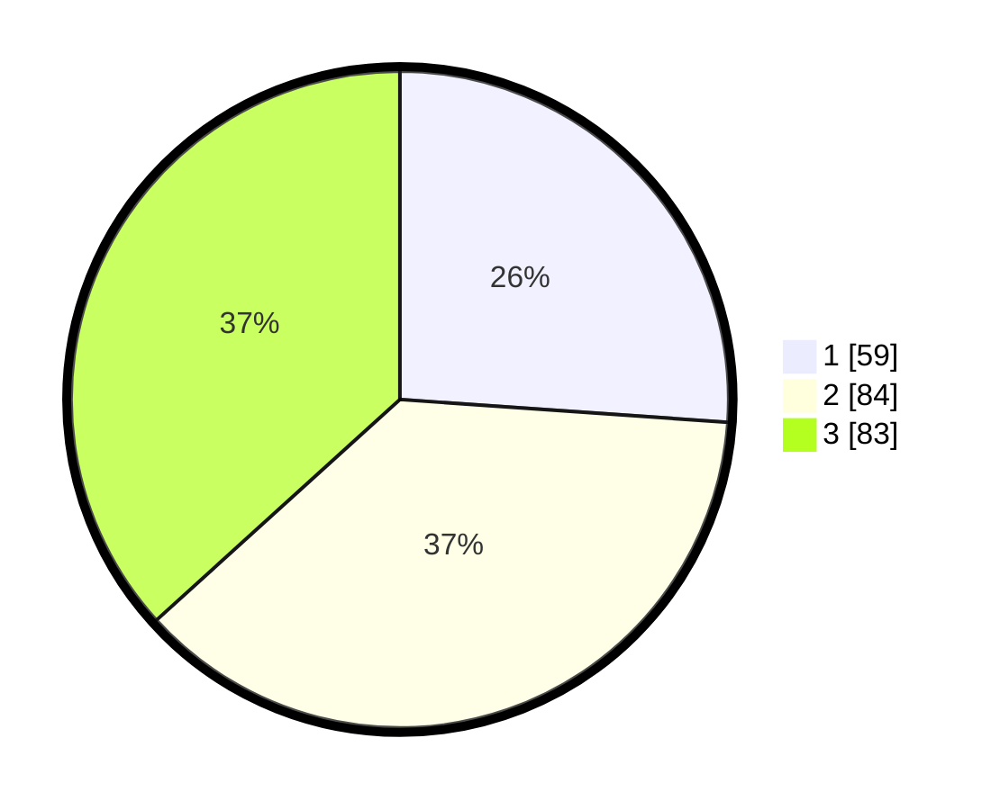

# Hasil

## Grafik

## Tabel

| No. | Nama Paslon    | Suara | Suara (raw) | Persentase |
|:--- |:-------------- | -----:| -----------:| ----------:|
| 1   | ANIES MUHAIMIN | 59    | [59][p-1]   | 26,11      |
| 2   | PRABOWO GIBRAN | 84    | [84][p-2]   | 37,17      |
| 3   | GANJAR MAHFUD  | 83    | [83][p-3]   | 36,73      |

[p-1]: https://github.com/gigit-pemilu/pemilu-2024/blob/main/pilpres/hitung-suara/sub/34-di-yogyakarta/sub/71-kota-yogyakarta/sub/12-mergangsan/sub/1001-keparakan/sub/028-tps/sub/paslon-1.txt
[p-2]: https://github.com/gigit-pemilu/pemilu-2024/blob/main/pilpres/hitung-suara/sub/34-di-yogyakarta/sub/71-kota-yogyakarta/sub/12-mergangsan/sub/1001-keparakan/sub/028-tps/sub/paslon-2.txt
[p-3]: https://github.com/gigit-pemilu/pemilu-2024/blob/main/pilpres/hitung-suara/sub/34-di-yogyakarta/sub/71-kota-yogyakarta/sub/12-mergangsan/sub/1001-keparakan/sub/028-tps/sub/paslon-3.txt

## Foto C Plano

https://sirekap-obj-formc.kpu.go.id/a2f9/pemilu/ppwp/34/71/12/10/01/3471121001028-20240216-174317--ab0d6625-70d1-4ded-861e-9bf53895c55f.jpg

https://sirekap-obj-formc.kpu.go.id/a2f9/pemilu/ppwp/34/71/12/10/01/3471121001028-20240215-024521--cf4aed2a-fbe4-46e9-a4d7-a05a592e0e90.jpg

https://sirekap-obj-formc.kpu.go.id/a2f9/pemilu/ppwp/34/71/12/10/01/3471121001028-20240215-024633--35a40ac7-e695-4f7c-b468-316285f09936.jpg

## Metadata

| Key        | Value               |
| ---------- | ------------------- |
| Time Stamp | 2024-02-16 21:01:00 |

