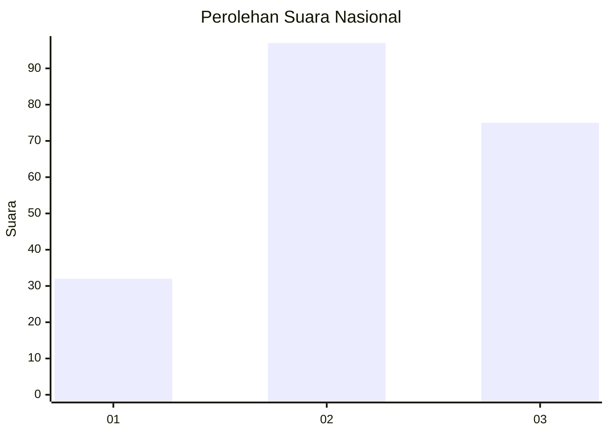
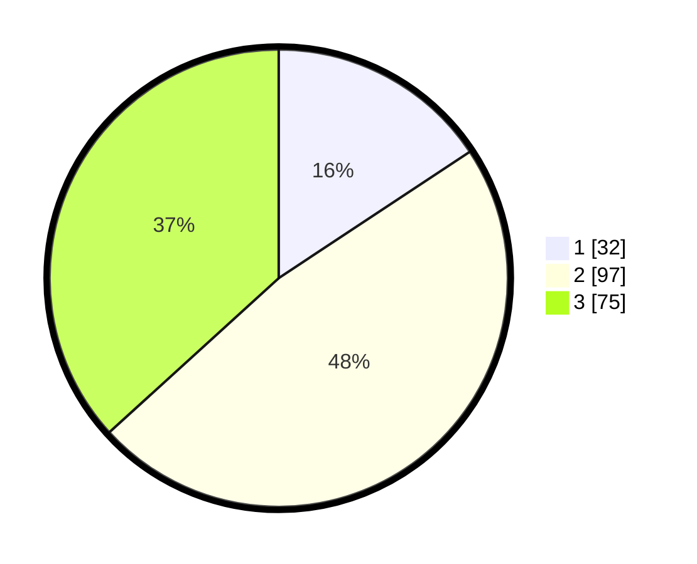

# Hasil

## Grafik

## Tabel

| No. | Nama Paslon    | Suara | Suara (raw) | Persentase |
|:--- |:-------------- | -----:| -----------:| ----------:|
| 1   | ANIES MUHAIMIN | 32    | [32][p-1]   | 15,69      |
| 2   | PRABOWO GIBRAN | 97    | [97][p-2]   | 47,55      |
| 3   | GANJAR MAHFUD  | 75    | [75][p-3]   | 36,76      |

[p-1]: https://github.com/gigit-pemilu/pemilu-2024/blob/main/pilpres/hitung-suara/sub/34-di-yogyakarta/sub/71-kota-yogyakarta/sub/12-mergangsan/sub/1002-wirogunan/sub/003-tps/sub/paslon-1.txt
[p-2]: https://github.com/gigit-pemilu/pemilu-2024/blob/main/pilpres/hitung-suara/sub/34-di-yogyakarta/sub/71-kota-yogyakarta/sub/12-mergangsan/sub/1002-wirogunan/sub/003-tps/sub/paslon-2.txt
[p-3]: https://github.com/gigit-pemilu/pemilu-2024/blob/main/pilpres/hitung-suara/sub/34-di-yogyakarta/sub/71-kota-yogyakarta/sub/12-mergangsan/sub/1002-wirogunan/sub/003-tps/sub/paslon-3.txt

## Foto C Plano

https://sirekap-obj-formc.kpu.go.id/729b/pemilu/ppwp/34/71/12/10/02/3471121002003-20240215-005106--030d92ae-27d7-425d-8596-def4836d5a5a.jpg

https://sirekap-obj-formc.kpu.go.id/729b/pemilu/ppwp/34/71/12/10/02/3471121002003-20240215-005102--c1898967-00d4-43cd-9b75-b0d37530feec.jpg

https://sirekap-obj-formc.kpu.go.id/729b/pemilu/ppwp/34/71/12/10/02/3471121002003-20240215-005055--c1a10f86-ae98-4048-a32c-7cc98482edbe.jpg

## Metadata

| Key        | Value               |
| ---------- | ------------------- |
| Time Stamp | 2024-02-25 13:00:00 |

