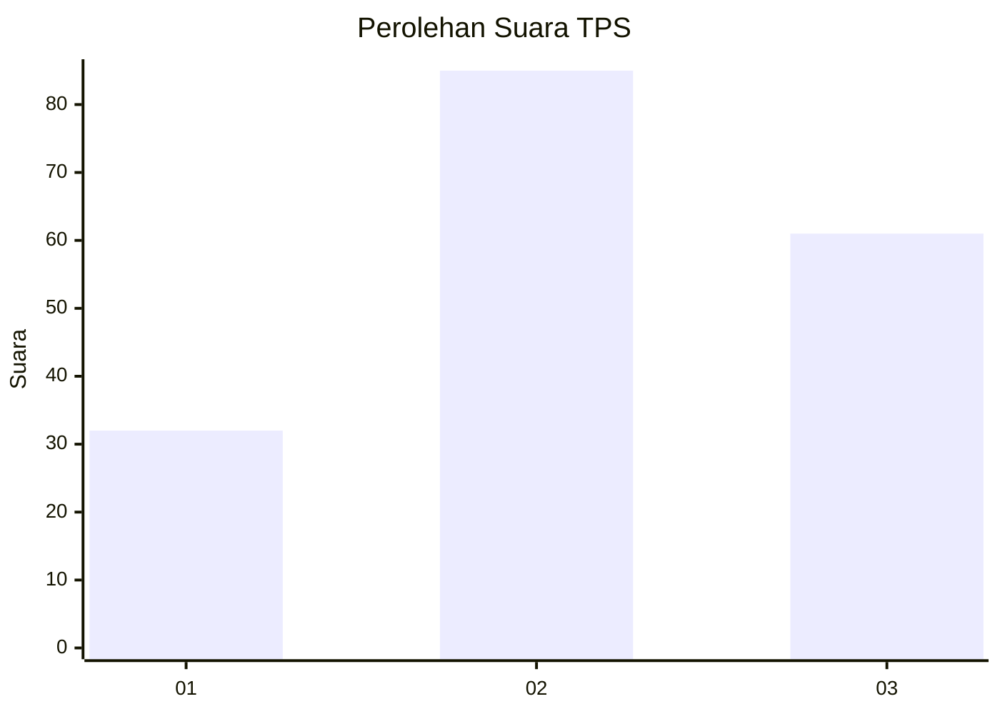
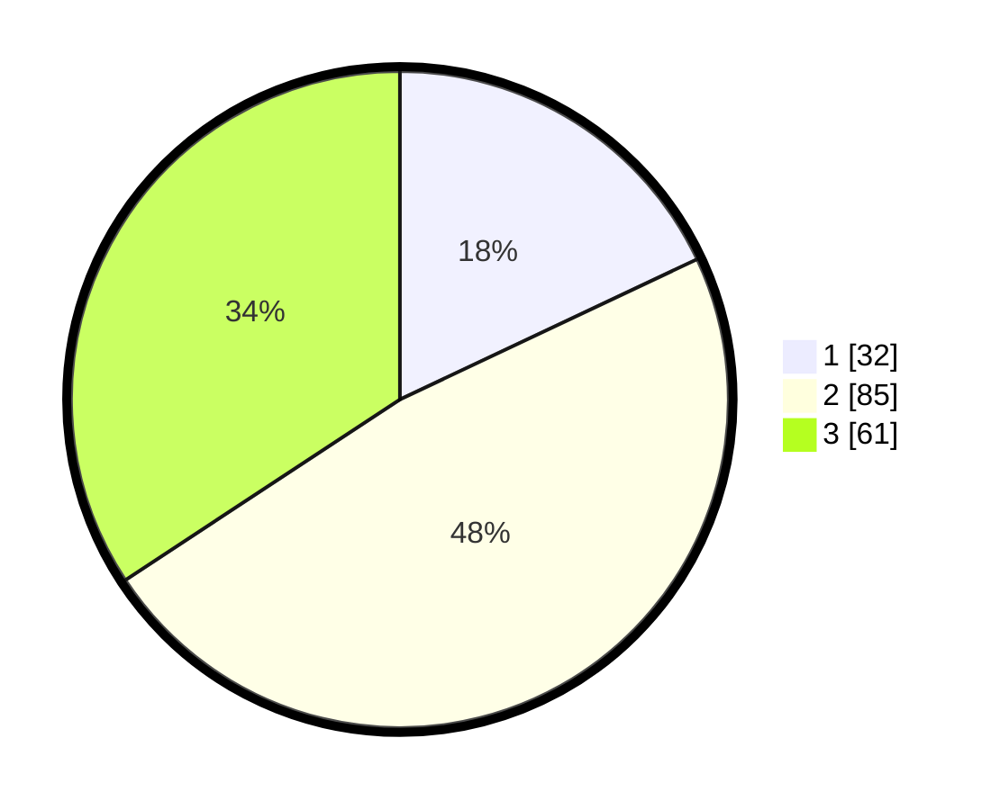

# Hasil

## Grafik

## Tabel

| No. | Nama Paslon    | Suara | Suara (raw) | Persentase |
|:--- |:-------------- | -----:| -----------:| ----------:|
| 1   | ANIES MUHAIMIN | 32    | [32][p-1]   | 17,98      |
| 2   | PRABOWO GIBRAN | 85    | [85][p-2]   | 47,75      |
| 3   | GANJAR MAHFUD  | 61    | [61][p-3]   | 34,27      |

[p-1]: https://github.com/gigit-pemilu/pemilu-2024-34-di-yogyakarta/blob/main/pilpres/hitung-suara/sub/34-di-yogyakarta/sub/71-kota-yogyakarta/sub/12-mergangsan/sub/1002-wirogunan/sub/004-tps/sub/paslon-1.txt
[p-2]: https://github.com/gigit-pemilu/pemilu-2024-34-di-yogyakarta/blob/main/pilpres/hitung-suara/sub/34-di-yogyakarta/sub/71-kota-yogyakarta/sub/12-mergangsan/sub/1002-wirogunan/sub/004-tps/sub/paslon-2.txt
[p-3]: https://github.com/gigit-pemilu/pemilu-2024-34-di-yogyakarta/blob/main/pilpres/hitung-suara/sub/34-di-yogyakarta/sub/71-kota-yogyakarta/sub/12-mergangsan/sub/1002-wirogunan/sub/004-tps/sub/paslon-3.txt

## Foto C Plano

https://sirekap-obj-formc.kpu.go.id/f9ef/pemilu/ppwp/34/71/12/10/02/3471121002004-20240214-224157--d8d1b7b7-115f-4176-9519-49f270bbc1d4.jpg

https://sirekap-obj-formc.kpu.go.id/f9ef/pemilu/ppwp/34/71/12/10/02/3471121002004-20240214-225748--40b44232-d5a7-46da-a130-4eab41b9ba08.jpg

https://sirekap-obj-formc.kpu.go.id/f9ef/pemilu/ppwp/34/71/12/10/02/3471121002004-20240214-225854--864e1ad4-fa1b-464d-8ec8-c7da163f7e5f.jpg

## Metadata

| Key        | Value               |
| ---------- | ------------------- |
| Time Stamp | 2024-02-25 13:00:00 |

