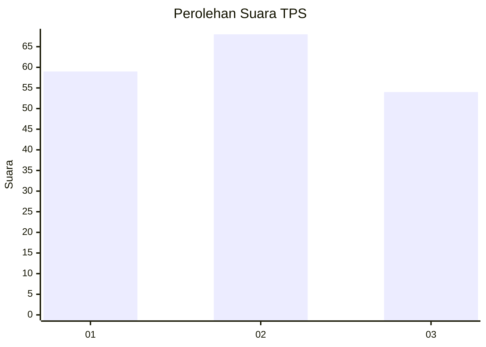
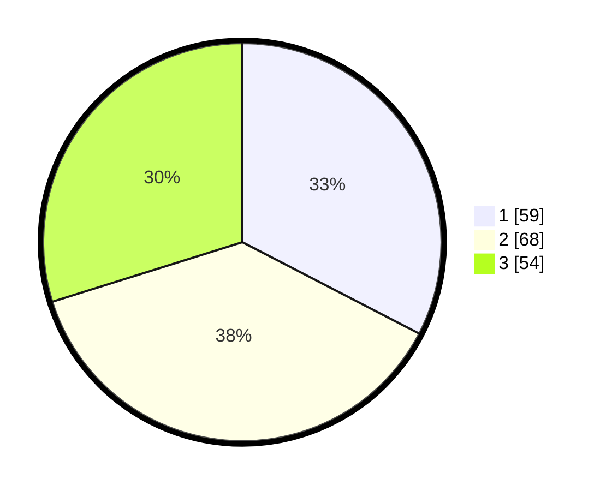

# Hasil

## Grafik

## Tabel

| No. | Nama Paslon    | Suara | Suara (raw) | Persentase |
|:--- |:-------------- | -----:| -----------:| ----------:|
| 1   | ANIES MUHAIMIN | 59    | [59][p-1]   | 32,60      |
| 2   | PRABOWO GIBRAN | 68    | [68][p-2]   | 37,57      |
| 3   | GANJAR MAHFUD  | 54    | [54][p-3]   | 29,83      |

[p-1]: https://github.com/gigit-pemilu/pemilu-2024-34-di-yogyakarta/blob/main/pilpres/hitung-suara/sub/34-di-yogyakarta/sub/71-kota-yogyakarta/sub/12-mergangsan/sub/1002-wirogunan/sub/019-tps/sub/paslon-1.txt
[p-2]: https://github.com/gigit-pemilu/pemilu-2024-34-di-yogyakarta/blob/main/pilpres/hitung-suara/sub/34-di-yogyakarta/sub/71-kota-yogyakarta/sub/12-mergangsan/sub/1002-wirogunan/sub/019-tps/sub/paslon-2.txt
[p-3]: https://github.com/gigit-pemilu/pemilu-2024-34-di-yogyakarta/blob/main/pilpres/hitung-suara/sub/34-di-yogyakarta/sub/71-kota-yogyakarta/sub/12-mergangsan/sub/1002-wirogunan/sub/019-tps/sub/paslon-3.txt

## Foto C Plano

https://sirekap-obj-formc.kpu.go.id/2256/pemilu/ppwp/34/71/12/10/02/3471121002019-20240215-025643--dac1a9b7-729b-43fe-93bf-9fb10db6aabd.jpg

https://sirekap-obj-formc.kpu.go.id/2256/pemilu/ppwp/34/71/12/10/02/3471121002019-20240215-034904--895be1f2-2197-470c-989c-b2f891eb08d7.jpg

https://sirekap-obj-formc.kpu.go.id/2256/pemilu/ppwp/34/71/12/10/02/3471121002019-20240215-025709--dff7dc85-9a7d-4984-b627-5d75baaf713c.jpg

## Metadata

| Key        | Value               |
| ---------- | ------------------- |
| Time Stamp | 2024-02-25 14:00:00 |

