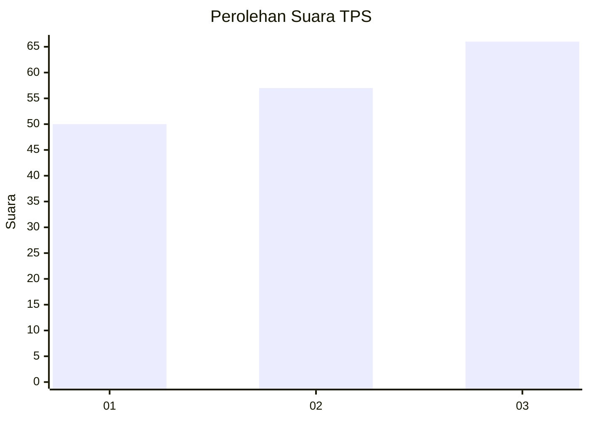
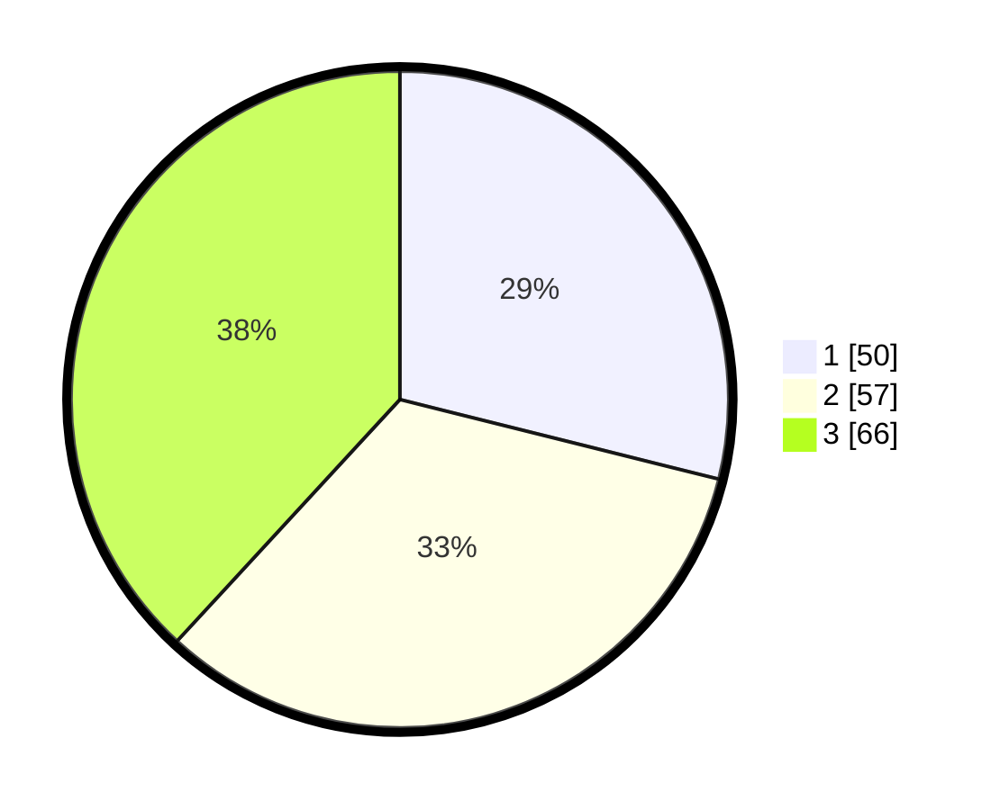

# Hasil

## Grafik

## Tabel

| No. | Nama Paslon    | Suara | Suara (raw) | Persentase |
|:--- |:-------------- | -----:| -----------:| ----------:|
| 1   | ANIES MUHAIMIN | 50    | [50][p-1]   | 28,90      |
| 2   | PRABOWO GIBRAN | 57    | [57][p-2]   | 32,95      |
| 3   | GANJAR MAHFUD  | 66    | [66][p-3]   | 38,15      |

[p-1]: https://github.com/gigit-pemilu/pemilu-2024-34-di-yogyakarta/blob/main/pilpres/hitung-suara/sub/34-di-yogyakarta/sub/71-kota-yogyakarta/sub/12-mergangsan/sub/1002-wirogunan/sub/028-tps/sub/paslon-1.txt
[p-2]: https://github.com/gigit-pemilu/pemilu-2024-34-di-yogyakarta/blob/main/pilpres/hitung-suara/sub/34-di-yogyakarta/sub/71-kota-yogyakarta/sub/12-mergangsan/sub/1002-wirogunan/sub/028-tps/sub/paslon-2.txt
[p-3]: https://github.com/gigit-pemilu/pemilu-2024-34-di-yogyakarta/blob/main/pilpres/hitung-suara/sub/34-di-yogyakarta/sub/71-kota-yogyakarta/sub/12-mergangsan/sub/1002-wirogunan/sub/028-tps/sub/paslon-3.txt

## Foto C Plano

https://sirekap-obj-formc.kpu.go.id/b4d6/pemilu/ppwp/34/71/12/10/02/3471121002028-20240214-194636--0e62053d-722a-40f1-971b-ad80ac440903.jpg

https://sirekap-obj-formc.kpu.go.id/b4d6/pemilu/ppwp/34/71/12/10/02/3471121002028-20240214-193522--147dac6a-0e4c-4390-8761-67896f5e5d5c.jpg

https://sirekap-obj-formc.kpu.go.id/b4d6/pemilu/ppwp/34/71/12/10/02/3471121002028-20240214-194821--d5810886-dd1d-4465-865b-0e28514342a3.jpg

## Metadata

| Key        | Value               |
| ---------- | ------------------- |
| Time Stamp | 2024-02-14 21:46:01 |

## DATA PEMILIH TETAP

Jumlah pemilih dalam DPT: **216**.
 * L: **95**.
 * P: **121**.

## DATA PENGGUNA HAK PILIH

Jumlah pengguna hak pilih dalam DPT: **165**.
 * L: **71**.
 * P: **94**.

Jumlah pengguna hak pilih dalam DPTb: **10**.
 * L: **7**.
 * P: **3**.

Jumlah pengguna hak pilih dalam DPK: **6**.
 * L: **3**.
 * P: **3**.

Jumlah pengguna hak pilih: **181**.
 * L: **81**.
 * P: **100**.

## JUMLAH SUARA SAH DAN TIDAK SAH

JUMLAH SELURUH SUARA SAH: **173**.

JUMLAH SUARA TIDAK SAH: **8**.

JUMLAH SELURUH SUARA SAH DAN SUARA TIDAK SAH: **181**.

