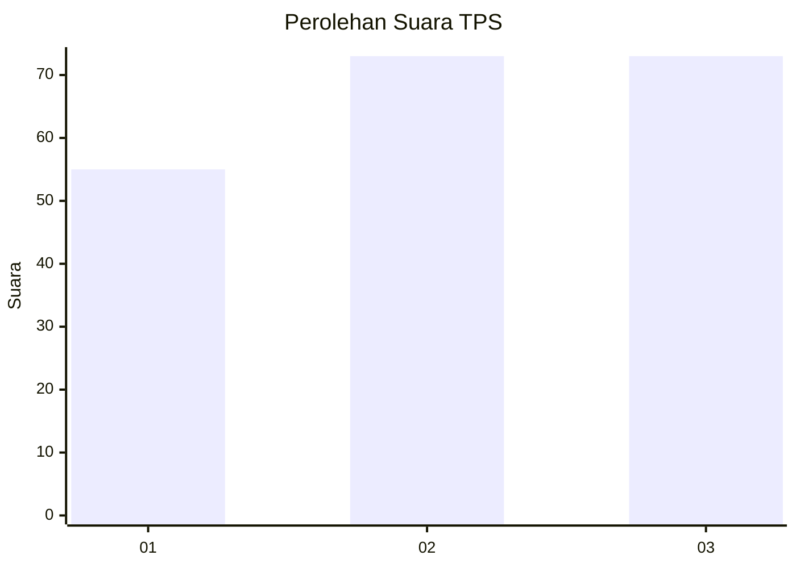
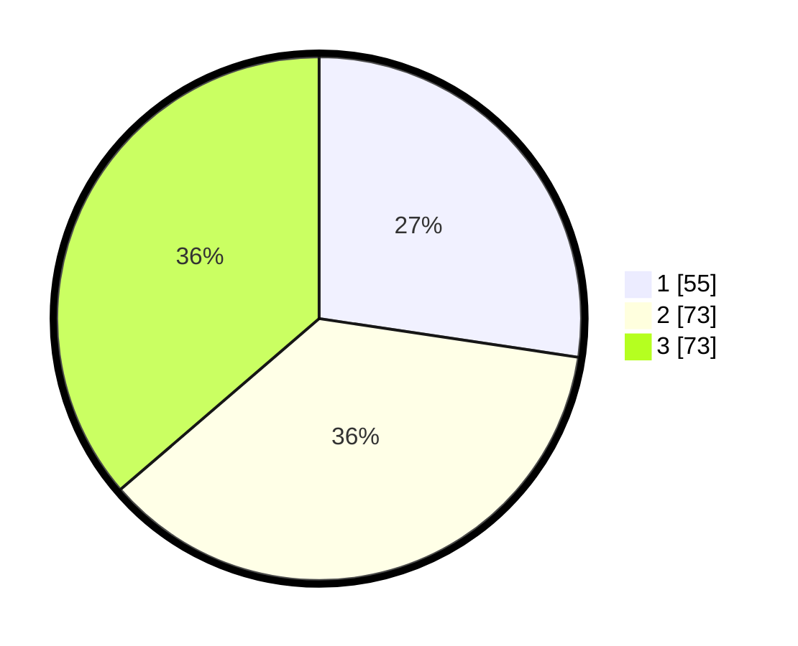

# Hasil

## Grafik

## Tabel

| No. | Nama Paslon    | Suara | Suara (raw) | Persentase |
|:--- |:-------------- | -----:| -----------:| ----------:|
| 1   | ANIES MUHAIMIN | 55    | [55][p-1]   | 27,36      |
| 2   | PRABOWO GIBRAN | 73    | [73][p-2]   | 36,32      |
| 3   | GANJAR MAHFUD  | 73    | [73][p-3]   | 36,32      |

[p-1]: https://github.com/gigit-pemilu/pemilu-2024-34-di-yogyakarta/blob/main/pilpres/hitung-suara/sub/34-di-yogyakarta/sub/71-kota-yogyakarta/sub/12-mergangsan/sub/1003-brontokusuman/sub/002-tps/sub/paslon-1.txt
[p-2]: https://github.com/gigit-pemilu/pemilu-2024-34-di-yogyakarta/blob/main/pilpres/hitung-suara/sub/34-di-yogyakarta/sub/71-kota-yogyakarta/sub/12-mergangsan/sub/1003-brontokusuman/sub/002-tps/sub/paslon-2.txt
[p-3]: https://github.com/gigit-pemilu/pemilu-2024-34-di-yogyakarta/blob/main/pilpres/hitung-suara/sub/34-di-yogyakarta/sub/71-kota-yogyakarta/sub/12-mergangsan/sub/1003-brontokusuman/sub/002-tps/sub/paslon-3.txt

## Foto C Plano

https://sirekap-obj-formc.kpu.go.id/6377/pemilu/ppwp/34/71/12/10/03/3471121003002-20240214-235724--4ec1349b-a22d-41a5-8a44-e675d5fde48e.jpg

https://sirekap-obj-formc.kpu.go.id/6377/pemilu/ppwp/34/71/12/10/03/3471121003002-20240214-235910--52636b41-e075-4dfe-8b3f-7b76d2f6640d.jpg

https://sirekap-obj-formc.kpu.go.id/6377/pemilu/ppwp/34/71/12/10/03/3471121003002-20240214-235940--b61fcbc2-f70a-42f0-9691-7a80e3b4716a.jpg

## Metadata

| Key        | Value               |
| ---------- | ------------------- |
| Time Stamp | 2024-02-24 22:31:28 |

