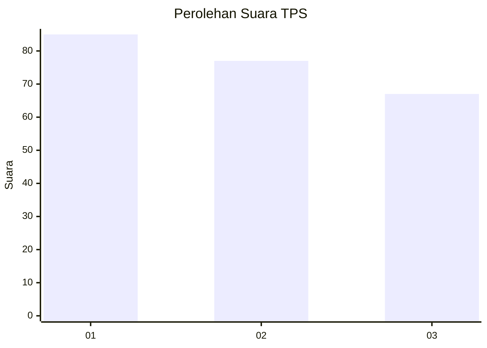
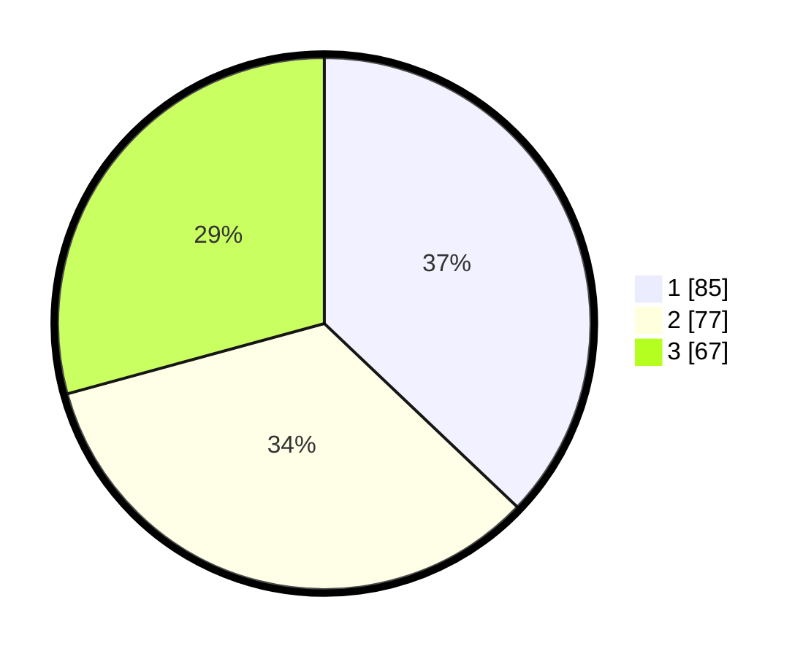

# Hasil

## Grafik

## Tabel

| No. | Nama Paslon    | Suara | Suara (raw) | Persentase |
|:--- |:-------------- | -----:| -----------:| ----------:|
| 1   | ANIES MUHAIMIN | 85    | [85][p-1]   | 37,12      |
| 2   | PRABOWO GIBRAN | 77    | [77][p-2]   | 33,62      |
| 3   | GANJAR MAHFUD  | 67    | [67][p-3]   | 29,26      |

[p-1]: https://github.com/gigit-pemilu/pemilu-2024-34-di-yogyakarta/blob/main/pilpres/hitung-suara/sub/34-di-yogyakarta/sub/71-kota-yogyakarta/sub/12-mergangsan/sub/1003-brontokusuman/sub/003-tps/sub/paslon-1.txt
[p-2]: https://github.com/gigit-pemilu/pemilu-2024-34-di-yogyakarta/blob/main/pilpres/hitung-suara/sub/34-di-yogyakarta/sub/71-kota-yogyakarta/sub/12-mergangsan/sub/1003-brontokusuman/sub/003-tps/sub/paslon-2.txt
[p-3]: https://github.com/gigit-pemilu/pemilu-2024-34-di-yogyakarta/blob/main/pilpres/hitung-suara/sub/34-di-yogyakarta/sub/71-kota-yogyakarta/sub/12-mergangsan/sub/1003-brontokusuman/sub/003-tps/sub/paslon-3.txt

## Foto C Plano

https://sirekap-obj-formc.kpu.go.id/d3e2/pemilu/ppwp/34/71/12/10/03/3471121003003-20240214-155752--866ac491-ae5b-4798-afc1-645e6c433db9.jpg

https://sirekap-obj-formc.kpu.go.id/d3e2/pemilu/ppwp/34/71/12/10/03/3471121003003-20240214-155900--f030ab0b-5e7e-49be-af47-672c9dd710e0.jpg

https://sirekap-obj-formc.kpu.go.id/d3e2/pemilu/ppwp/34/71/12/10/03/3471121003003-20240214-160109--fbd021f1-d83c-459e-b031-a3b70c2490f7.jpg

## Metadata

| Key        | Value               |
| ---------- | ------------------- |
| Time Stamp | 2024-02-15 12:00:28 |

## DATA PEMILIH TETAP

Jumlah pemilih dalam DPT: **262**.
 * L: **119**.
 * P: **143**.

## DATA PENGGUNA HAK PILIH

Jumlah pengguna hak pilih dalam DPT: **221**.
 * L: **95**.
 * P: **126**.

Jumlah pengguna hak pilih dalam DPTb: **14**.
 * L: **1**.
 * P: **13**.

Jumlah pengguna hak pilih dalam DPK: **0**.
 * L: **0**.
 * P: **0**.

Jumlah pengguna hak pilih: **235**.
 * L: **96**.
 * P: **139**.

## JUMLAH SUARA SAH DAN TIDAK SAH

JUMLAH SELURUH SUARA SAH: **229**.

JUMLAH SUARA TIDAK SAH: **6**.

JUMLAH SELURUH SUARA SAH DAN SUARA TIDAK SAH: **235**.

