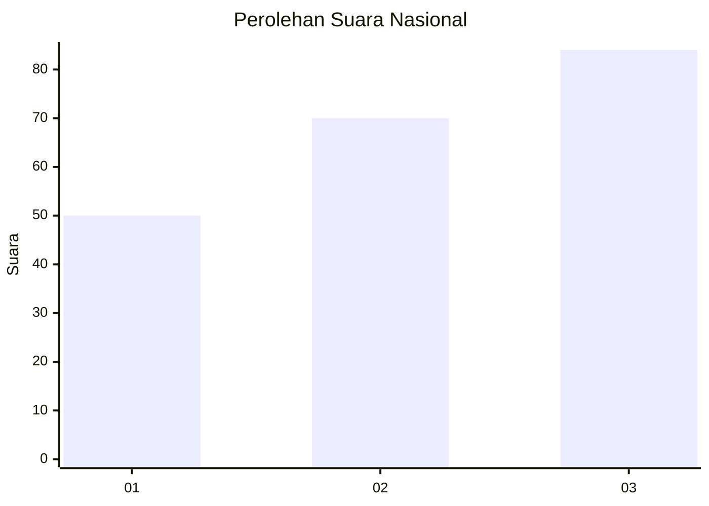
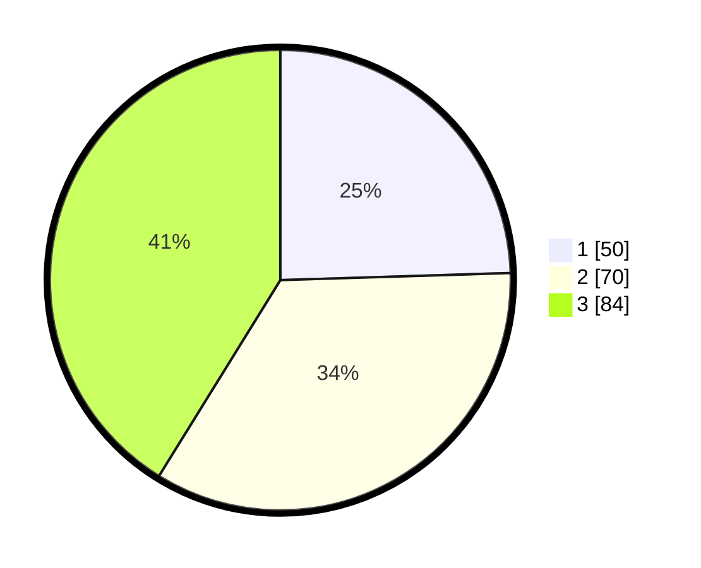

# Hasil

## Grafik

## Tabel

| No. | Nama Paslon    | Suara | Suara (raw) | Persentase |
|:--- |:-------------- | -----:| -----------:| ----------:|
| 1   | ANIES MUHAIMIN | 50    | [50][p-1]   | 24,51      |
| 2   | PRABOWO GIBRAN | 70    | [70][p-2]   | 34,31      |
| 3   | GANJAR MAHFUD  | 84    | [84][p-3]   | 41,18      |

[p-1]: https://github.com/gigit-pemilu/pemilu-2024/blob/main/pilpres/hitung-suara/sub/34-di-yogyakarta/sub/71-kota-yogyakarta/sub/12-mergangsan/sub/1003-brontokusuman/sub/006-tps/sub/paslon-1.txt
[p-2]: https://github.com/gigit-pemilu/pemilu-2024/blob/main/pilpres/hitung-suara/sub/34-di-yogyakarta/sub/71-kota-yogyakarta/sub/12-mergangsan/sub/1003-brontokusuman/sub/006-tps/sub/paslon-2.txt
[p-3]: https://github.com/gigit-pemilu/pemilu-2024/blob/main/pilpres/hitung-suara/sub/34-di-yogyakarta/sub/71-kota-yogyakarta/sub/12-mergangsan/sub/1003-brontokusuman/sub/006-tps/sub/paslon-3.txt

## Foto C Plano

https://sirekap-obj-formc.kpu.go.id/74d7/pemilu/ppwp/34/71/12/10/03/3471121003006-20240214-155641--bc0efa26-8ef6-4dff-b341-631ef3bc08a7.jpg

https://sirekap-obj-formc.kpu.go.id/74d7/pemilu/ppwp/34/71/12/10/03/3471121003006-20240214-155242--09fb7cfc-17f6-49b9-8d87-351e1ab68acf.jpg

https://sirekap-obj-formc.kpu.go.id/74d7/pemilu/ppwp/34/71/12/10/03/3471121003006-20240214-155220--bdbfa11b-2e98-427c-ab64-8c526108dc2e.jpg

## Metadata

| Key        | Value               |
| ---------- | ------------------- |
| Time Stamp | 2024-02-14 21:46:01 |

