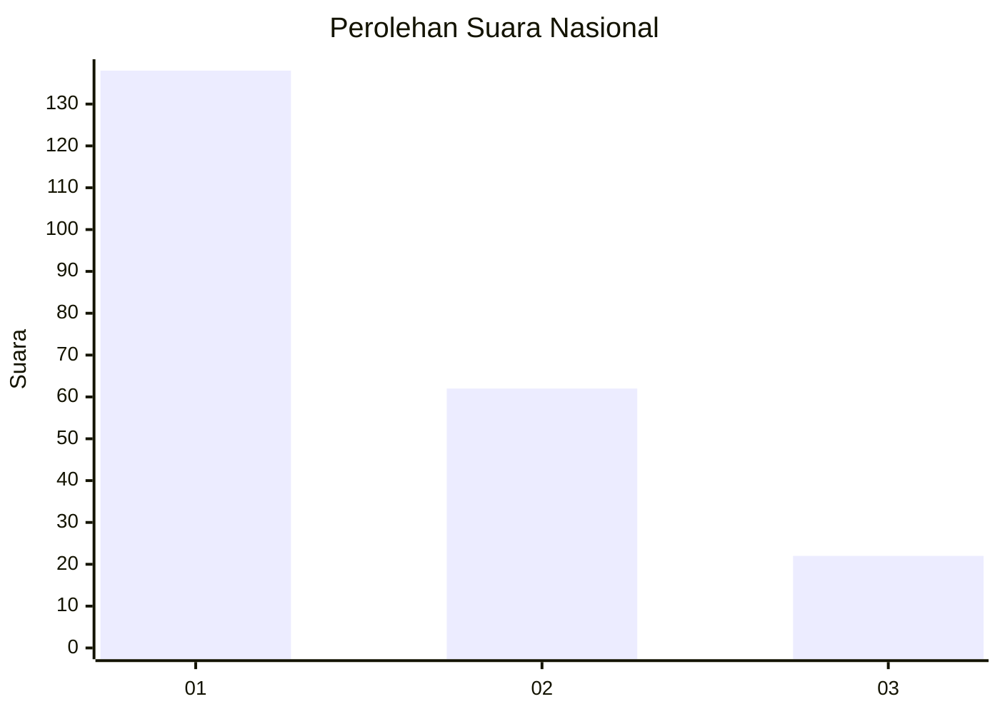
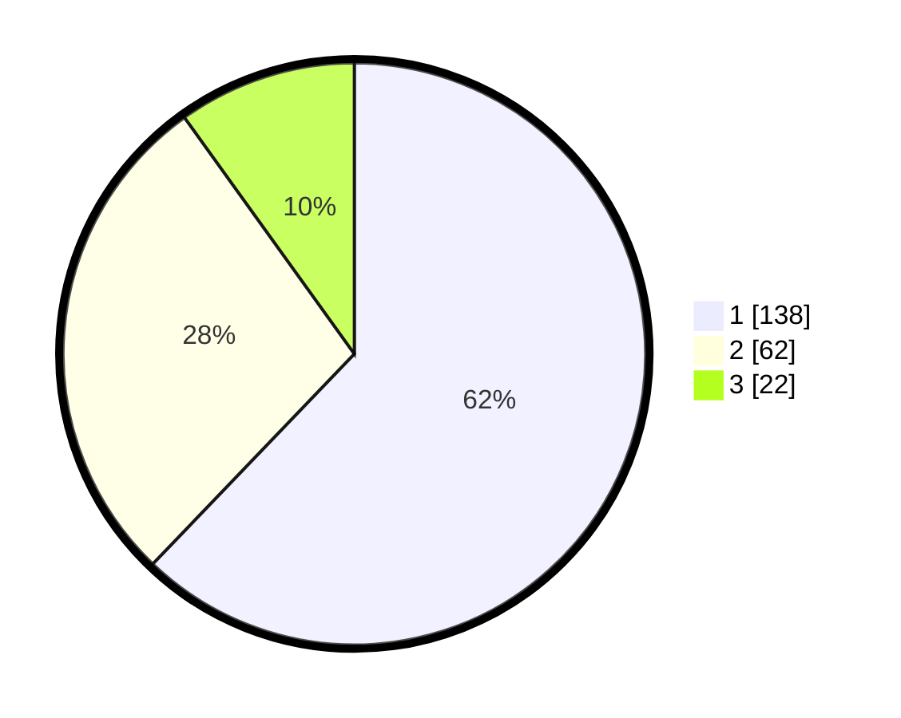

# Hasil

## Grafik

## Tabel

| No. | Nama Paslon    | Suara | Suara (raw) | Persentase |
|:--- |:-------------- | -----:| -----------:| ----------:|
| 1   | ANIES MUHAIMIN | 138   | [138][p-1]  | 62,16      |
| 2   | PRABOWO GIBRAN | 62    | [62][p-2]   | 27,93      |
| 3   | GANJAR MAHFUD  | 22    | [22][p-3]   | 9,91       |

[p-1]: https://github.com/gigit-pemilu/pemilu-2024/blob/main/pilpres/hitung-suara/sub/34-di-yogyakarta/sub/71-kota-yogyakarta/sub/12-mergangsan/sub/1003-brontokusuman/sub/024-tps/sub/paslon-1.txt
[p-2]: https://github.com/gigit-pemilu/pemilu-2024/blob/main/pilpres/hitung-suara/sub/34-di-yogyakarta/sub/71-kota-yogyakarta/sub/12-mergangsan/sub/1003-brontokusuman/sub/024-tps/sub/paslon-2.txt
[p-3]: https://github.com/gigit-pemilu/pemilu-2024/blob/main/pilpres/hitung-suara/sub/34-di-yogyakarta/sub/71-kota-yogyakarta/sub/12-mergangsan/sub/1003-brontokusuman/sub/024-tps/sub/paslon-3.txt

## Foto C Plano

https://sirekap-obj-formc.kpu.go.id/2ddc/pemilu/ppwp/34/71/12/10/03/3471121003024-20240214-193630--5c1efb4f-b30e-436a-81a2-f032e403765a.jpg

https://sirekap-obj-formc.kpu.go.id/2ddc/pemilu/ppwp/34/71/12/10/03/3471121003024-20240214-221037--5fa57180-6147-4461-aefe-527b36930975.jpg

https://sirekap-obj-formc.kpu.go.id/2ddc/pemilu/ppwp/34/71/12/10/03/3471121003024-20240214-203423--1014a785-41e6-47d2-a6d7-da8404c88bb1.jpg

## Metadata

| Key        | Value               |
| ---------- | ------------------- |
| Time Stamp | 2024-02-24 22:31:28 |

## DATA PEMILIH TETAP

Jumlah pemilih dalam DPT: **272**.
 * L: **134**.
 * P: **138**.

## DATA PENGGUNA HAK PILIH

Jumlah pengguna hak pilih dalam DPT: **214**.
 * L: **98**.
 * P: **116**.

Jumlah pengguna hak pilih dalam DPTb: **8**.
 * L: **7**.
 * P: **1**.

Jumlah pengguna hak pilih dalam DPK: **3**.
 * L: **1**.
 * P: **2**.

Jumlah pengguna hak pilih: **225**.
 * L: **106**.
 * P: **119**.

## JUMLAH SUARA SAH DAN TIDAK SAH

JUMLAH SELURUH SUARA SAH: **222**.

JUMLAH SUARA TIDAK SAH: **3**.

JUMLAH SELURUH SUARA SAH DAN SUARA TIDAK SAH: **225**.

