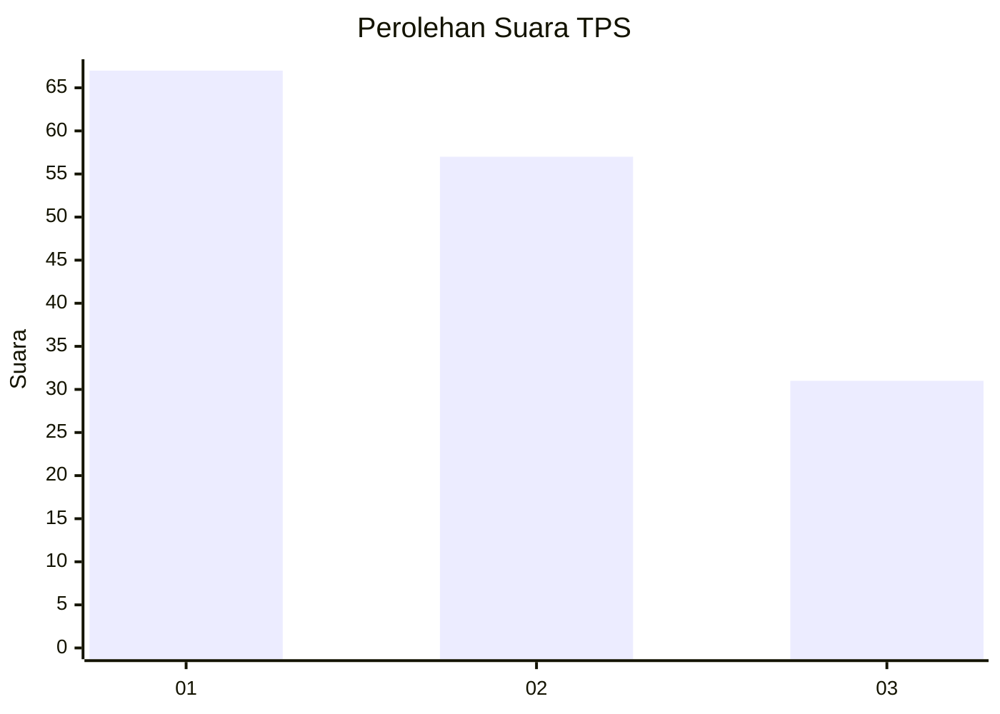
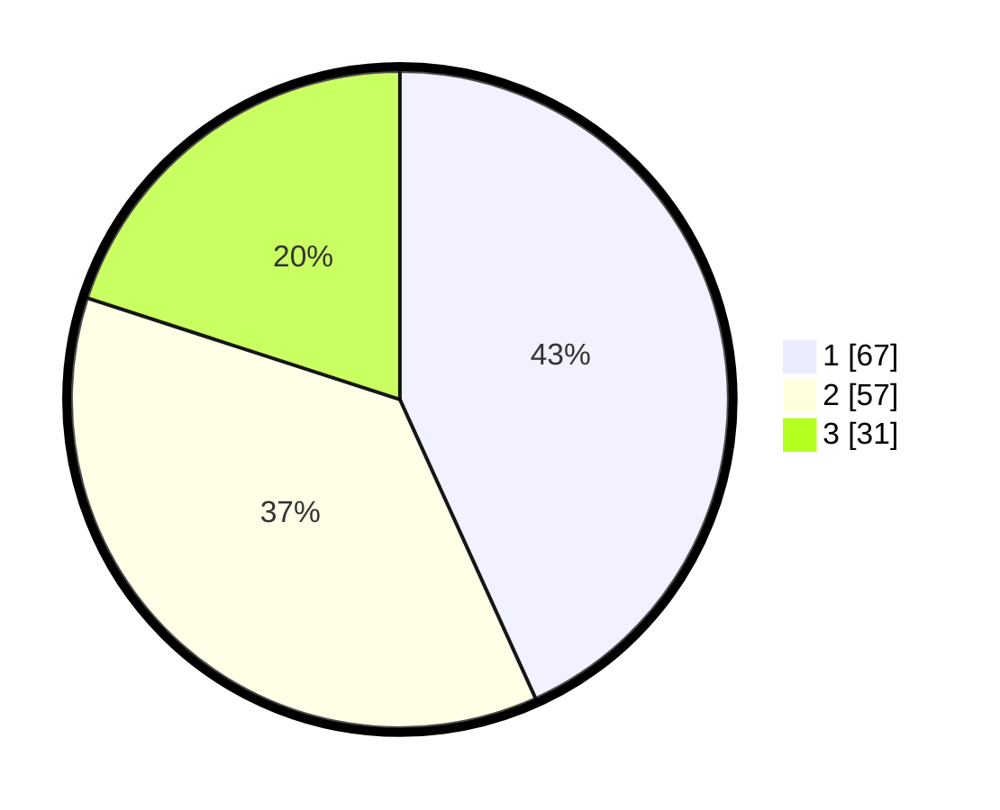

# Hasil

## Grafik

## Tabel

| No. | Nama Paslon    | Suara | Suara (raw) | Persentase |
|:--- |:-------------- | -----:| -----------:| ----------:|
| 1   | ANIES MUHAIMIN | 67    | [67][p-1]   | 43,23      |
| 2   | PRABOWO GIBRAN | 57    | [57][p-2]   | 36,77      |
| 3   | GANJAR MAHFUD  | 31    | [31][p-3]   | 20,00      |

[p-1]: https://github.com/gigit-pemilu/pemilu-2024-34-di-yogyakarta/blob/main/pilpres/hitung-suara/sub/34-di-yogyakarta/sub/71-kota-yogyakarta/sub/12-mergangsan/sub/1003-brontokusuman/sub/035-tps/sub/paslon-1.txt
[p-2]: https://github.com/gigit-pemilu/pemilu-2024-34-di-yogyakarta/blob/main/pilpres/hitung-suara/sub/34-di-yogyakarta/sub/71-kota-yogyakarta/sub/12-mergangsan/sub/1003-brontokusuman/sub/035-tps/sub/paslon-2.txt
[p-3]: https://github.com/gigit-pemilu/pemilu-2024-34-di-yogyakarta/blob/main/pilpres/hitung-suara/sub/34-di-yogyakarta/sub/71-kota-yogyakarta/sub/12-mergangsan/sub/1003-brontokusuman/sub/035-tps/sub/paslon-3.txt

## Foto C Plano

https://sirekap-obj-formc.kpu.go.id/e7e7/pemilu/ppwp/34/71/12/10/03/3471121003035-20240214-155309--8ac6eaed-7847-4db2-9a0c-f9c0e06b8fbc.jpg

https://sirekap-obj-formc.kpu.go.id/e7e7/pemilu/ppwp/34/71/12/10/03/3471121003035-20240214-193813--e9f50181-c333-495b-a027-ebe02b2712e6.jpg

https://sirekap-obj-formc.kpu.go.id/e7e7/pemilu/ppwp/34/71/12/10/03/3471121003035-20240214-193619--9b22ac58-0884-4feb-b51e-b5f7a33848e1.jpg

## Metadata

| Key        | Value               |
| ---------- | ------------------- |
| Time Stamp | 2024-02-15 00:41:44 |

## DATA PEMILIH TETAP

Jumlah pemilih dalam DPT: **174**.
 * L: **90**.
 * P: **84**.

## DATA PENGGUNA HAK PILIH

Jumlah pengguna hak pilih dalam DPT: **140**.
 * L: **70**.
 * P: **70**.

Jumlah pengguna hak pilih dalam DPTb: **77**.
 * L: **7**.
 * P: **70**.

Jumlah pengguna hak pilih dalam DPK: **4**.
 * L: **4**.
 * P: **0**.

Jumlah pengguna hak pilih: **155**.
 * L: **75**.
 * P: **80**.

## JUMLAH SUARA SAH DAN TIDAK SAH

JUMLAH SELURUH SUARA SAH: **155**.

JUMLAH SUARA TIDAK SAH: **0**.

JUMLAH SELURUH SUARA SAH DAN SUARA TIDAK SAH: **155**.

