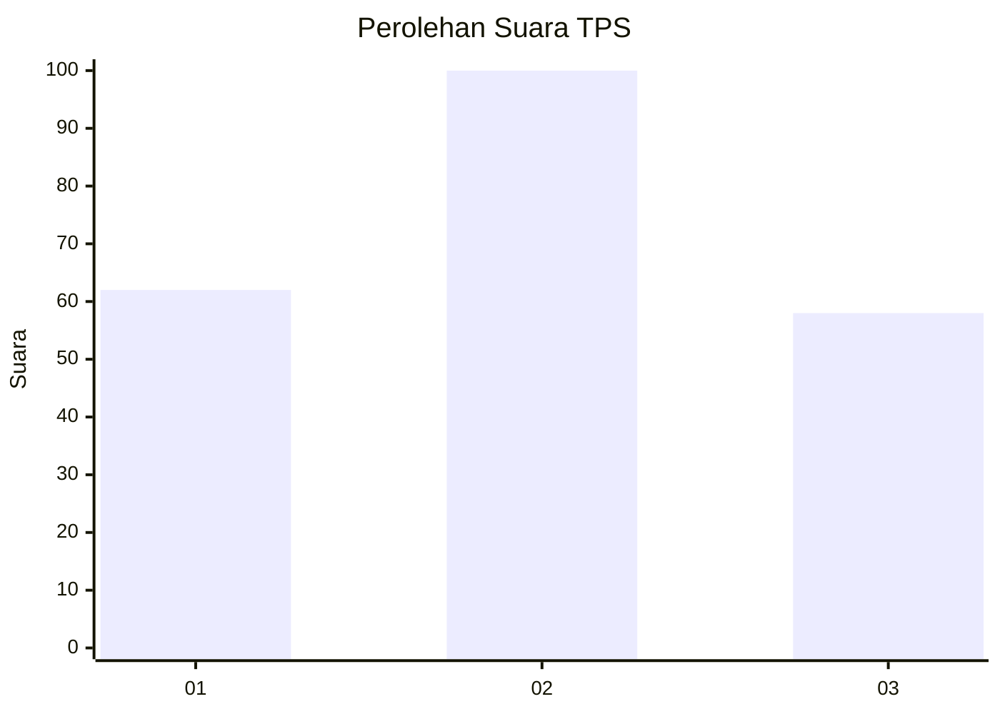
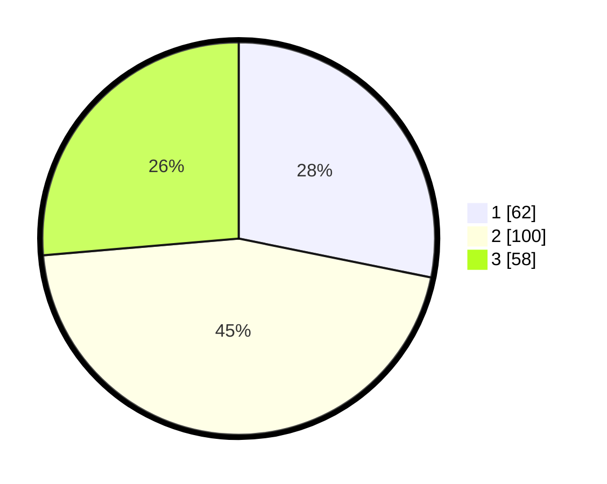

# Hasil

## Grafik

## Tabel

| No. | Nama Paslon    | Suara | Suara (raw) | Persentase |
|:--- |:-------------- | -----:| -----------:| ----------:|
| 1   | ANIES MUHAIMIN | 62    | [62][p-1]   | 28,18      |
| 2   | PRABOWO GIBRAN | 100   | [100][p-2]  | 45,45      |
| 3   | GANJAR MAHFUD  | 58    | [58][p-3]   | 26,36      |

[p-1]: https://github.com/gigit-pemilu/pemilu-2024-34-di-yogyakarta/blob/main/pilpres/hitung-suara/sub/34-di-yogyakarta/sub/71-kota-yogyakarta/sub/13-umbulharjo/sub/1001-semaki/sub/003-tps/sub/paslon-1.txt
[p-2]: https://github.com/gigit-pemilu/pemilu-2024-34-di-yogyakarta/blob/main/pilpres/hitung-suara/sub/34-di-yogyakarta/sub/71-kota-yogyakarta/sub/13-umbulharjo/sub/1001-semaki/sub/003-tps/sub/paslon-2.txt
[p-3]: https://github.com/gigit-pemilu/pemilu-2024-34-di-yogyakarta/blob/main/pilpres/hitung-suara/sub/34-di-yogyakarta/sub/71-kota-yogyakarta/sub/13-umbulharjo/sub/1001-semaki/sub/003-tps/sub/paslon-3.txt

## Foto C Plano

https://sirekap-obj-formc.kpu.go.id/fa4e/pemilu/ppwp/34/71/13/10/01/3471131001003-20240214-184910--0b54f2dd-75e2-43e4-973e-6345f4794cf5.jpg

https://sirekap-obj-formc.kpu.go.id/fa4e/pemilu/ppwp/34/71/13/10/01/3471131001003-20240214-185136--aadfb52b-b9fe-4467-aa8b-898db2075ef3.jpg

https://sirekap-obj-formc.kpu.go.id/fa4e/pemilu/ppwp/34/71/13/10/01/3471131001003-20240214-185321--b75e7abc-dd7e-497b-b9a4-bb91c0696631.jpg

## Metadata

| Key        | Value               |
| ---------- | ------------------- |
| Time Stamp | 2024-02-14 21:46:01 |

## DATA PEMILIH TETAP

Jumlah pemilih dalam DPT: **242**.
 * L: **112**.
 * P: **130**.

## DATA PENGGUNA HAK PILIH

Jumlah pengguna hak pilih dalam DPT: **212**.
 * L: **92**.
 * P: **120**.

Jumlah pengguna hak pilih dalam DPTb: **13**.
 * L: **3**.
 * P: **10**.

Jumlah pengguna hak pilih dalam DPK: **0**.
 * L: **0**.
 * P: **0**.

Jumlah pengguna hak pilih: **225**.
 * L: **95**.
 * P: **130**.

## JUMLAH SUARA SAH DAN TIDAK SAH

JUMLAH SELURUH SUARA SAH: **220**.

JUMLAH SUARA TIDAK SAH: **5**.

JUMLAH SELURUH SUARA SAH DAN SUARA TIDAK SAH: **225**.

