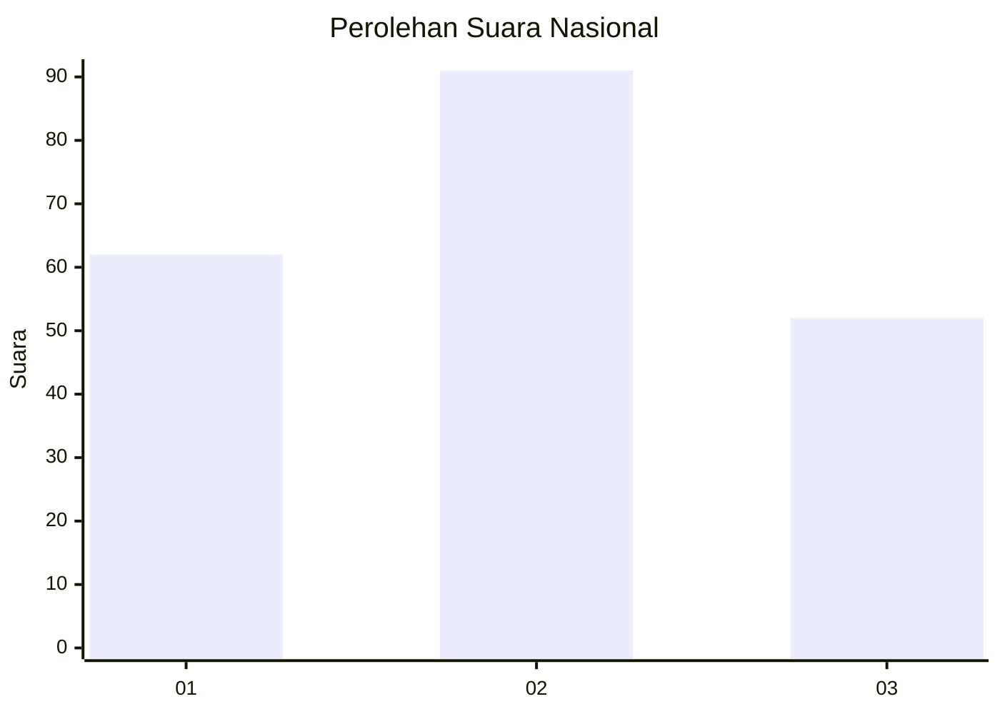
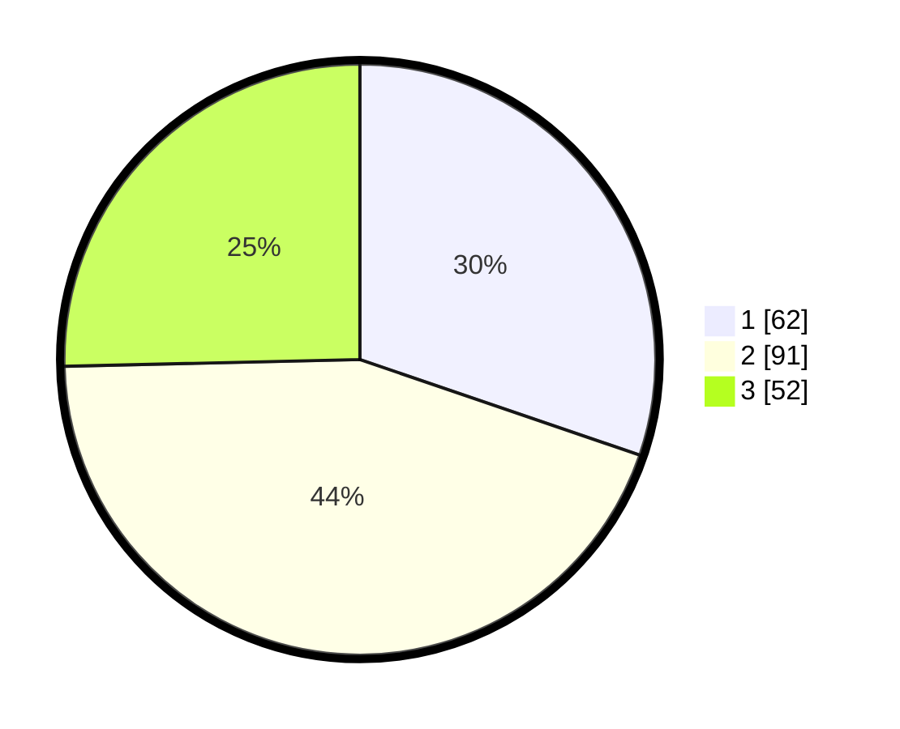

# Hasil

## Grafik

## Tabel

| No. | Nama Paslon    | Suara | Suara (raw) | Persentase |
|:--- |:-------------- | -----:| -----------:| ----------:|
| 1   | ANIES MUHAIMIN | 62    | [62][p-1]   | 30,24      |
| 2   | PRABOWO GIBRAN | 91    | [91][p-2]   | 44,39      |
| 3   | GANJAR MAHFUD  | 52    | [52][p-3]   | 25,37      |

[p-1]: https://github.com/gigit-pemilu/pemilu-2024/blob/main/pilpres/hitung-suara/sub/34-di-yogyakarta/sub/71-kota-yogyakarta/sub/13-umbulharjo/sub/1001-semaki/sub/004-tps/sub/paslon-1.txt
[p-2]: https://github.com/gigit-pemilu/pemilu-2024/blob/main/pilpres/hitung-suara/sub/34-di-yogyakarta/sub/71-kota-yogyakarta/sub/13-umbulharjo/sub/1001-semaki/sub/004-tps/sub/paslon-2.txt
[p-3]: https://github.com/gigit-pemilu/pemilu-2024/blob/main/pilpres/hitung-suara/sub/34-di-yogyakarta/sub/71-kota-yogyakarta/sub/13-umbulharjo/sub/1001-semaki/sub/004-tps/sub/paslon-3.txt

## Foto C Plano

https://sirekap-obj-formc.kpu.go.id/f4b1/pemilu/ppwp/34/71/13/10/01/3471131001004-20240214-155455--9f55c6ac-d020-4f28-ba93-184b989c6c7d.jpg

https://sirekap-obj-formc.kpu.go.id/f4b1/pemilu/ppwp/34/71/13/10/01/3471131001004-20240214-210512--90f0469f-6d4b-4518-a322-43acac34f010.jpg

https://sirekap-obj-formc.kpu.go.id/f4b1/pemilu/ppwp/34/71/13/10/01/3471131001004-20240215-021921--26b86a43-6443-4fa1-99c0-0abba11c6682.jpg

## Metadata

| Key        | Value               |
| ---------- | ------------------- |
| Time Stamp | 2024-02-15 12:00:28 |

## DATA PEMILIH TETAP

Jumlah pemilih dalam DPT: **244**.
 * L: **112**.
 * P: **132**.

## DATA PENGGUNA HAK PILIH

Jumlah pengguna hak pilih dalam DPT: **198**.
 * L: **87**.
 * P: **111**.

Jumlah pengguna hak pilih dalam DPTb: **8**.
 * L: **3**.
 * P: **5**.

Jumlah pengguna hak pilih dalam DPK: **3**.
 * L: **2**.
 * P: **1**.

Jumlah pengguna hak pilih: **209**.
 * L: **92**.
 * P: **117**.

## JUMLAH SUARA SAH DAN TIDAK SAH

JUMLAH SELURUH SUARA SAH: **205**.

JUMLAH SUARA TIDAK SAH: **4**.

JUMLAH SELURUH SUARA SAH DAN SUARA TIDAK SAH: **209**.

