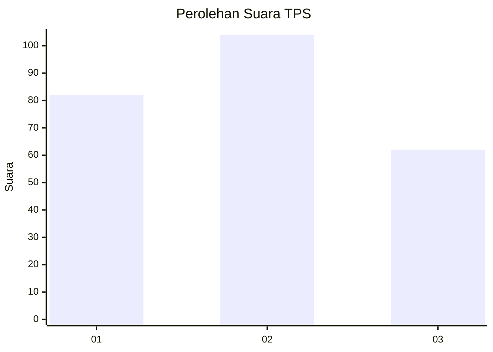
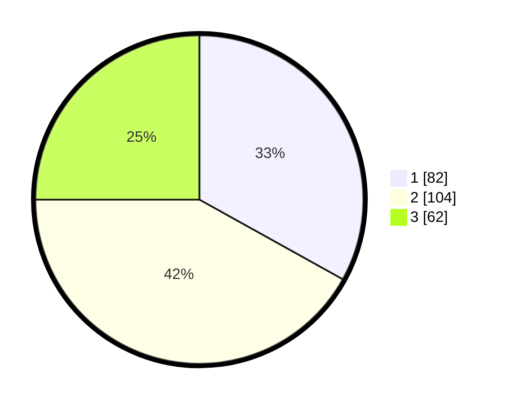

# Hasil

## Grafik

## Tabel

| No. | Nama Paslon    | Suara | Suara (raw) | Persentase |
|:--- |:-------------- | -----:| -----------:| ----------:|
| 1   | ANIES MUHAIMIN | 82    | [82][p-1]   | 33,06      |
| 2   | PRABOWO GIBRAN | 104   | [104][p-2]  | 41,94      |
| 3   | GANJAR MAHFUD  | 62    | [62][p-3]   | 25,00      |

[p-1]: https://github.com/gigit-pemilu/pemilu-2024-34-di-yogyakarta/blob/main/pilpres/hitung-suara/sub/34-di-yogyakarta/sub/71-kota-yogyakarta/sub/13-umbulharjo/sub/1001-semaki/sub/009-tps/sub/paslon-1.txt
[p-2]: https://github.com/gigit-pemilu/pemilu-2024-34-di-yogyakarta/blob/main/pilpres/hitung-suara/sub/34-di-yogyakarta/sub/71-kota-yogyakarta/sub/13-umbulharjo/sub/1001-semaki/sub/009-tps/sub/paslon-2.txt
[p-3]: https://github.com/gigit-pemilu/pemilu-2024-34-di-yogyakarta/blob/main/pilpres/hitung-suara/sub/34-di-yogyakarta/sub/71-kota-yogyakarta/sub/13-umbulharjo/sub/1001-semaki/sub/009-tps/sub/paslon-3.txt

## Foto C Plano

https://sirekap-obj-formc.kpu.go.id/f0a0/pemilu/ppwp/34/71/13/10/01/3471131001009-20240214-203922--5ed21b00-be0c-4b01-a6cb-c3f4b5f430d6.jpg

https://sirekap-obj-formc.kpu.go.id/f0a0/pemilu/ppwp/34/71/13/10/01/3471131001009-20240214-204103--ce0c57d5-b5f6-468f-90ec-298384342a7d.jpg

https://sirekap-obj-formc.kpu.go.id/f0a0/pemilu/ppwp/34/71/13/10/01/3471131001009-20240214-204201--fb1c7596-83be-4841-83c9-1140986f4df3.jpg

## Metadata

| Key        | Value               |
| ---------- | ------------------- |
| Time Stamp | 2024-02-24 22:31:28 |

