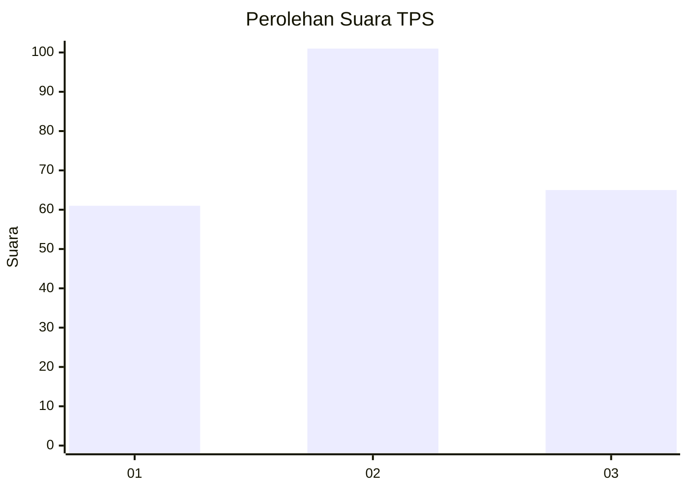
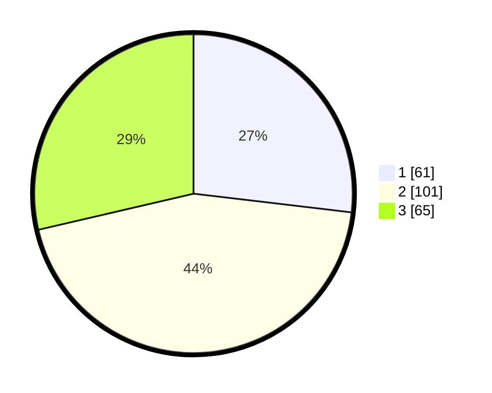

# Hasil

## Grafik

## Tabel

| No. | Nama Paslon    | Suara | Suara (raw) | Persentase |
|:--- |:-------------- | -----:| -----------:| ----------:|
| 1   | ANIES MUHAIMIN | 61    | [61][p-1]   | 26,87      |
| 2   | PRABOWO GIBRAN | 101   | [101][p-2]  | 44,49      |
| 3   | GANJAR MAHFUD  | 65    | [65][p-3]   | 28,63      |

[p-1]: https://github.com/gigit-pemilu/pemilu-2024-34-di-yogyakarta/blob/main/pilpres/hitung-suara/sub/34-di-yogyakarta/sub/71-kota-yogyakarta/sub/13-umbulharjo/sub/1001-semaki/sub/012-tps/sub/paslon-1.txt
[p-2]: https://github.com/gigit-pemilu/pemilu-2024-34-di-yogyakarta/blob/main/pilpres/hitung-suara/sub/34-di-yogyakarta/sub/71-kota-yogyakarta/sub/13-umbulharjo/sub/1001-semaki/sub/012-tps/sub/paslon-2.txt
[p-3]: https://github.com/gigit-pemilu/pemilu-2024-34-di-yogyakarta/blob/main/pilpres/hitung-suara/sub/34-di-yogyakarta/sub/71-kota-yogyakarta/sub/13-umbulharjo/sub/1001-semaki/sub/012-tps/sub/paslon-3.txt

## Foto C Plano

https://sirekap-obj-formc.kpu.go.id/80d2/pemilu/ppwp/34/71/13/10/01/3471131001012-20240214-194507--f859af01-7d3d-4cb2-b751-473d1bdacc94.jpg

https://sirekap-obj-formc.kpu.go.id/80d2/pemilu/ppwp/34/71/13/10/01/3471131001012-20240214-194944--12e57efe-238d-4174-9104-d0e0ce10e812.jpg

https://sirekap-obj-formc.kpu.go.id/80d2/pemilu/ppwp/34/71/13/10/01/3471131001012-20240214-210611--4b848d89-1c9e-4f82-ba23-de6c63bd2e27.jpg

## Metadata

| Key        | Value               |
| ---------- | ------------------- |
| Time Stamp | 2024-02-15 12:00:28 |

## DATA PEMILIH TETAP

Jumlah pemilih dalam DPT: **265**.
 * L: **122**.
 * P: **143**.

## DATA PENGGUNA HAK PILIH

Jumlah pengguna hak pilih dalam DPT: **219**.
 * L: **97**.
 * P: **122**.

Jumlah pengguna hak pilih dalam DPTb: **11**.
 * L: **3**.
 * P: **8**.

Jumlah pengguna hak pilih dalam DPK: **3**.
 * L: **0**.
 * P: **3**.

Jumlah pengguna hak pilih: **233**.
 * L: **100**.
 * P: **133**.

## JUMLAH SUARA SAH DAN TIDAK SAH

JUMLAH SELURUH SUARA SAH: **227**.

JUMLAH SUARA TIDAK SAH: **6**.

JUMLAH SELURUH SUARA SAH DAN SUARA TIDAK SAH: **233**.

