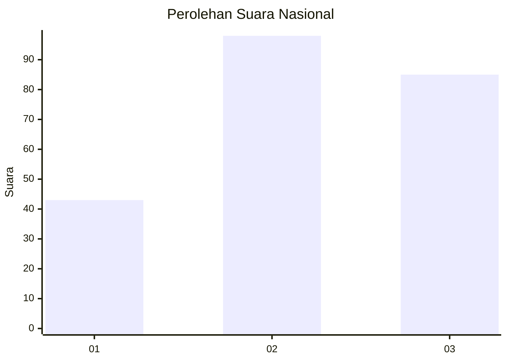
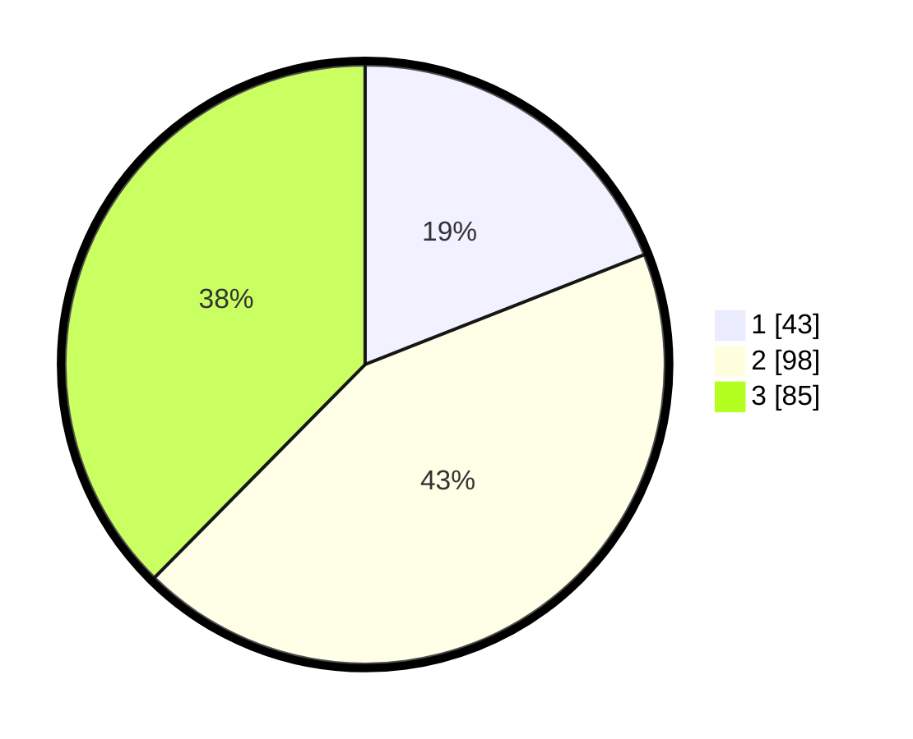

# Hasil

## Grafik

## Tabel

| No. | Nama Paslon    | Suara | Suara (raw) | Persentase |
|:--- |:-------------- | -----:| -----------:| ----------:|
| 1   | ANIES MUHAIMIN | 43    | [43][p-1]   | 19,03      |
| 2   | PRABOWO GIBRAN | 98    | [98][p-2]   | 43,36      |
| 3   | GANJAR MAHFUD  | 85    | [85][p-3]   | 37,61      |

[p-1]: https://github.com/gigit-pemilu/pemilu-2024/blob/main/pilpres/hitung-suara/sub/34-di-yogyakarta/sub/71-kota-yogyakarta/sub/13-umbulharjo/sub/1001-semaki/sub/016-tps/sub/paslon-1.txt
[p-2]: https://github.com/gigit-pemilu/pemilu-2024/blob/main/pilpres/hitung-suara/sub/34-di-yogyakarta/sub/71-kota-yogyakarta/sub/13-umbulharjo/sub/1001-semaki/sub/016-tps/sub/paslon-2.txt
[p-3]: https://github.com/gigit-pemilu/pemilu-2024/blob/main/pilpres/hitung-suara/sub/34-di-yogyakarta/sub/71-kota-yogyakarta/sub/13-umbulharjo/sub/1001-semaki/sub/016-tps/sub/paslon-3.txt

## Foto C Plano

https://sirekap-obj-formc.kpu.go.id/25dc/pemilu/ppwp/34/71/13/10/01/3471131001016-20240214-220933--4d18e2ab-5cbf-4170-961f-f6ec697dff5c.jpg

https://sirekap-obj-formc.kpu.go.id/25dc/pemilu/ppwp/34/71/13/10/01/3471131001016-20240214-221015--199a2503-506b-49d5-be48-f01ca86050f7.jpg

https://sirekap-obj-formc.kpu.go.id/25dc/pemilu/ppwp/34/71/13/10/01/3471131001016-20240214-155259--9f350166-b173-44fb-ac21-508436a9c4ab.jpg

## Metadata

| Key        | Value               |
| ---------- | ------------------- |
| Time Stamp | 2024-02-25 10:00:00 |

