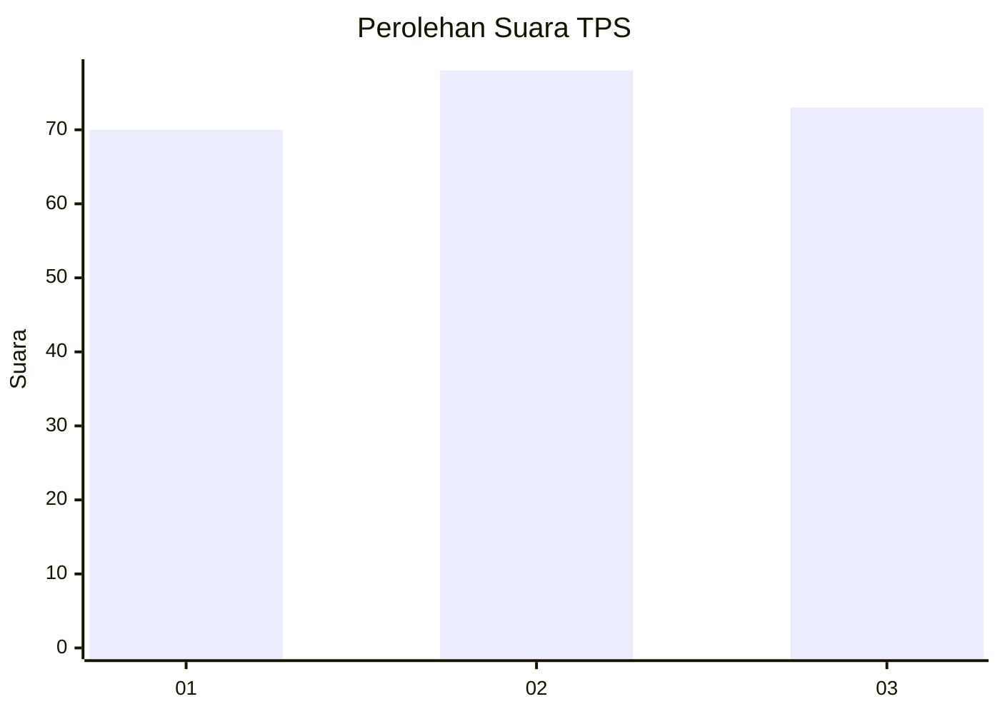
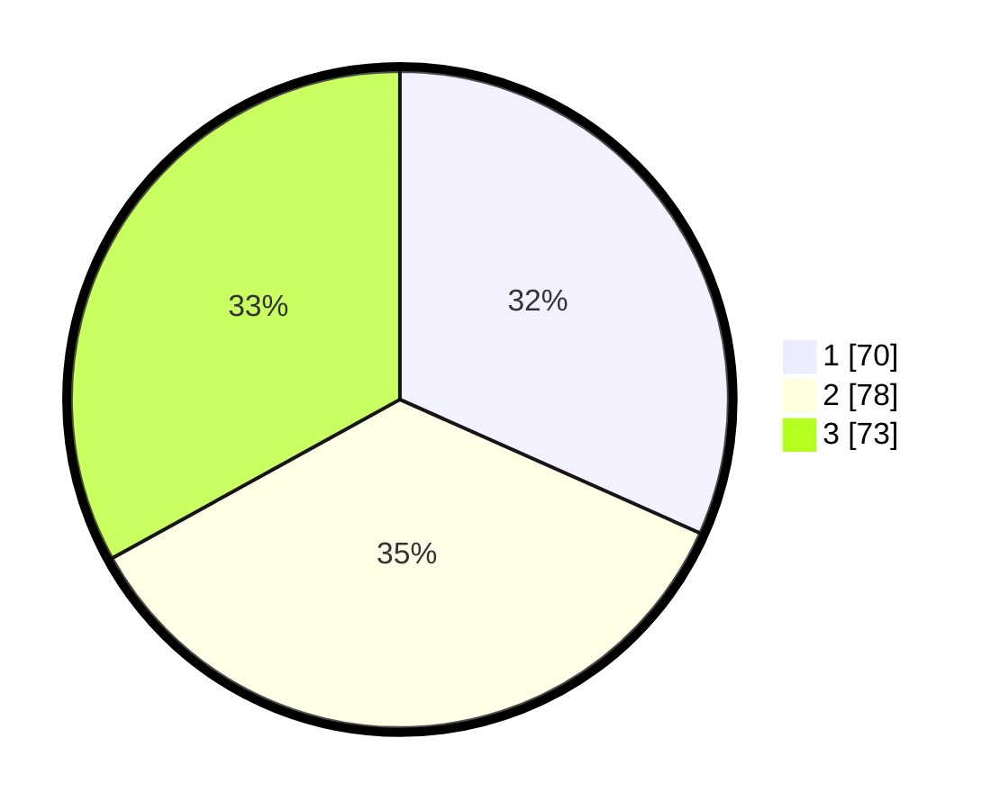

# Hasil

## Grafik

## Tabel

| No. | Nama Paslon    | Suara | Suara (raw) | Persentase |
|:--- |:-------------- | -----:| -----------:| ----------:|
| 1   | ANIES MUHAIMIN | 70    | [70][p-1]   | 31,67      |
| 2   | PRABOWO GIBRAN | 78    | [78][p-2]   | 35,29      |
| 3   | GANJAR MAHFUD  | 73    | [73][p-3]   | 33,03      |

[p-1]: https://github.com/gigit-pemilu/pemilu-2024-34-di-yogyakarta/blob/main/pilpres/hitung-suara/sub/34-di-yogyakarta/sub/71-kota-yogyakarta/sub/13-umbulharjo/sub/1002-muja-muju/sub/002-tps/sub/paslon-1.txt
[p-2]: https://github.com/gigit-pemilu/pemilu-2024-34-di-yogyakarta/blob/main/pilpres/hitung-suara/sub/34-di-yogyakarta/sub/71-kota-yogyakarta/sub/13-umbulharjo/sub/1002-muja-muju/sub/002-tps/sub/paslon-2.txt
[p-3]: https://github.com/gigit-pemilu/pemilu-2024-34-di-yogyakarta/blob/main/pilpres/hitung-suara/sub/34-di-yogyakarta/sub/71-kota-yogyakarta/sub/13-umbulharjo/sub/1002-muja-muju/sub/002-tps/sub/paslon-3.txt

## Foto C Plano

https://sirekap-obj-formc.kpu.go.id/50cd/pemilu/ppwp/34/71/13/10/02/3471131002002-20240214-202052--2ec771b5-08dc-4455-85d1-46315e0d5787.jpg

https://sirekap-obj-formc.kpu.go.id/50cd/pemilu/ppwp/34/71/13/10/02/3471131002002-20240214-210454--a05ecd23-7408-4ccc-bfec-e9b0bf50dbab.jpg

https://sirekap-obj-formc.kpu.go.id/50cd/pemilu/ppwp/34/71/13/10/02/3471131002002-20240214-202511--f16a229d-9d1d-45f6-98ba-ac4470afcef2.jpg

## Metadata

| Key        | Value               |
| ---------- | ------------------- |
| Time Stamp | 2024-02-15 00:41:44 |

## DATA PEMILIH TETAP

Jumlah pemilih dalam DPT: **268**.
 * L: **132**.
 * P: **136**.

## DATA PENGGUNA HAK PILIH

Jumlah pengguna hak pilih dalam DPT: **208**.
 * L: **99**.
 * P: **109**.

Jumlah pengguna hak pilih dalam DPTb: **15**.
 * L: **4**.
 * P: **11**.

Jumlah pengguna hak pilih dalam DPK: **2**.
 * L: **1**.
 * P: **1**.

Jumlah pengguna hak pilih: **225**.
 * L: **104**.
 * P: **121**.

## JUMLAH SUARA SAH DAN TIDAK SAH

JUMLAH SELURUH SUARA SAH: **221**.

JUMLAH SUARA TIDAK SAH: **4**.

JUMLAH SELURUH SUARA SAH DAN SUARA TIDAK SAH: **225**.

