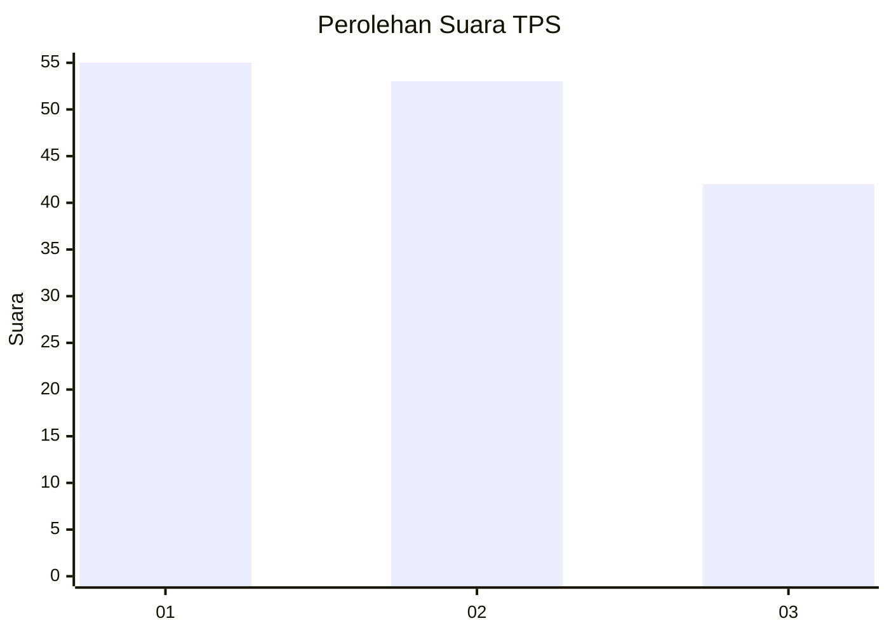
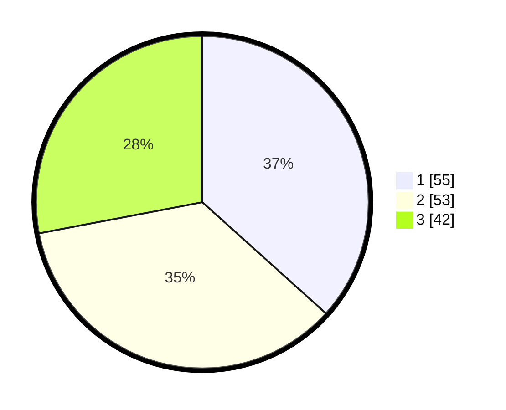

# Hasil

## Grafik

## Tabel

| No. | Nama Paslon    | Suara | Suara (raw) | Persentase |
|:--- |:-------------- | -----:| -----------:| ----------:|
| 1   | ANIES MUHAIMIN | 55    | [55][p-1]   | 36,67      |
| 2   | PRABOWO GIBRAN | 53    | [53][p-2]   | 35,33      |
| 3   | GANJAR MAHFUD  | 42    | [42][p-3]   | 28,00      |

[p-1]: https://github.com/gigit-pemilu/pemilu-2024-34-di-yogyakarta/blob/main/pilpres/hitung-suara/sub/34-di-yogyakarta/sub/71-kota-yogyakarta/sub/13-umbulharjo/sub/1002-muja-muju/sub/021-tps/sub/paslon-1.txt
[p-2]: https://github.com/gigit-pemilu/pemilu-2024-34-di-yogyakarta/blob/main/pilpres/hitung-suara/sub/34-di-yogyakarta/sub/71-kota-yogyakarta/sub/13-umbulharjo/sub/1002-muja-muju/sub/021-tps/sub/paslon-2.txt
[p-3]: https://github.com/gigit-pemilu/pemilu-2024-34-di-yogyakarta/blob/main/pilpres/hitung-suara/sub/34-di-yogyakarta/sub/71-kota-yogyakarta/sub/13-umbulharjo/sub/1002-muja-muju/sub/021-tps/sub/paslon-3.txt

## Foto C Plano

https://sirekap-obj-formc.kpu.go.id/c7de/pemilu/ppwp/34/71/13/10/02/3471131002021-20240214-204407--a3c53977-6592-4402-be94-737302cc6d6b.jpg

https://sirekap-obj-formc.kpu.go.id/c7de/pemilu/ppwp/34/71/13/10/02/3471131002021-20240214-211325--8392b897-528a-4544-9615-fd0673fb2608.jpg

https://sirekap-obj-formc.kpu.go.id/c7de/pemilu/ppwp/34/71/13/10/02/3471131002021-20240214-211501--f35be95f-8a3c-4464-8d76-5dcf32c0d5dc.jpg

## Metadata

| Key        | Value               |
| ---------- | ------------------- |
| Time Stamp | 2024-02-25 10:00:00 |

## DATA PEMILIH TETAP

Jumlah pemilih dalam DPT: **170**.
 * L: **84**.
 * P: **86**.

## DATA PENGGUNA HAK PILIH

Jumlah pengguna hak pilih dalam DPT: **144**.
 * L: **67**.
 * P: **77**.

Jumlah pengguna hak pilih dalam DPTb: **5**.
 * L: **802**.
 * P: **83**.

Jumlah pengguna hak pilih dalam DPK: **1**.
 * L: **0**.
 * P: **1**.

Jumlah pengguna hak pilih: **150**.
 * L: **69**.
 * P: **81**.

## JUMLAH SUARA SAH DAN TIDAK SAH

JUMLAH SELURUH SUARA SAH: **150**.

JUMLAH SUARA TIDAK SAH: **0**.

JUMLAH SELURUH SUARA SAH DAN SUARA TIDAK SAH: **150**.

