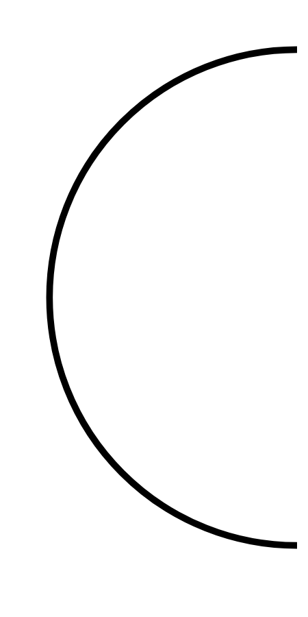

# Hasil

## Grafik

```mermaid
xychart-beta
    title "Perolehan Suara Nasional"
    x-axis []
    y-axis "Suara" 0 --> 0
    bar []
```



## Tabel

| No. | Nama Paslon | Suara | Suara (raw) | Persentase |
|:--- |:----------- | -----:| -----------:| ----------:|


[p-1]: https://github.com/gigit-pemilu/pemilu-2024/blob/main/pilpres/hitung-suara/sub/34-di-yogyakarta/sub/71-kota-yogyakarta/sub/13-umbulharjo/sub/1002-muja-muju/sub/023-tps/sub/paslon-1.txt
[p-2]: https://github.com/gigit-pemilu/pemilu-2024/blob/main/pilpres/hitung-suara/sub/34-di-yogyakarta/sub/71-kota-yogyakarta/sub/13-umbulharjo/sub/1002-muja-muju/sub/023-tps/sub/paslon-2.txt
[p-3]: https://github.com/gigit-pemilu/pemilu-2024/blob/main/pilpres/hitung-suara/sub/34-di-yogyakarta/sub/71-kota-yogyakarta/sub/13-umbulharjo/sub/1002-muja-muju/sub/023-tps/sub/paslon-3.txt

## Foto C Plano

https://sirekap-obj-formc.kpu.go.id/1bd7/pemilu/ppwp/34/71/13/10/02/3471131002023-20240215-234255--9906a379-a247-4425-acad-162990879a59.jpg

https://sirekap-obj-formc.kpu.go.id/1bd7/pemilu/ppwp/34/71/13/10/02/3471131002023-20240216-000416--edb9dfe0-2dd3-4346-bca9-3610e57e8b73.jpg

https://sirekap-obj-formc.kpu.go.id/1bd7/pemilu/ppwp/34/71/13/10/02/3471131002023-20240216-171928--9066d5f9-2402-46a2-908a-ebc4959e2576.jpg


## Metadata

| Key        | Value               |
| ---------- | ------------------- |
| Time Stamp | 2024-02-16 17:30:00 |


## DATA PEMILIH TETAP

Jumlah pemilih dalam DPT: **286**.
 * L: **131**.
 * P: **155**.

## DATA PENGGUNA HAK PILIH

Jumlah pengguna hak pilih dalam DPT: **251**.
 * L: **114**.
 * P: **137**.

Jumlah pengguna hak pilih dalam DPTb: **8**.
 * L: **0**.
 * P: **8**.

Jumlah pengguna hak pilih dalam DPK: **1**.
 * L: **1**.
 * P: **0**.

Jumlah pengguna hak pilih: **260**.
 * L: **115**.
 * P: **145**.

## JUMLAH SUARA SAH DAN TIDAK SAH

JUMLAH SELURUH SUARA SAH: **257**.

JUMLAH SUARA TIDAK SAH: **3**.

JUMLAH SELURUH SUARA SAH DAN SUARA TIDAK SAH: **260**.


