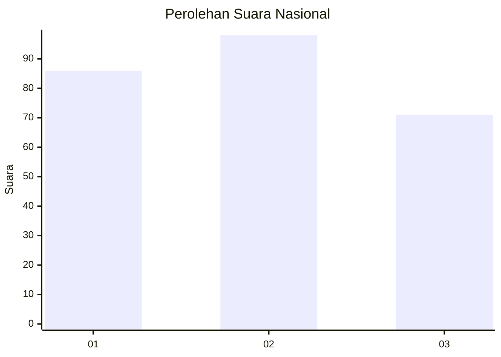
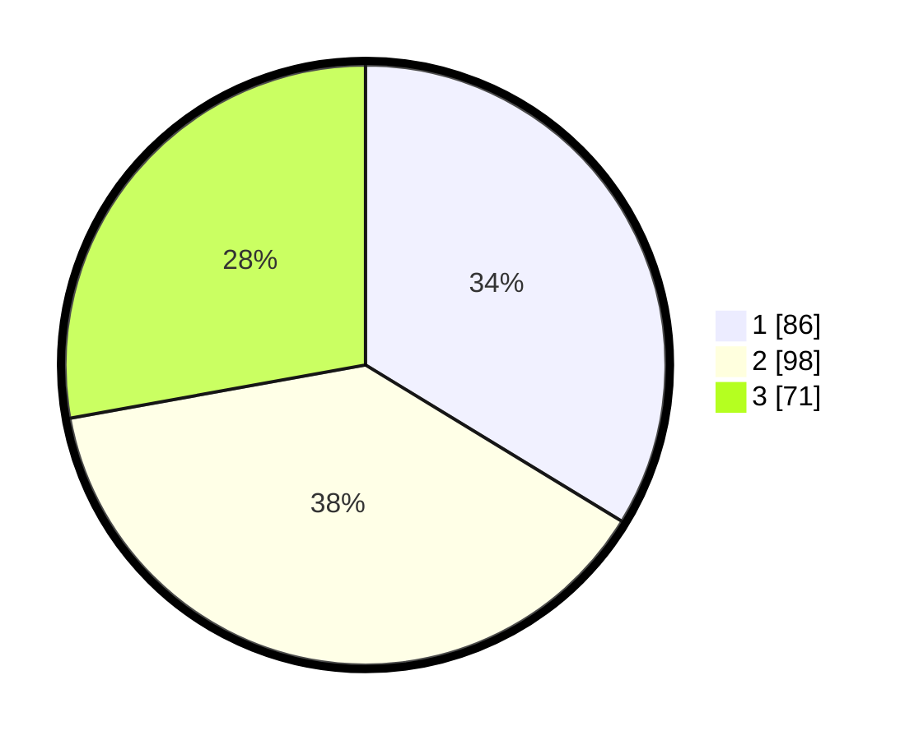

# Hasil

## Grafik

## Tabel

| No. | Nama Paslon    | Suara | Suara (raw) | Persentase |
|:--- |:-------------- | -----:| -----------:| ----------:|
| 1   | ANIES MUHAIMIN | 86    | [86][p-1]   | 33,73      |
| 2   | PRABOWO GIBRAN | 98    | [98][p-2]   | 38,43      |
| 3   | GANJAR MAHFUD  | 71    | [71][p-3]   | 27,84      |

[p-1]: https://github.com/gigit-pemilu/pemilu-2024/blob/main/pilpres/hitung-suara/sub/34-di-yogyakarta/sub/71-kota-yogyakarta/sub/13-umbulharjo/sub/1002-muja-muju/sub/026-tps/sub/paslon-1.txt
[p-2]: https://github.com/gigit-pemilu/pemilu-2024/blob/main/pilpres/hitung-suara/sub/34-di-yogyakarta/sub/71-kota-yogyakarta/sub/13-umbulharjo/sub/1002-muja-muju/sub/026-tps/sub/paslon-2.txt
[p-3]: https://github.com/gigit-pemilu/pemilu-2024/blob/main/pilpres/hitung-suara/sub/34-di-yogyakarta/sub/71-kota-yogyakarta/sub/13-umbulharjo/sub/1002-muja-muju/sub/026-tps/sub/paslon-3.txt

## Foto C Plano

https://sirekap-obj-formc.kpu.go.id/35e6/pemilu/ppwp/34/71/13/10/02/3471131002026-20240215-011810--91335e89-36c3-49b8-97fe-d833f762f102.jpg

https://sirekap-obj-formc.kpu.go.id/35e6/pemilu/ppwp/34/71/13/10/02/3471131002026-20240215-011841--c4b28141-3cd6-4f94-b9b5-9203aa317387.jpg

https://sirekap-obj-formc.kpu.go.id/35e6/pemilu/ppwp/34/71/13/10/02/3471131002026-20240215-011917--0388a4b7-d2e8-4f46-bc4e-f9a5958cd21c.jpg

## Metadata

| Key        | Value               |
| ---------- | ------------------- |
| Time Stamp | 2024-02-24 22:31:28 |

## DATA PEMILIH TETAP

Jumlah pemilih dalam DPT: **288**.
 * L: **137**.
 * P: **151**.

## DATA PENGGUNA HAK PILIH

Jumlah pengguna hak pilih dalam DPT: **251**.
 * L: **117**.
 * P: **134**.

Jumlah pengguna hak pilih dalam DPTb: **8**.
 * L: **7**.
 * P: **807**.

Jumlah pengguna hak pilih dalam DPK: **1**.
 * L: **1**.
 * P: **0**.

Jumlah pengguna hak pilih: **260**.
 * L: **219**.
 * P: **141**.

## JUMLAH SUARA SAH DAN TIDAK SAH

JUMLAH SELURUH SUARA SAH: **255**.

JUMLAH SUARA TIDAK SAH: **5**.

JUMLAH SELURUH SUARA SAH DAN SUARA TIDAK SAH: **260**.

