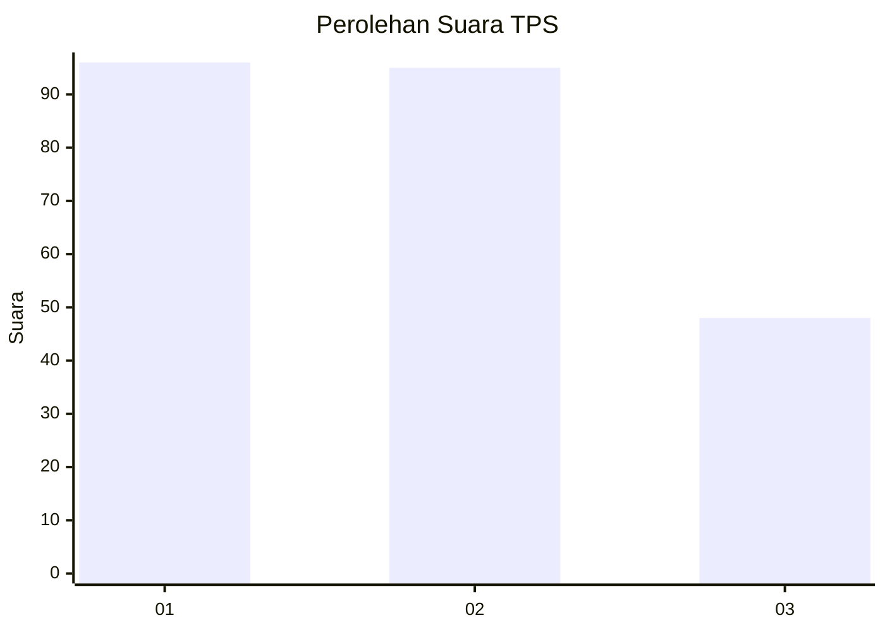
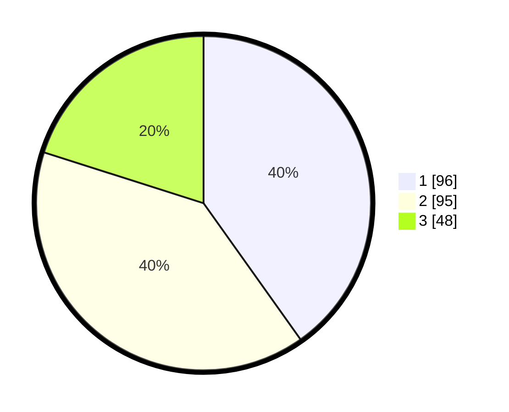

# Hasil

## Grafik

## Tabel

| No. | Nama Paslon    | Suara | Suara (raw) | Persentase |
|:--- |:-------------- | -----:| -----------:| ----------:|
| 1   | ANIES MUHAIMIN | 96    | [96][p-1]   | 40,17      |
| 2   | PRABOWO GIBRAN | 95    | [95][p-2]   | 39,75      |
| 3   | GANJAR MAHFUD  | 48    | [48][p-3]   | 20,08      |

[p-1]: https://github.com/gigit-pemilu/pemilu-2024-34-di-yogyakarta/blob/main/pilpres/hitung-suara/sub/34-di-yogyakarta/sub/71-kota-yogyakarta/sub/13-umbulharjo/sub/1003-tahunan/sub/012-tps/sub/paslon-1.txt
[p-2]: https://github.com/gigit-pemilu/pemilu-2024-34-di-yogyakarta/blob/main/pilpres/hitung-suara/sub/34-di-yogyakarta/sub/71-kota-yogyakarta/sub/13-umbulharjo/sub/1003-tahunan/sub/012-tps/sub/paslon-2.txt
[p-3]: https://github.com/gigit-pemilu/pemilu-2024-34-di-yogyakarta/blob/main/pilpres/hitung-suara/sub/34-di-yogyakarta/sub/71-kota-yogyakarta/sub/13-umbulharjo/sub/1003-tahunan/sub/012-tps/sub/paslon-3.txt

## Foto C Plano

https://sirekap-obj-formc.kpu.go.id/90b2/pemilu/ppwp/34/71/13/10/03/3471131003012-20240214-212844--4961b8ee-e756-444d-bbe5-f4d0319a79e9.jpg

https://sirekap-obj-formc.kpu.go.id/90b2/pemilu/ppwp/34/71/13/10/03/3471131003012-20240214-213052--a51eccb9-0472-47bb-8d8b-415827345376.jpg

https://sirekap-obj-formc.kpu.go.id/90b2/pemilu/ppwp/34/71/13/10/03/3471131003012-20240214-213228--98acd8a6-bac0-4cdc-a9fc-921415512ad9.jpg

## Metadata

| Key        | Value               |
| ---------- | ------------------- |
| Time Stamp | 2024-02-24 22:31:28 |

