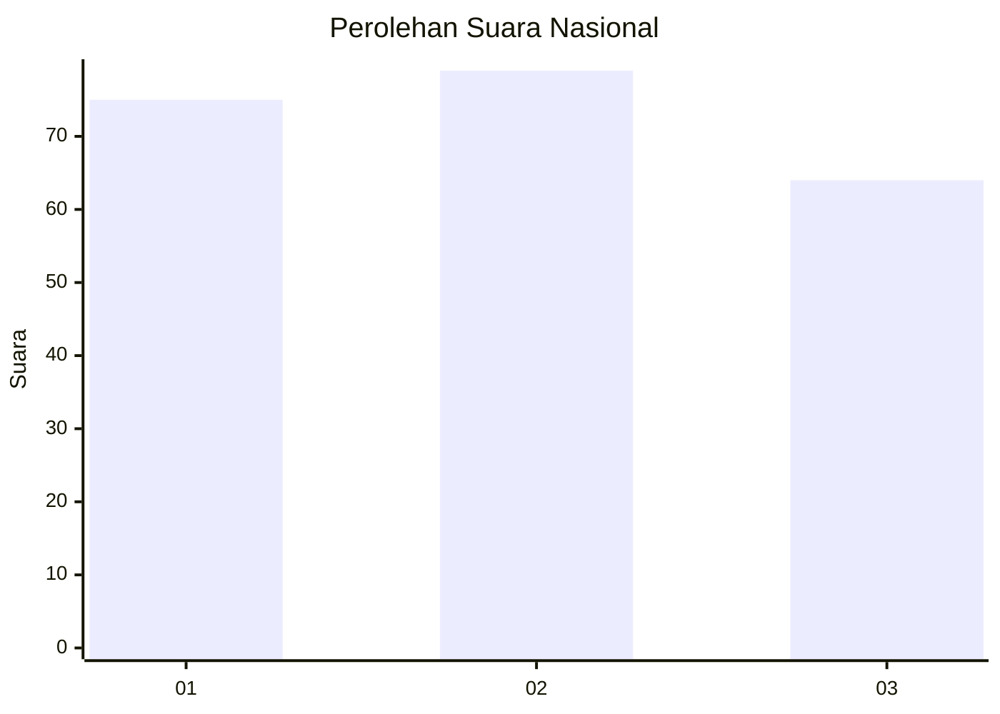
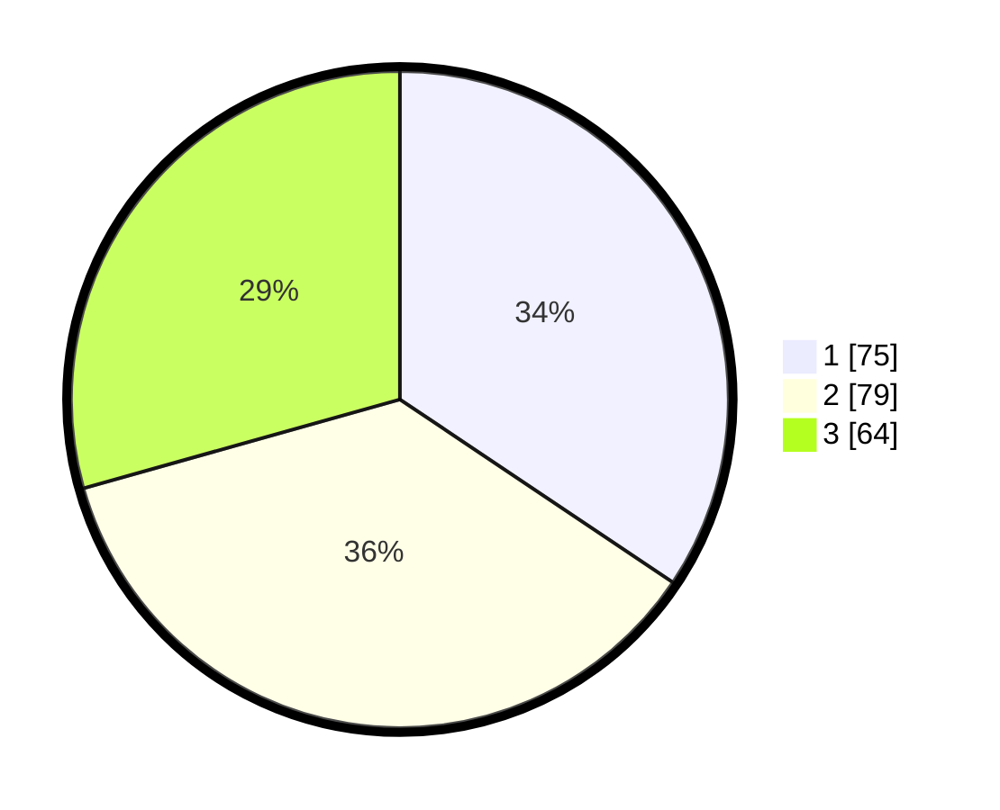

# Hasil

## Grafik

## Tabel

| No. | Nama Paslon    | Suara | Suara (raw) | Persentase |
|:--- |:-------------- | -----:| -----------:| ----------:|
| 1   | ANIES MUHAIMIN | 75    | [75][p-1]   | 34,40      |
| 2   | PRABOWO GIBRAN | 79    | [79][p-2]   | 36,24      |
| 3   | GANJAR MAHFUD  | 64    | [64][p-3]   | 29,36      |

[p-1]: https://github.com/gigit-pemilu/pemilu-2024/blob/main/pilpres/hitung-suara/sub/34-di-yogyakarta/sub/71-kota-yogyakarta/sub/13-umbulharjo/sub/1003-tahunan/sub/018-tps/sub/paslon-1.txt
[p-2]: https://github.com/gigit-pemilu/pemilu-2024/blob/main/pilpres/hitung-suara/sub/34-di-yogyakarta/sub/71-kota-yogyakarta/sub/13-umbulharjo/sub/1003-tahunan/sub/018-tps/sub/paslon-2.txt
[p-3]: https://github.com/gigit-pemilu/pemilu-2024/blob/main/pilpres/hitung-suara/sub/34-di-yogyakarta/sub/71-kota-yogyakarta/sub/13-umbulharjo/sub/1003-tahunan/sub/018-tps/sub/paslon-3.txt

## Foto C Plano

https://sirekap-obj-formc.kpu.go.id/1a9b/pemilu/ppwp/34/71/13/10/03/3471131003018-20240214-205847--db2f4587-0397-488a-a04d-ec345febdf87.jpg

https://sirekap-obj-formc.kpu.go.id/1a9b/pemilu/ppwp/34/71/13/10/03/3471131003018-20240214-205924--f4b0afaf-0020-4aa8-8d4b-b9851ede742a.jpg

https://sirekap-obj-formc.kpu.go.id/1a9b/pemilu/ppwp/34/71/13/10/03/3471131003018-20240214-210135--a544d37f-20d1-4448-9dfc-f8cada1d2372.jpg

## Metadata

| Key        | Value               |
| ---------- | ------------------- |
| Time Stamp | 2024-02-25 17:00:00 |

## DATA PEMILIH TETAP

Jumlah pemilih dalam DPT: **281**.
 * L: **133**.
 * P: **148**.

## DATA PENGGUNA HAK PILIH

Jumlah pengguna hak pilih dalam DPT: **215**.
 * L: **97**.
 * P: **118**.

Jumlah pengguna hak pilih dalam DPTb: **9**.
 * L: **5**.
 * P: **88**.

Jumlah pengguna hak pilih dalam DPK: **0**.
 * L: **0**.
 * P: **0**.

Jumlah pengguna hak pilih: **224**.
 * L: **98**.
 * P: **126**.

## JUMLAH SUARA SAH DAN TIDAK SAH

JUMLAH SELURUH SUARA SAH: **218**.

JUMLAH SUARA TIDAK SAH: **6**.

JUMLAH SELURUH SUARA SAH DAN SUARA TIDAK SAH: **224**.

