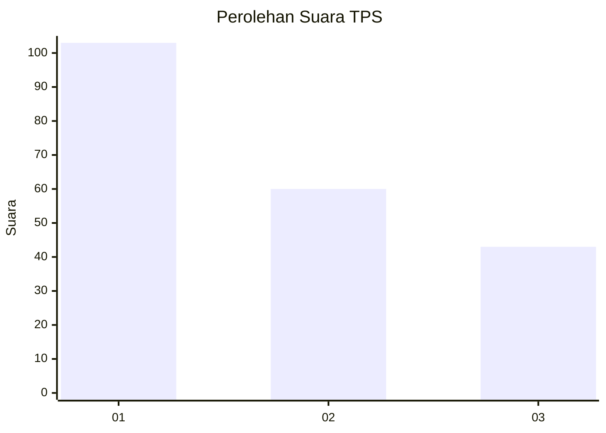
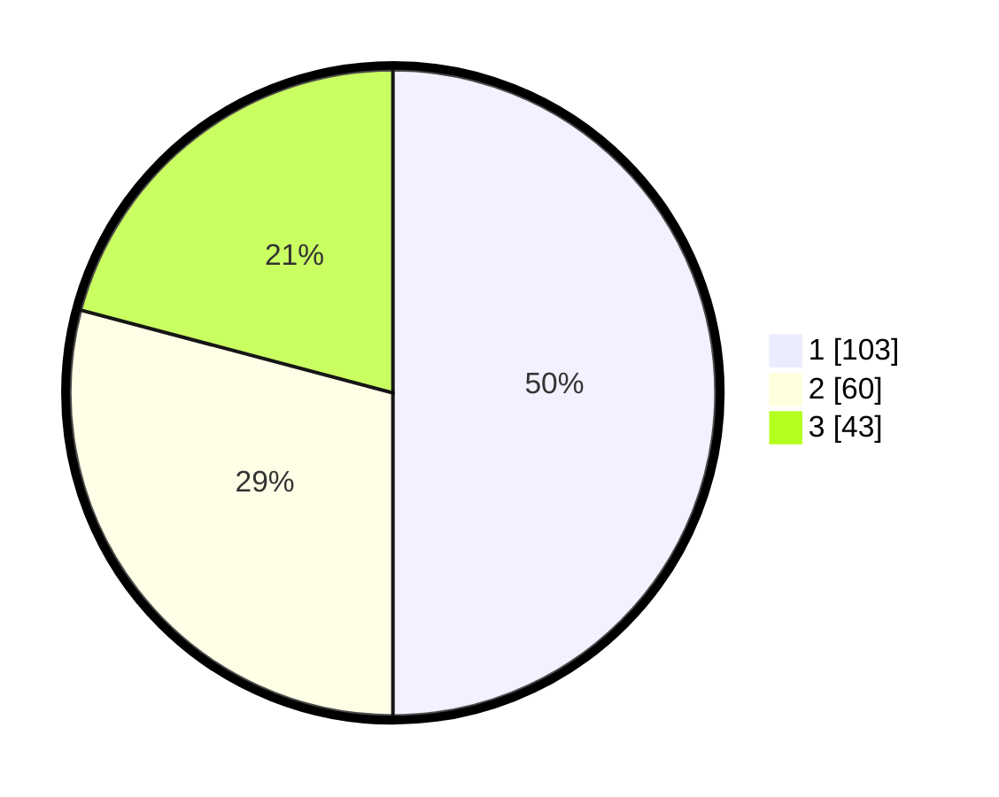

# Hasil

## Grafik

## Tabel

| No. | Nama Paslon    | Suara | Suara (raw) | Persentase |
|:--- |:-------------- | -----:| -----------:| ----------:|
| 1   | ANIES MUHAIMIN | 103   | [103][p-1]  | 50,00      |
| 2   | PRABOWO GIBRAN | 60    | [60][p-2]   | 29,13      |
| 3   | GANJAR MAHFUD  | 43    | [43][p-3]   | 20,87      |

[p-1]: https://github.com/gigit-pemilu/pemilu-2024-34-di-yogyakarta/blob/main/pilpres/hitung-suara/sub/34-di-yogyakarta/sub/71-kota-yogyakarta/sub/13-umbulharjo/sub/1003-tahunan/sub/019-tps/sub/paslon-1.txt
[p-2]: https://github.com/gigit-pemilu/pemilu-2024-34-di-yogyakarta/blob/main/pilpres/hitung-suara/sub/34-di-yogyakarta/sub/71-kota-yogyakarta/sub/13-umbulharjo/sub/1003-tahunan/sub/019-tps/sub/paslon-2.txt
[p-3]: https://github.com/gigit-pemilu/pemilu-2024-34-di-yogyakarta/blob/main/pilpres/hitung-suara/sub/34-di-yogyakarta/sub/71-kota-yogyakarta/sub/13-umbulharjo/sub/1003-tahunan/sub/019-tps/sub/paslon-3.txt

## Foto C Plano

https://sirekap-obj-formc.kpu.go.id/37a5/pemilu/ppwp/34/71/13/10/03/3471131003019-20240214-211843--d84e876c-85fc-44c8-b001-2d986e843728.jpg

https://sirekap-obj-formc.kpu.go.id/37a5/pemilu/ppwp/34/71/13/10/03/3471131003019-20240214-214034--e3a63ffb-7cb7-4496-8e48-f3f04ab53c1b.jpg

https://sirekap-obj-formc.kpu.go.id/37a5/pemilu/ppwp/34/71/13/10/03/3471131003019-20240214-214153--4a72c20d-75c2-4657-a79a-d13741e85aa0.jpg

## Metadata

| Key        | Value               |
| ---------- | ------------------- |
| Time Stamp | 2024-02-17 16:00:02 |

## DATA PEMILIH TETAP

Jumlah pemilih dalam DPT: **255**.
 * L: **5**.
 * P: **535**.

## DATA PENGGUNA HAK PILIH

Jumlah pengguna hak pilih dalam DPT: **201**.
 * L: **43**.
 * P: **100**.

Jumlah pengguna hak pilih dalam DPTb: **7**.
 * L: **266**.
 * P: **84**.

Jumlah pengguna hak pilih dalam DPK: **0**.
 * L: **200**.
 * P: **84**.

Jumlah pengguna hak pilih: **208**.
 * L: **98**.
 * P: **423**.

## JUMLAH SUARA SAH DAN TIDAK SAH

JUMLAH SELURUH SUARA SAH: **206**.

JUMLAH SUARA TIDAK SAH: **2**.

JUMLAH SELURUH SUARA SAH DAN SUARA TIDAK SAH: **208**.

