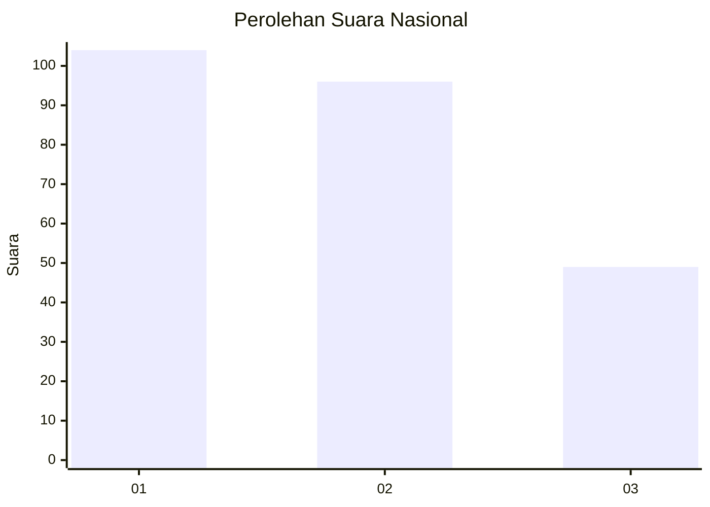
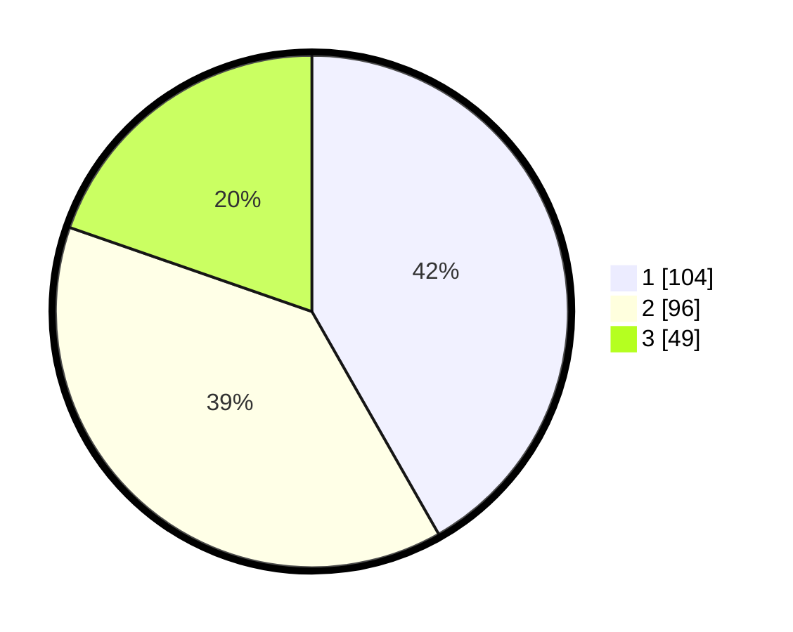

# Hasil

## Grafik

## Tabel

| No. | Nama Paslon    | Suara | Suara (raw) | Persentase |
|:--- |:-------------- | -----:| -----------:| ----------:|
| 1   | ANIES MUHAIMIN | 104   | [104][p-1]  | 41,77      |
| 2   | PRABOWO GIBRAN | 96    | [96][p-2]   | 38,55      |
| 3   | GANJAR MAHFUD  | 49    | [49][p-3]   | 19,68      |

[p-1]: https://github.com/gigit-pemilu/pemilu-2024/blob/main/pilpres/hitung-suara/sub/34-di-yogyakarta/sub/71-kota-yogyakarta/sub/13-umbulharjo/sub/1004-warungboto/sub/006-tps/sub/paslon-1.txt
[p-2]: https://github.com/gigit-pemilu/pemilu-2024/blob/main/pilpres/hitung-suara/sub/34-di-yogyakarta/sub/71-kota-yogyakarta/sub/13-umbulharjo/sub/1004-warungboto/sub/006-tps/sub/paslon-2.txt
[p-3]: https://github.com/gigit-pemilu/pemilu-2024/blob/main/pilpres/hitung-suara/sub/34-di-yogyakarta/sub/71-kota-yogyakarta/sub/13-umbulharjo/sub/1004-warungboto/sub/006-tps/sub/paslon-3.txt

## Foto C Plano

https://sirekap-obj-formc.kpu.go.id/4aa9/pemilu/ppwp/34/71/13/10/04/3471131004006-20240214-235411--0a4a0550-c8c7-4f6f-8498-4bb11d3b2d72.jpg

https://sirekap-obj-formc.kpu.go.id/4aa9/pemilu/ppwp/34/71/13/10/04/3471131004006-20240214-235449--80584cfe-b3af-4144-8d1c-021228e10ea2.jpg

## Metadata

| Key        | Value               |
| ---------- | ------------------- |
| Time Stamp | 2024-02-25 14:00:00 |

