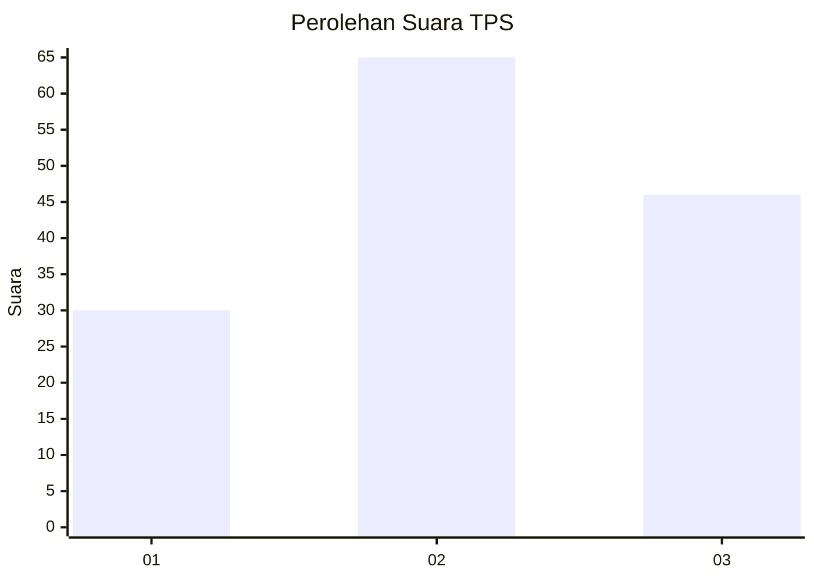
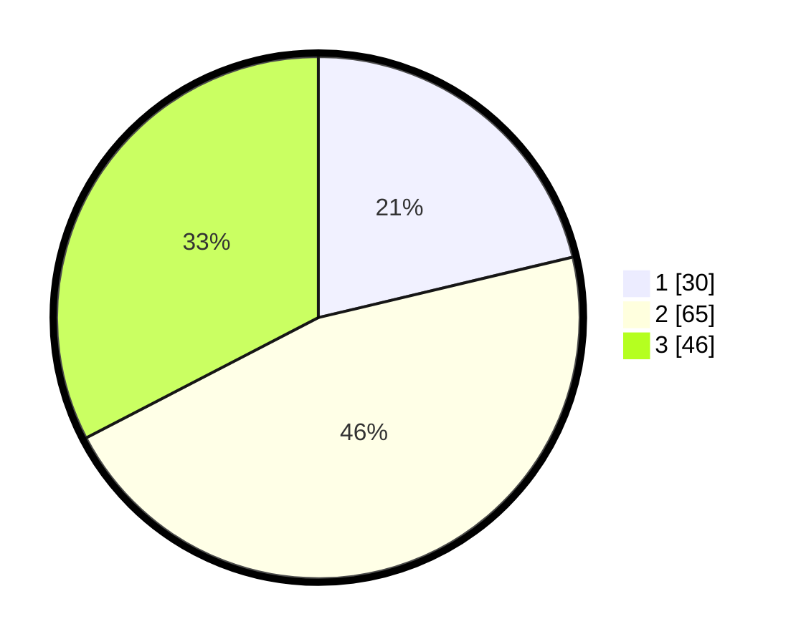

# Hasil

## Grafik

## Tabel

| No. | Nama Paslon    | Suara | Suara (raw) | Persentase |
|:--- |:-------------- | -----:| -----------:| ----------:|
| 1   | ANIES MUHAIMIN | 30    | [30][p-1]   | 21,28      |
| 2   | PRABOWO GIBRAN | 65    | [65][p-2]   | 46,10      |
| 3   | GANJAR MAHFUD  | 46    | [46][p-3]   | 32,62      |

[p-1]: https://github.com/gigit-pemilu/pemilu-2024-34-di-yogyakarta/blob/main/pilpres/hitung-suara/sub/34-di-yogyakarta/sub/71-kota-yogyakarta/sub/13-umbulharjo/sub/1005-pandeyan/sub/009-tps/sub/paslon-1.txt
[p-2]: https://github.com/gigit-pemilu/pemilu-2024-34-di-yogyakarta/blob/main/pilpres/hitung-suara/sub/34-di-yogyakarta/sub/71-kota-yogyakarta/sub/13-umbulharjo/sub/1005-pandeyan/sub/009-tps/sub/paslon-2.txt
[p-3]: https://github.com/gigit-pemilu/pemilu-2024-34-di-yogyakarta/blob/main/pilpres/hitung-suara/sub/34-di-yogyakarta/sub/71-kota-yogyakarta/sub/13-umbulharjo/sub/1005-pandeyan/sub/009-tps/sub/paslon-3.txt

## Foto C Plano

https://sirekap-obj-formc.kpu.go.id/312e/pemilu/ppwp/34/71/13/10/05/3471131005009-20240214-223615--c735aa72-800f-4108-a42e-e99dcae6bb10.jpg

https://sirekap-obj-formc.kpu.go.id/312e/pemilu/ppwp/34/71/13/10/05/3471131005009-20240214-223626--a931f561-086f-41de-8a19-952ff89f9de7.jpg

https://sirekap-obj-formc.kpu.go.id/312e/pemilu/ppwp/34/71/13/10/05/3471131005009-20240214-223841--dbb3752e-134d-4aa4-9c38-560420f42eaa.jpg

## Metadata

| Key        | Value               |
| ---------- | ------------------- |
| Time Stamp | 2024-02-24 23:00:00 |

