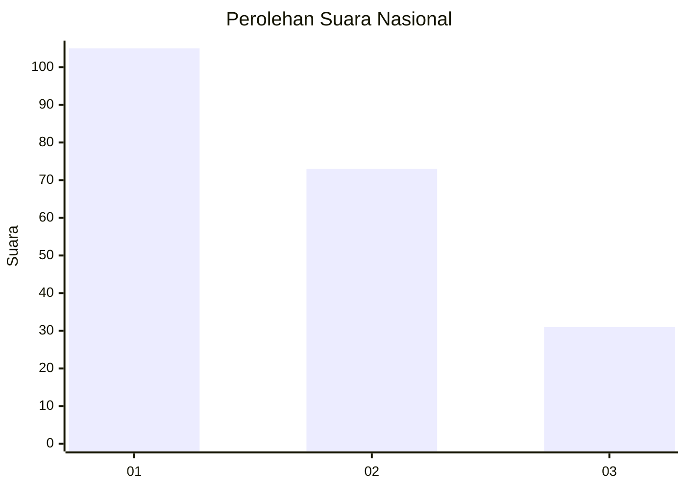
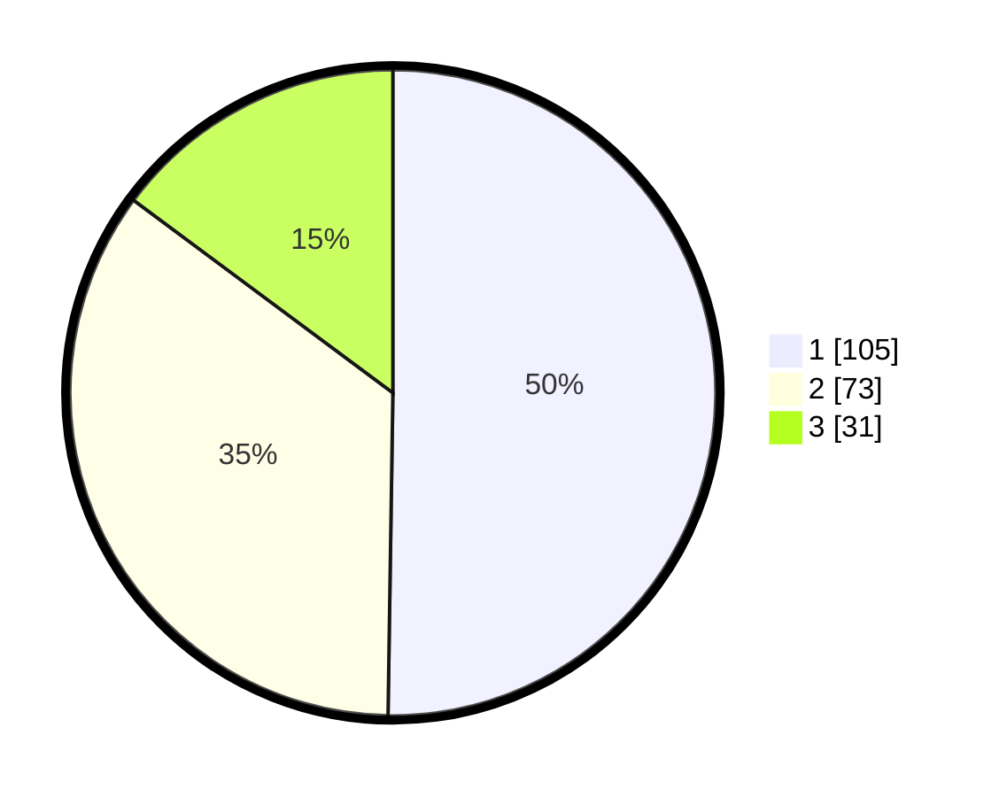

# Hasil

## Grafik

## Tabel

| No. | Nama Paslon    | Suara | Suara (raw) | Persentase |
|:--- |:-------------- | -----:| -----------:| ----------:|
| 1   | ANIES MUHAIMIN | 105   | [105][p-1]  | 50,24      |
| 2   | PRABOWO GIBRAN | 73    | [73][p-2]   | 34,93      |
| 3   | GANJAR MAHFUD  | 31    | [31][p-3]   | 14,83      |

[p-1]: https://github.com/gigit-pemilu/pemilu-2024/blob/main/pilpres/hitung-suara/sub/34-di-yogyakarta/sub/71-kota-yogyakarta/sub/13-umbulharjo/sub/1005-pandeyan/sub/013-tps/sub/paslon-1.txt
[p-2]: https://github.com/gigit-pemilu/pemilu-2024/blob/main/pilpres/hitung-suara/sub/34-di-yogyakarta/sub/71-kota-yogyakarta/sub/13-umbulharjo/sub/1005-pandeyan/sub/013-tps/sub/paslon-2.txt
[p-3]: https://github.com/gigit-pemilu/pemilu-2024/blob/main/pilpres/hitung-suara/sub/34-di-yogyakarta/sub/71-kota-yogyakarta/sub/13-umbulharjo/sub/1005-pandeyan/sub/013-tps/sub/paslon-3.txt

## Foto C Plano

https://sirekap-obj-formc.kpu.go.id/6c48/pemilu/ppwp/34/71/13/10/05/3471131005013-20240218-162308--6561fdbb-ca02-48ef-97fb-70270a8f2b08.jpg

https://sirekap-obj-formc.kpu.go.id/6c48/pemilu/ppwp/34/71/13/10/05/3471131005013-20240218-162345--e69d221a-ade8-4947-9253-5d2acd700a71.jpg

https://sirekap-obj-formc.kpu.go.id/6c48/pemilu/ppwp/34/71/13/10/05/3471131005013-20240218-162438--2c55e8c7-b706-447d-ab8e-b4bbfccdbf35.jpg

## Metadata

| Key        | Value               |
| ---------- | ------------------- |
| Time Stamp | 2024-02-19 06:16:00 |

## DATA PEMILIH TETAP

Jumlah pemilih dalam DPT: **250**.
 * L: **227**.
 * P: **241**.

## DATA PENGGUNA HAK PILIH

Jumlah pengguna hak pilih dalam DPT: **99**.
 * L: **90**.
 * P: **509**.

Jumlah pengguna hak pilih dalam DPTb: **264**.
 * L: **82**.
 * P: **802**.

Jumlah pengguna hak pilih dalam DPK: **803**.
 * L: **0**.
 * P: **802**.

Jumlah pengguna hak pilih: **200**.
 * L: **48**.
 * P: **643**.

## JUMLAH SUARA SAH DAN TIDAK SAH

JUMLAH SELURUH SUARA SAH: **209**.

JUMLAH SUARA TIDAK SAH: **2**.

JUMLAH SELURUH SUARA SAH DAN SUARA TIDAK SAH: **211**.

