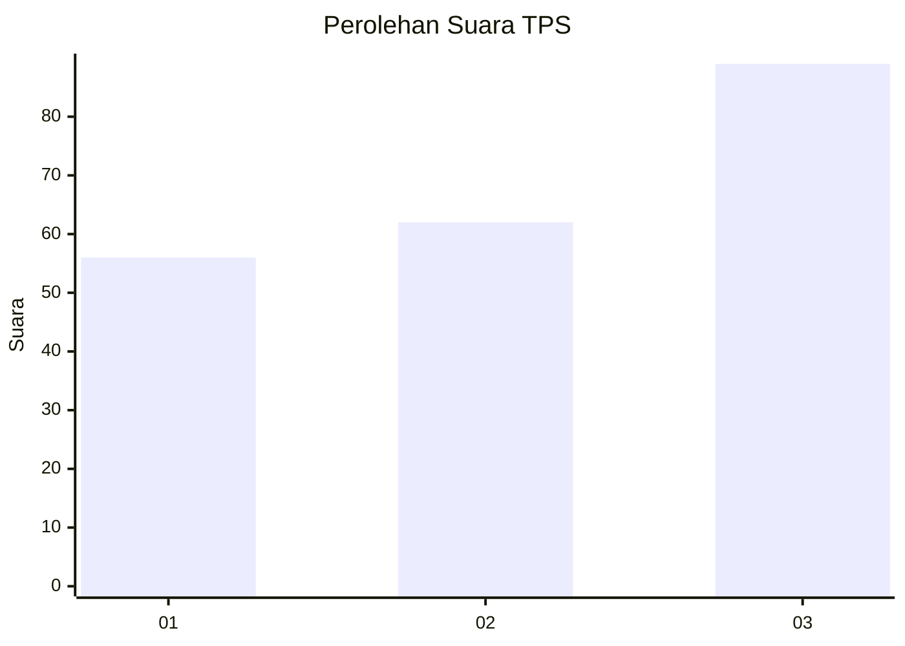
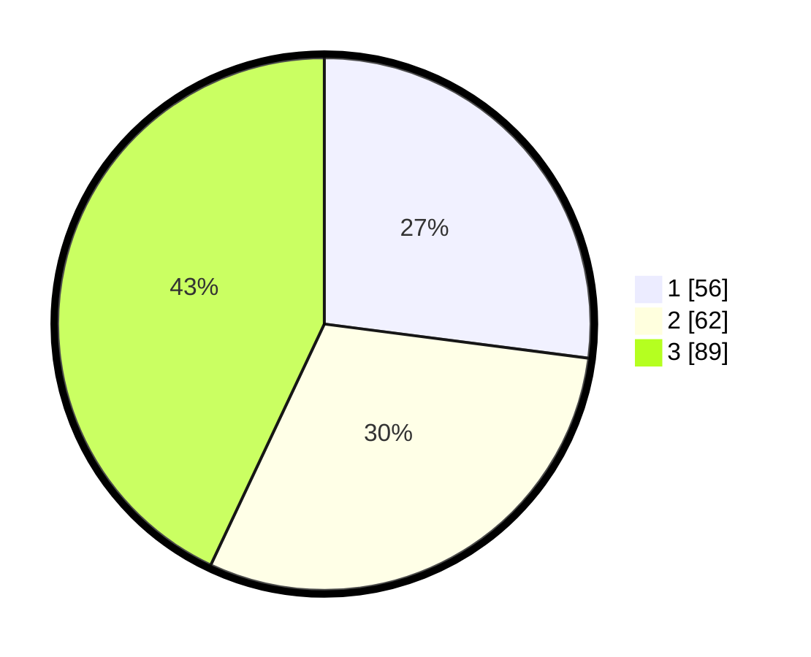

# Hasil

## Grafik

## Tabel

| No. | Nama Paslon    | Suara | Suara (raw) | Persentase |
|:--- |:-------------- | -----:| -----------:| ----------:|
| 1   | ANIES MUHAIMIN | 56    | [56][p-1]   | 27,05      |
| 2   | PRABOWO GIBRAN | 62    | [62][p-2]   | 29,95      |
| 3   | GANJAR MAHFUD  | 89    | [89][p-3]   | 43,00      |

[p-1]: https://github.com/gigit-pemilu/pemilu-2024-34-di-yogyakarta/blob/main/pilpres/hitung-suara/sub/34-di-yogyakarta/sub/71-kota-yogyakarta/sub/13-umbulharjo/sub/1005-pandeyan/sub/015-tps/sub/paslon-1.txt
[p-2]: https://github.com/gigit-pemilu/pemilu-2024-34-di-yogyakarta/blob/main/pilpres/hitung-suara/sub/34-di-yogyakarta/sub/71-kota-yogyakarta/sub/13-umbulharjo/sub/1005-pandeyan/sub/015-tps/sub/paslon-2.txt
[p-3]: https://github.com/gigit-pemilu/pemilu-2024-34-di-yogyakarta/blob/main/pilpres/hitung-suara/sub/34-di-yogyakarta/sub/71-kota-yogyakarta/sub/13-umbulharjo/sub/1005-pandeyan/sub/015-tps/sub/paslon-3.txt

## Foto C Plano

https://sirekap-obj-formc.kpu.go.id/e7c9/pemilu/ppwp/34/71/13/10/05/3471131005015-20240215-055857--1d9570f8-5fb2-41f8-9f71-457b419cb322.jpg

https://sirekap-obj-formc.kpu.go.id/e7c9/pemilu/ppwp/34/71/13/10/05/3471131005015-20240214-203751--545aa63f-5183-444d-80e3-2dc0f61222ba.jpg

https://sirekap-obj-formc.kpu.go.id/e7c9/pemilu/ppwp/34/71/13/10/05/3471131005015-20240214-201803--d6cac5c9-fef9-4e61-b2c2-101afb78b063.jpg

## Metadata

| Key        | Value               |
| ---------- | ------------------- |
| Time Stamp | 2024-02-25 15:00:00 |

