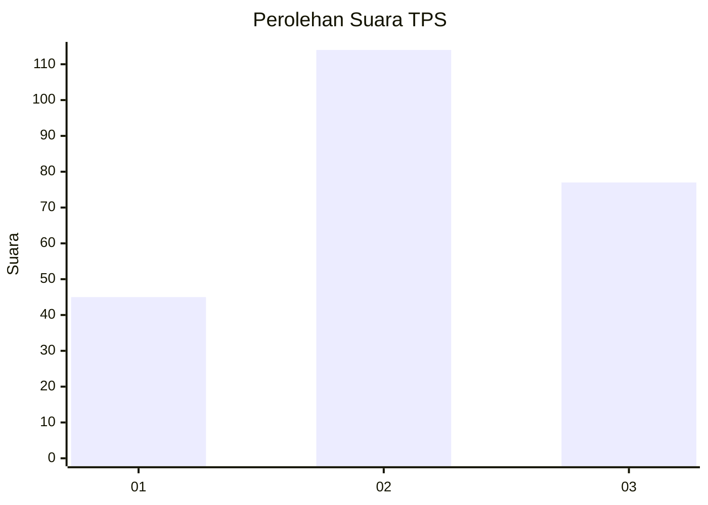
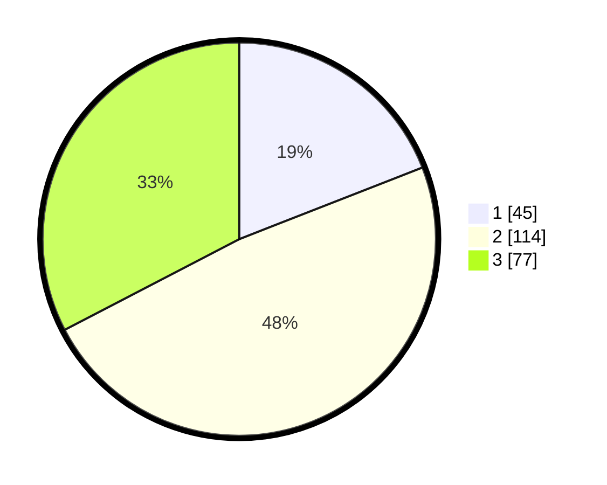

# Hasil

## Grafik

## Tabel

| No. | Nama Paslon    | Suara | Suara (raw) | Persentase |
|:--- |:-------------- | -----:| -----------:| ----------:|
| 1   | ANIES MUHAIMIN | 45    | [45][p-1]   | 19,07      |
| 2   | PRABOWO GIBRAN | 114   | [114][p-2]  | 48,31      |
| 3   | GANJAR MAHFUD  | 77    | [77][p-3]   | 32,63      |

[p-1]: https://github.com/gigit-pemilu/pemilu-2024-34-di-yogyakarta/blob/main/pilpres/hitung-suara/sub/34-di-yogyakarta/sub/71-kota-yogyakarta/sub/13-umbulharjo/sub/1005-pandeyan/sub/019-tps/sub/paslon-1.txt
[p-2]: https://github.com/gigit-pemilu/pemilu-2024-34-di-yogyakarta/blob/main/pilpres/hitung-suara/sub/34-di-yogyakarta/sub/71-kota-yogyakarta/sub/13-umbulharjo/sub/1005-pandeyan/sub/019-tps/sub/paslon-2.txt
[p-3]: https://github.com/gigit-pemilu/pemilu-2024-34-di-yogyakarta/blob/main/pilpres/hitung-suara/sub/34-di-yogyakarta/sub/71-kota-yogyakarta/sub/13-umbulharjo/sub/1005-pandeyan/sub/019-tps/sub/paslon-3.txt

## Foto C Plano

https://sirekap-obj-formc.kpu.go.id/7a39/pemilu/ppwp/34/71/13/10/05/3471131005019-20240215-050255--41c90c1f-0aec-44d4-a84a-1f83b8874971.jpg

https://sirekap-obj-formc.kpu.go.id/7a39/pemilu/ppwp/34/71/13/10/05/3471131005019-20240215-050323--9d0ffe2a-7032-4f6f-8c1d-6a45fc6e1ee8.jpg

https://sirekap-obj-formc.kpu.go.id/7a39/pemilu/ppwp/34/71/13/10/05/3471131005019-20240215-050442--73e6419e-34bc-4d72-b6e0-04fb8b84b4ce.jpg

## Metadata

| Key        | Value               |
| ---------- | ------------------- |
| Time Stamp | 2024-02-24 22:31:28 |

