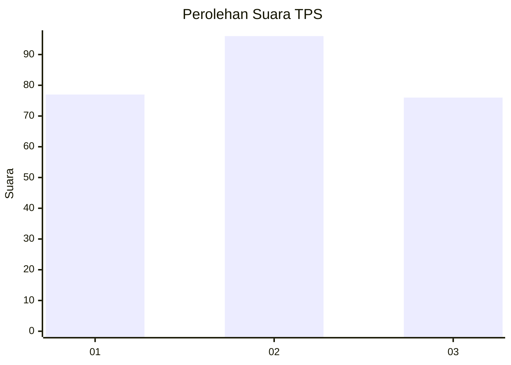
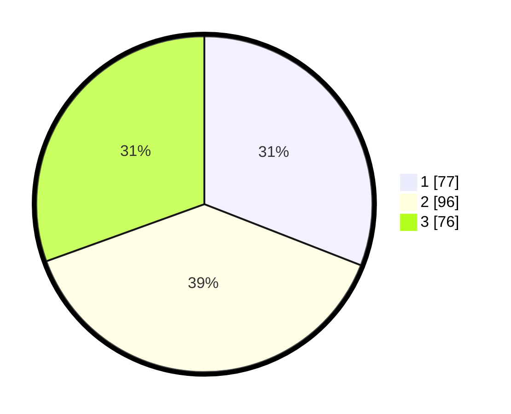

# Hasil

## Grafik

## Tabel

| No. | Nama Paslon    | Suara | Suara (raw) | Persentase |
|:--- |:-------------- | -----:| -----------:| ----------:|
| 1   | ANIES MUHAIMIN | 77    | [77][p-1]   | 30,92      |
| 2   | PRABOWO GIBRAN | 96    | [96][p-2]   | 38,55      |
| 3   | GANJAR MAHFUD  | 76    | [76][p-3]   | 30,52      |

[p-1]: https://github.com/gigit-pemilu/pemilu-2024-34-di-yogyakarta/blob/main/pilpres/hitung-suara/sub/34-di-yogyakarta/sub/71-kota-yogyakarta/sub/13-umbulharjo/sub/1005-pandeyan/sub/021-tps/sub/paslon-1.txt
[p-2]: https://github.com/gigit-pemilu/pemilu-2024-34-di-yogyakarta/blob/main/pilpres/hitung-suara/sub/34-di-yogyakarta/sub/71-kota-yogyakarta/sub/13-umbulharjo/sub/1005-pandeyan/sub/021-tps/sub/paslon-2.txt
[p-3]: https://github.com/gigit-pemilu/pemilu-2024-34-di-yogyakarta/blob/main/pilpres/hitung-suara/sub/34-di-yogyakarta/sub/71-kota-yogyakarta/sub/13-umbulharjo/sub/1005-pandeyan/sub/021-tps/sub/paslon-3.txt

## Foto C Plano

https://sirekap-obj-formc.kpu.go.id/347c/pemilu/ppwp/34/71/13/10/05/3471131005021-20240214-235612--2c9e8969-9b3b-416a-8f2c-30a2f67a155c.jpg

https://sirekap-obj-formc.kpu.go.id/347c/pemilu/ppwp/34/71/13/10/05/3471131005021-20240214-235728--0b7e64fe-d834-4ab2-ab01-6231120b0c62.jpg

https://sirekap-obj-formc.kpu.go.id/347c/pemilu/ppwp/34/71/13/10/05/3471131005021-20240214-235757--333e1da9-c91a-46ea-8c11-1437e52fba78.jpg

## Metadata

| Key        | Value               |
| ---------- | ------------------- |
| Time Stamp | 2024-02-15 03:06:03 |

