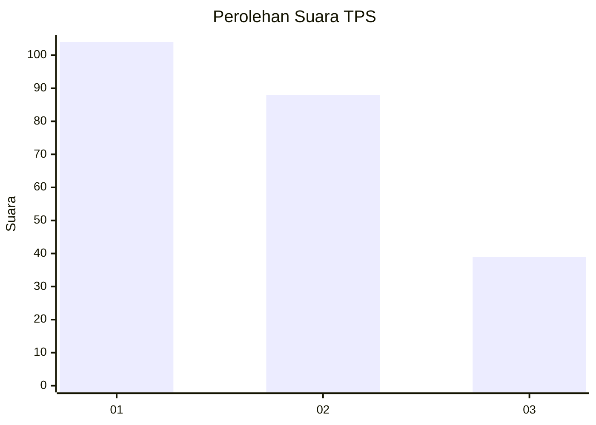
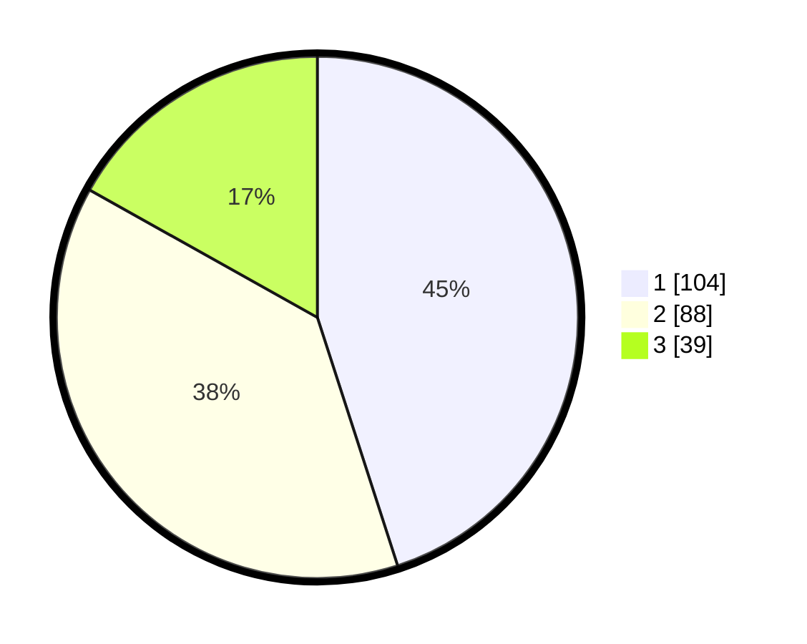

# Hasil

## Grafik

## Tabel

| No. | Nama Paslon    | Suara | Suara (raw) | Persentase |
|:--- |:-------------- | -----:| -----------:| ----------:|
| 1   | ANIES MUHAIMIN | 104   | [104][p-1]  | 45,02      |
| 2   | PRABOWO GIBRAN | 88    | [88][p-2]   | 38,10      |
| 3   | GANJAR MAHFUD  | 39    | [39][p-3]   | 16,88      |

[p-1]: https://github.com/gigit-pemilu/pemilu-2024-34-di-yogyakarta/blob/main/pilpres/hitung-suara/sub/34-di-yogyakarta/sub/71-kota-yogyakarta/sub/13-umbulharjo/sub/1005-pandeyan/sub/025-tps/sub/paslon-1.txt
[p-2]: https://github.com/gigit-pemilu/pemilu-2024-34-di-yogyakarta/blob/main/pilpres/hitung-suara/sub/34-di-yogyakarta/sub/71-kota-yogyakarta/sub/13-umbulharjo/sub/1005-pandeyan/sub/025-tps/sub/paslon-2.txt
[p-3]: https://github.com/gigit-pemilu/pemilu-2024-34-di-yogyakarta/blob/main/pilpres/hitung-suara/sub/34-di-yogyakarta/sub/71-kota-yogyakarta/sub/13-umbulharjo/sub/1005-pandeyan/sub/025-tps/sub/paslon-3.txt

## Foto C Plano

https://sirekap-obj-formc.kpu.go.id/292c/pemilu/ppwp/34/71/13/10/05/3471131005025-20240215-015003--e63b2626-14ef-4902-9be0-490796a31482.jpg

https://sirekap-obj-formc.kpu.go.id/292c/pemilu/ppwp/34/71/13/10/05/3471131005025-20240215-002931--5225093d-8a31-41a2-ba8f-2328882bb1e7.jpg

https://sirekap-obj-formc.kpu.go.id/292c/pemilu/ppwp/34/71/13/10/05/3471131005025-20240215-003039--89000e29-6927-43b9-bf94-1314e29e593b.jpg

## Metadata

| Key        | Value               |
| ---------- | ------------------- |
| Time Stamp | 2024-02-25 15:00:00 |

