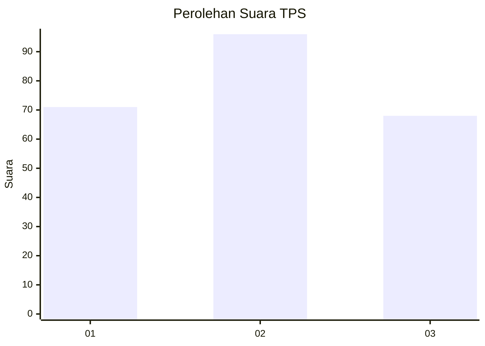
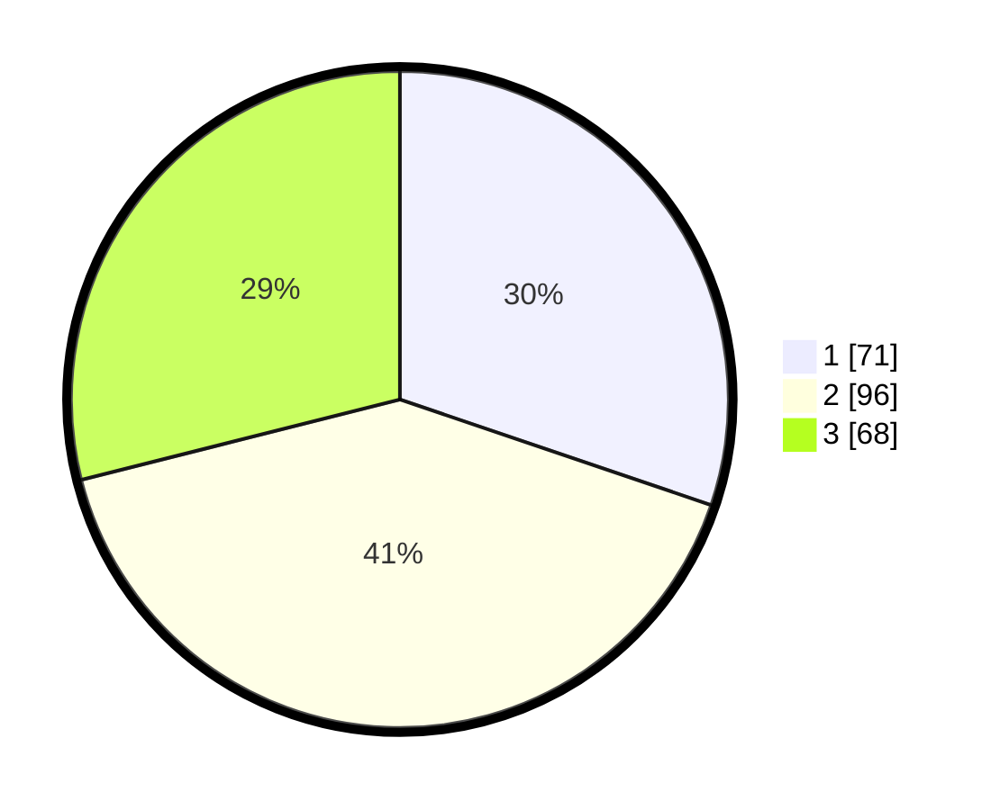

# Hasil

## Grafik

## Tabel

| No. | Nama Paslon    | Suara | Suara (raw) | Persentase |
|:--- |:-------------- | -----:| -----------:| ----------:|
| 1   | ANIES MUHAIMIN | 71    | [71][p-1]   | 30,21      |
| 2   | PRABOWO GIBRAN | 96    | [96][p-2]   | 40,85      |
| 3   | GANJAR MAHFUD  | 68    | [68][p-3]   | 28,94      |

[p-1]: https://github.com/gigit-pemilu/pemilu-2024-34-di-yogyakarta/blob/main/pilpres/hitung-suara/sub/34-di-yogyakarta/sub/71-kota-yogyakarta/sub/13-umbulharjo/sub/1005-pandeyan/sub/029-tps/sub/paslon-1.txt
[p-2]: https://github.com/gigit-pemilu/pemilu-2024-34-di-yogyakarta/blob/main/pilpres/hitung-suara/sub/34-di-yogyakarta/sub/71-kota-yogyakarta/sub/13-umbulharjo/sub/1005-pandeyan/sub/029-tps/sub/paslon-2.txt
[p-3]: https://github.com/gigit-pemilu/pemilu-2024-34-di-yogyakarta/blob/main/pilpres/hitung-suara/sub/34-di-yogyakarta/sub/71-kota-yogyakarta/sub/13-umbulharjo/sub/1005-pandeyan/sub/029-tps/sub/paslon-3.txt

## Foto C Plano

https://sirekap-obj-formc.kpu.go.id/9398/pemilu/ppwp/34/71/13/10/05/3471131005029-20240214-230837--5bd1cd7a-5acd-4c42-8152-0aba5c294240.jpg

https://sirekap-obj-formc.kpu.go.id/9398/pemilu/ppwp/34/71/13/10/05/3471131005029-20240214-230950--4b0af786-11b0-446f-abff-602140340503.jpg

https://sirekap-obj-formc.kpu.go.id/9398/pemilu/ppwp/34/71/13/10/05/3471131005029-20240214-231108--04204814-b76c-4622-a683-f49cdf4ec9ea.jpg

## Metadata

| Key        | Value               |
| ---------- | ------------------- |
| Time Stamp | 2024-02-24 22:31:28 |

