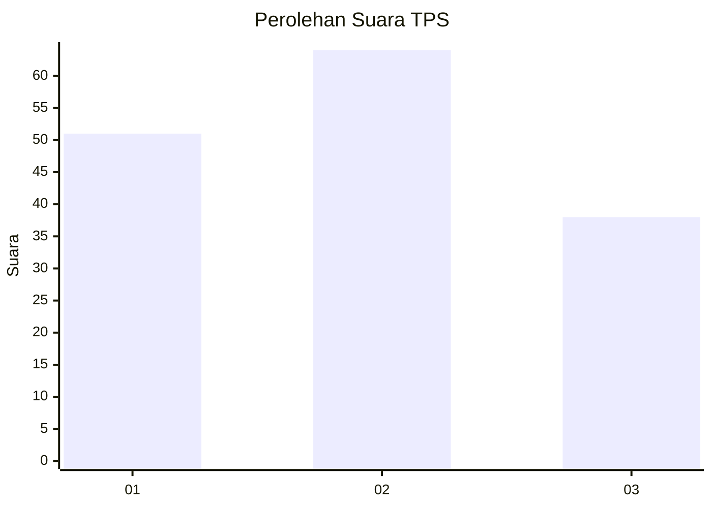
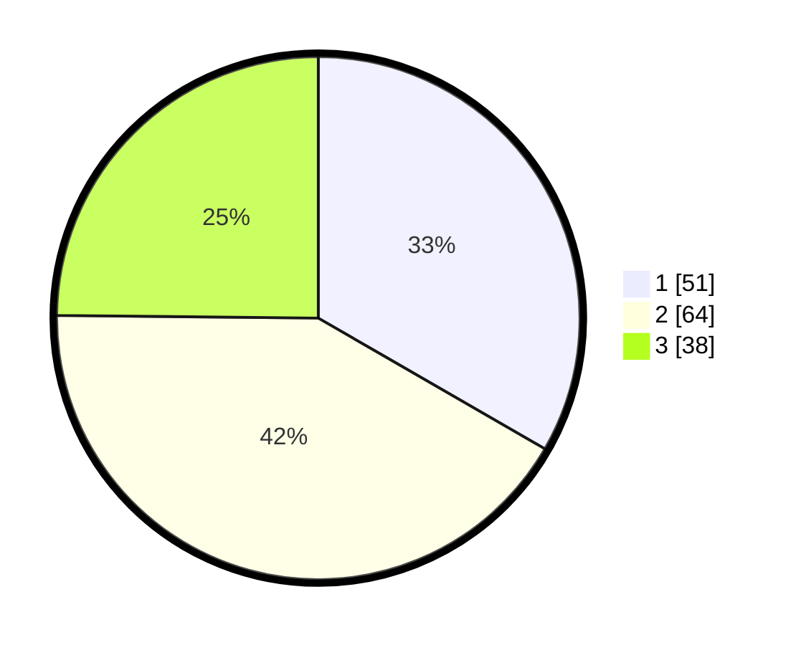

# Hasil

## Grafik

## Tabel

| No. | Nama Paslon    | Suara | Suara (raw) | Persentase |
|:--- |:-------------- | -----:| -----------:| ----------:|
| 1   | ANIES MUHAIMIN | 51    | [51][p-1]   | 33,33      |
| 2   | PRABOWO GIBRAN | 64    | [64][p-2]   | 41,83      |
| 3   | GANJAR MAHFUD  | 38    | [38][p-3]   | 24,84      |

[p-1]: https://github.com/gigit-pemilu/pemilu-2024-34-di-yogyakarta/blob/main/pilpres/hitung-suara/sub/34-di-yogyakarta/sub/71-kota-yogyakarta/sub/13-umbulharjo/sub/1005-pandeyan/sub/036-tps/sub/paslon-1.txt
[p-2]: https://github.com/gigit-pemilu/pemilu-2024-34-di-yogyakarta/blob/main/pilpres/hitung-suara/sub/34-di-yogyakarta/sub/71-kota-yogyakarta/sub/13-umbulharjo/sub/1005-pandeyan/sub/036-tps/sub/paslon-2.txt
[p-3]: https://github.com/gigit-pemilu/pemilu-2024-34-di-yogyakarta/blob/main/pilpres/hitung-suara/sub/34-di-yogyakarta/sub/71-kota-yogyakarta/sub/13-umbulharjo/sub/1005-pandeyan/sub/036-tps/sub/paslon-3.txt

## Foto C Plano

https://sirekap-obj-formc.kpu.go.id/b4e4/pemilu/ppwp/34/71/13/10/05/3471131005036-20240214-194649--d3acbac3-3a3f-44db-8491-b53f96e0297d.jpg

https://sirekap-obj-formc.kpu.go.id/b4e4/pemilu/ppwp/34/71/13/10/05/3471131005036-20240214-194918--e4b94e2c-b2df-45c2-b2bf-6074d887d888.jpg

https://sirekap-obj-formc.kpu.go.id/b4e4/pemilu/ppwp/34/71/13/10/05/3471131005036-20240214-195252--52cd2abe-5c5e-449c-9a8f-00cdfda49dba.jpg

## Metadata

| Key        | Value               |
| ---------- | ------------------- |
| Time Stamp | 2024-02-24 22:31:28 |

